.. _data-entry:

Data Entry
===========

.. contents::
   :local:
   :depth: 2

You will only be able to see the **Data Entry** tab if you have been assigned
the 'Data Entry' :ref:`roles`, when logged into the PMHC MDS on https://pmhc-mds.net.

If you don’t have access to the **Data Entry** tab and you believe you should, please
contact someone in your provider organisation or provider organisation's PHN
who has the 'User Management' role. If you are unsure who has the 'User Management'
role please email the PMHC Helpdesk at support@pmhc-mds.com.

After navigating to the **Data Entry** tab, you will be presented with three search
boxes, which will allow you to easily find and view the client data for the
organisations you have permission to access.

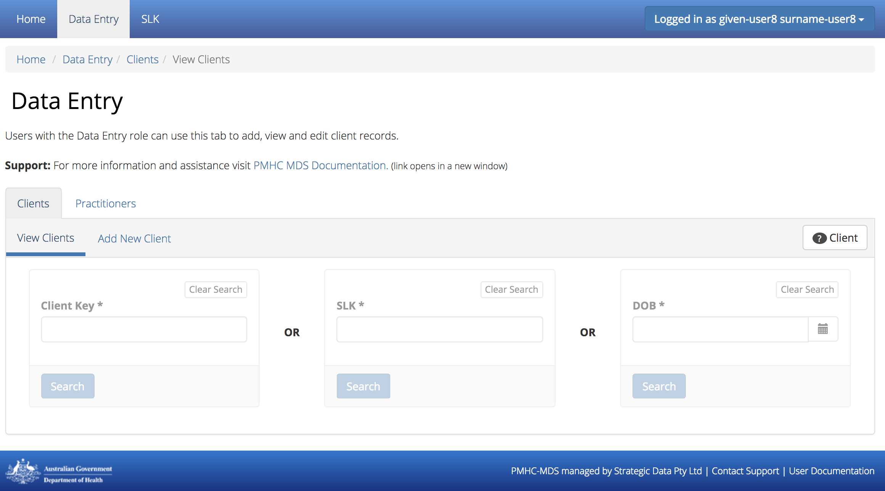

.. _client-data:

Client Data
^^^^^^^^^^^

.. contents::
   :local:
   :depth: 2

.. _find-client:

Finding a Client
----------------

There are three :ref:`search-fields` options available.

.. _search-fields:

Search Fields
~~~~~~~~~~~~~

You can choose any one of three search options to search for a client, depending
on the client information that is available.

- **Client Key** - Use this field to enter the first characters of, or the entire `Client Key <https://docs.pmhc-mds.com/en/v1/data-specification/data-model-and-specifications.html#dfn-client-key>`_

- **SLK** - Use this field to type in a client's `Statistical Linkage Key <https://docs.pmhc-mds.com/en/v1/data-specification/data-model-and-specifications.html#dfn-slk>`_

- **DOB** - Use this field to type in a client's `Date of Birth <https://docs.pmhc-mds.com/en/v1/data-specification/data-model-and-specifications.html#dfn-date-of-birth>`_

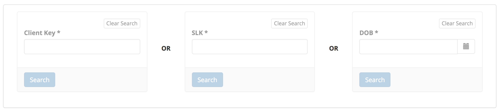

After entering information into one of these :ref:`search-fields`, simply click
the blue **Search** button to see :ref:`search-client`

Use the grey **Clear Search** button to removed any previously entered text.

.. _search-client:

Client Search Results
---------------------

A display of the details used within the :ref:`search-fields` used in :ref:`find-client`
will be visible above the search results table, when results are available.

You can sort the listed client search results through either of the
above three search features for :ref:`search-fields`.

Sort the listed clients by simply clicking the column header. Alternately
you can click the arrow beside a column header for more sort options, as follows:

- **Sort Ascending**
- **Sort Descending**
- **Remove Sort**
- **Hide Column**

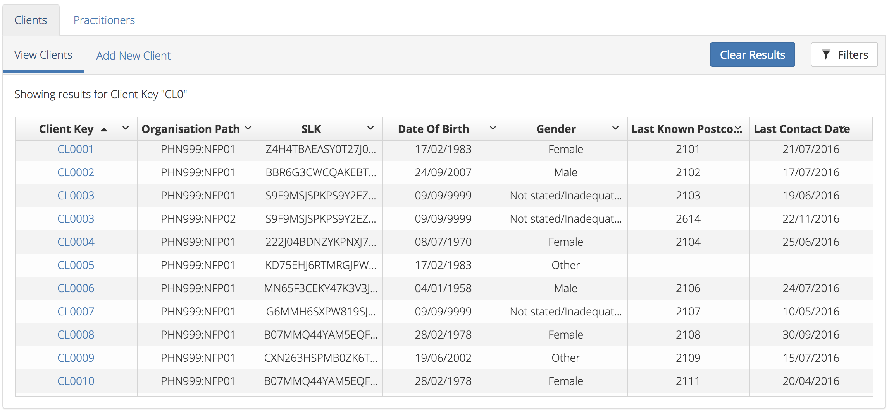

To filter the listed clients:

  1. Click the grey **Filters** button. This will open a field in which to enter
     text
  2. Type an appropriate filter into the field that opened
  3. To remove the filter, click the grey cross within the edit box beside any entered text or click the grey **Filters** button

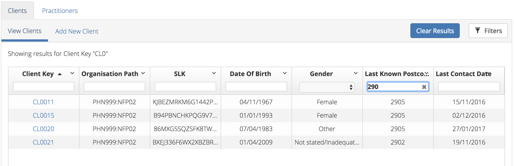

You can clear the search results and start a new search by clicking on the blue
**Edit Search** button.

.. _view-client-details:

Viewing a Client's details
--------------------------

You can view a client's details through the :ref:`search-client`
available on the **Data Entry** tab, by following these steps:

1. Create :ref:`search-client`
2. Click the **Client Key** in blue displayed within the table
3. This is the **Client's Summary** view, with summary details along with a
   snapshot of the five most recent episodes

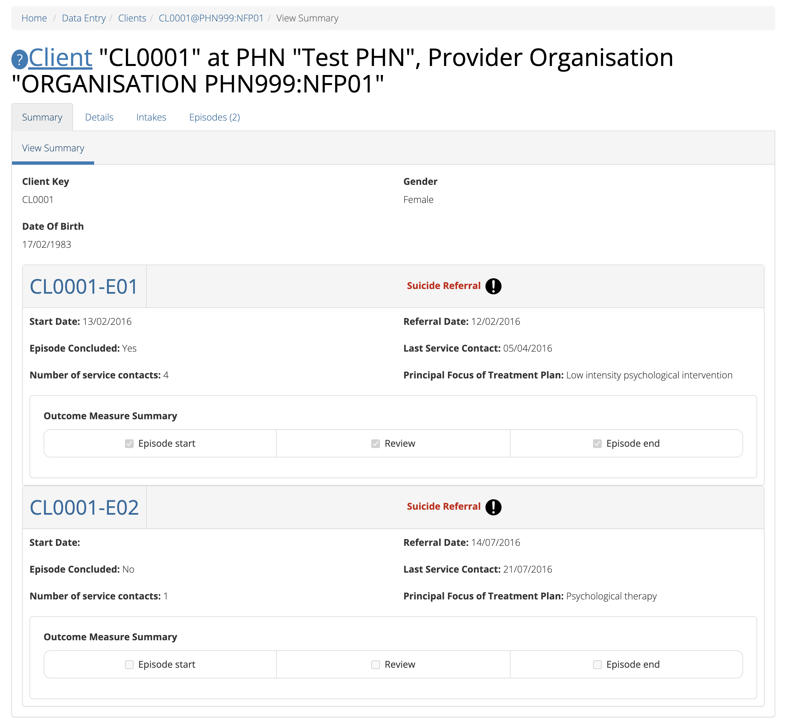

4. Click the **Details** tab for more information about the client

A page will display the client's details as recorded via the `Client Data Elements <https://docs.pmhc-mds.com/en/v1/data-specification/data-model-and-specifications.html#client-data-elements>`_.

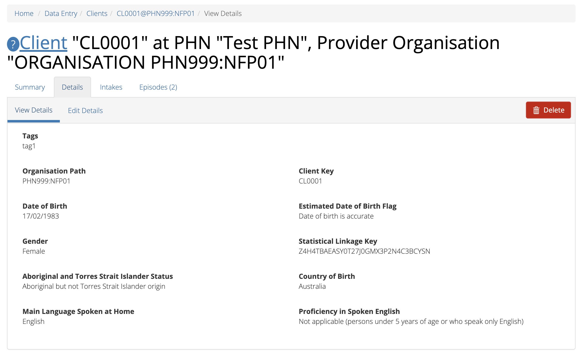

.. _edit-client:

Editing a Client
----------------

You can edit a client's details through the :ref:`search-client`
available on the **Data Entry** tab, by following these steps:

1. Create :ref:`search-client`
2. From the **Client Search Table**, click the **Client Key**
3. Click the **Details** tab, to view client's details
4. Click the **Edit Details** tab
5. Update the client's details. Mandatory fields are marked with an * (Specification `Client Data Elements <https://docs.pmhc-mds.com/en/v1/data-specification/data-model-and-specifications.html#client-data-elements>`_)
6. **Please note:** You can edit the **Client Key** from this screen. See :ref:`edit-client-key`

    .. figure:: screen-shots/client-view-edit.png
       :alt: Client Data Edit Details

7. **Please note:** If you edit the **Date of Birth** or **Gender** you will be
   required to update the **Statistical Linkage Key** field.
   You can choose to **Enter** or **Generate** a client's SLK.
   The SLK is generated on your device, the names used are not stored or
   transmitted over the network.

    .. figure:: screen-shots/client-view-generate-slk-edit.png
       :alt: Client Data Generated Client SLK Edit

8. Click the blue **Save** button. (If you decide not to save changes, you can
   navigate away from this screen)

You will receive confirmation that the client's details have been saved, and it
will now be display the updated details in the **Clients View Details** tab.

        .. figure:: screen-shots/client-data-saved.png
           :alt: Client Data Saved Successfully

If you receive an error message, the data will need to be corrected before the
record is saved and added to the PMHC MDS.
See Validation Rules - `Client <https://docs.pmhc-mds.com/en/v1/data-specification/validation-rules.html#client-current-validations>`_.

.. _edit-client-key:

Editing a Client Key
~~~~~~~~~~~~~~~~~~~~

You can edit a client's identification key through :ref:`edit-client`
available on the **Data Entry** tab, by following these steps:

1. Return to step five when :ref:`edit-client`
2. From the **Client Edit Details** tab, click the **Edit Key** button

       .. figure:: screen-shots/client-view-edit-key.png
          :alt: Client Data Edit Client Key

3. Type in the new client key and click **Next**
4. Double check the new key is correct and click **Save**. (If it is incorrect,
   click back to re-enter the key or click the 'cross' in the top right to
   cancel this key change request)

You will receive confirmation that the client's key has been saved, and the screen
will now be displaying the updated client key details in the **Clients View Details** tab.

       .. figure:: screen-shots/client-view-key-saved.png
          :alt: Client Key Saved Successfully

.. _add-client:

Adding a New Client
-------------------

You can add a client through the :ref:`search-client`
available on the **Data Entry** tab, by following these steps:

1. Create :ref:`search-client`
2. Firstly double check the client is not already added
3. Click the blue **Add New Client** button
4. Choose the **Provider Organisation** from the drop down list
5. Enter the client's details. Mandatory fields are marked with an * (Specification `Client Data Elements <https://docs.pmhc-mds.com/en/v1/data-specification/data-model-and-specifications.html#client-data-elements>`_)
6. **Please note:** With the **Statistical Linkage Key** field you can choose
   to **Enter** or **Generate** a client's SLK.
   The SLK is generated on your device, the names used are not stored or
   transmitted over the network.

    .. figure:: screen-shots/client-view-generate-slk.png
       :alt: Client Data Generate Client SLK

7. Click the blue **Save** button. (If you decide not to add this client, you
   can simply navigate away from this screen)

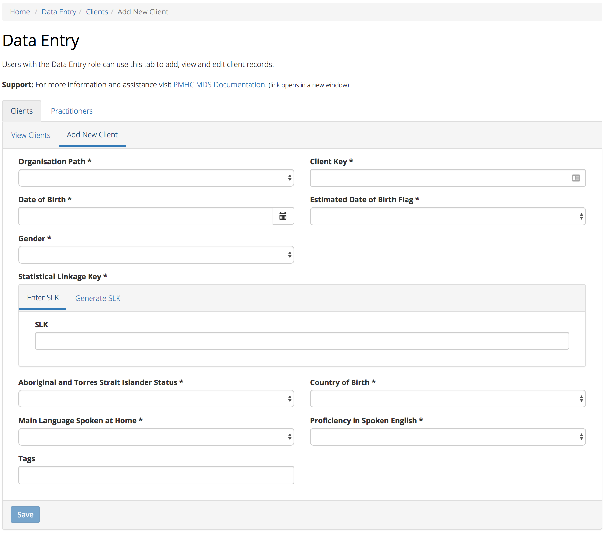

You will receive confirmation that the Client has been saved, and it will
now be displaying the client's saved information in the **Clients View Details** tab.

        .. figure:: screen-shots/client-data-saved.png
           :alt: Client Data Saved Successfully

If you receive an error message, the data will need to be corrected before the
record is saved and added to the PMHC MDS.
See Validation Rules - `Client <https://docs.pmhc-mds.com/en/v1/data-specification/validation-rules.html#client-current-validations>`_.

.. _delete-client:

Deleting a Client
-----------------

You can delete a client through :ref:`view-client-details`
available on the **Data Entry** tab, by following these steps:

1. :ref:`Search<find-client>` for the client
2. From the :ref:`search-client` table, click the **Client Key**
3. Click the **Details** tab, to :ref:`view Client's details<view-client-details>`
4. Click the red **Delete** button
5. You will either be displayed a :ref:`confirm-delete-client` screen or a :ref:`cannot-delete-client` screen

.. _confirm-delete-client:

Confirm Delete
~~~~~~~~~~~~~~

**Please note: Once the client is deleted, you will not be able to recover this client data.**

1. Click the blue **Confirm** button to delete this client.
   (or click the orange **Cancel** button if you decide not to delete this client data)

  .. figure:: screen-shots/client-view-delete-confirm.png
     :alt: Client Data Confirm Delete

After you click **Confirm**, you will receive confirmation that the client has
been deleted, and you will be redirected to the :ref:`search-client`, which
will no longer display the deleted client.

    .. figure:: screen-shots/client-view-delete-successful.png
       :alt: Client Data Delete Successful

.. _cannot-delete-client:

Cannot Delete
~~~~~~~~~~~~~

If the client you are trying to delete has any dependant records, you will not
be able to proceed with deleting this client until all the related records have
been deleted.

1. Click on the link provided to view the Client's Episodes, or click the orange **Dismiss** button

  .. figure:: screen-shots/client-view-delete-cannot.png
     :alt: Client Data Cannot Delete

See :ref:`delete-episode`.

.. _episode-data:

Episodes
^^^^^^^^

.. contents::
   :local:
   :depth: 2

.. _view-episodes:

Viewing a Client's Episodes
---------------------------

You can view a client's episodes through :ref:`view-client-details`
available on the **Data Entry** tab, by following these steps:

1. Once :ref:`view-client-details`
2. From the client's **Summary** tab, you can shortcut straight to an episode by clicking
   the blue **Episode Key** displayed in the snapshot of the five most recent episodes

3. Alternately, if you would like to view all episodes you can click on the
   **Episode** tab. The heading for this tab displays in brackets the total number of episodes recorded
   in the PMHC MDS for this client at Provider Organisations for which you have access.

A table will display all the Client's Episodes at Provider Organisations for which you have access.

.. figure:: screen-shots/client-episodes-summary.png
   :alt: Client Data Summary View

A drop down list is available to view:

* **All Episodes**
* **Currently Open Episodes**
* **Closed Episodes**

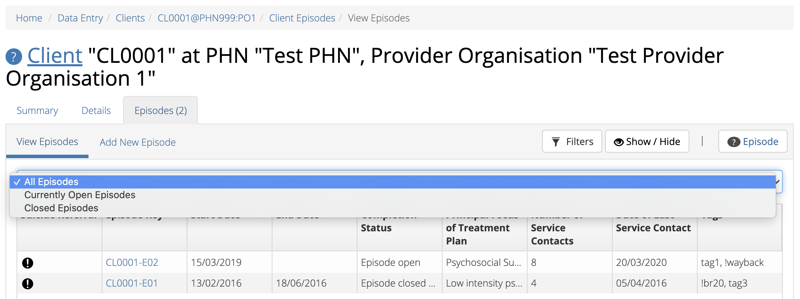

4. To view the client's episode details, click the blue **Episode Key**

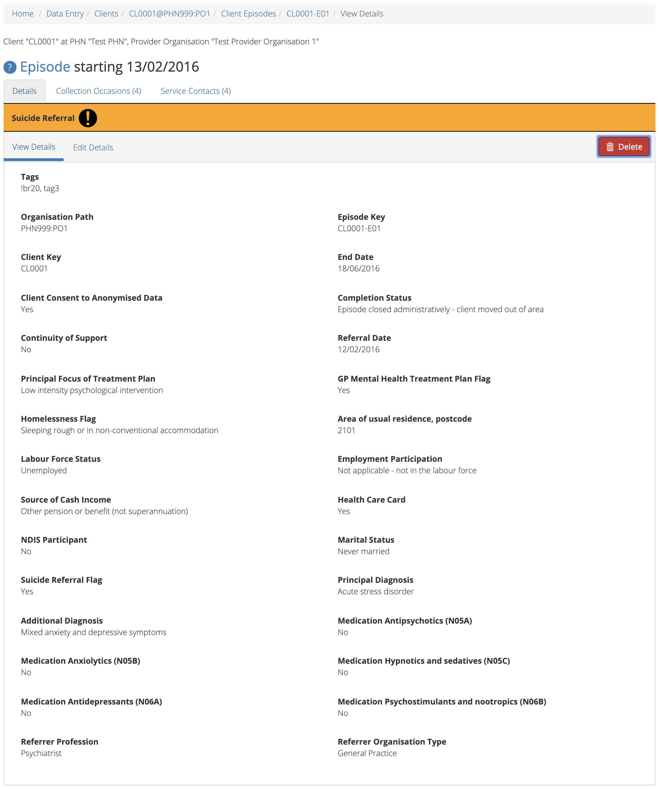

A page will display the client's episode details as recorded via the `Episode Data Elements <https://docs.pmhc-mds.com/en/v1/data-specification/data-model-and-specifications.html#episode-data-elements>`__.

.. _edit-episode:

Editing a Client's Episode data
-------------------------------

You can edit a client's episode details through :ref:`view-client-details`
available on the **Data Entry** tab, by following these steps:

1. Once :ref:`view-episodes`
2. From the client's **Episode** table, click the **Episode Key**
3. Click the **Edit Details** tab
4. Update the client's **Episode** details. Mandatory fields are marked with an *
   (Specification `Episode Data Elements <https://docs.pmhc-mds.com/en/v1/data-specification/data-model-and-specifications.html#episode-data-elements>`__)
5. **Please note:** You can edit the **Episode Key** from this screen. See :ref:`edit-episode-key`

.. note::
   The Department has recently announced the "*Australian Government Mental Health Response to Bushfire Trauma*".
   From January 2020, there is now a reserved **Episode Tag** ``!br20`` that can be easily selected or added to an Episode record if a new or existing client receives any services that meet the reporting requirements.
   While services funded under the response must report in-scope activity using this tag, all PHNs may use this tag.
   For more information please see `Reserved Tags - !br20 <https://docs.pmhc-mds.com/projects/data-specification/en/v2/reserved-tags.html#br20>`_.

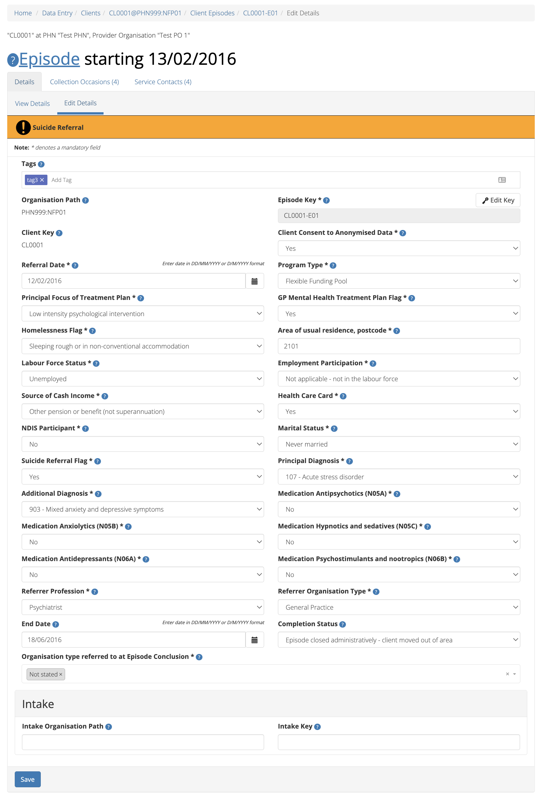

6. Click the blue **Save** button. (If you decide not to save changes, you can
   simply navigate away from this screen)

You will receive confirmation that the client's episode details have been saved,
and it will now be displaying these new details in the episode **View Details** tab.

        .. figure:: screen-shots/client-data-saved.png
           :alt: Client Episode Data Saved Successfully

If you receive an error message, the data will need to be corrected before the
record is saved and added to the PMHC MDS.
See Validation Rules - `Episode <https://docs.pmhc-mds.com/en/v1/data-specification/validation-rules.html#episode-current-validations>`__.

.. _edit-episode-key:

Editing an Episode Key
~~~~~~~~~~~~~~~~~~~~~~

You can edit an episode's identification key through :ref:`view-episodes`
available on the **Data Entry** tab, by following these steps:

1. Return to step five when :ref:`edit-episode`
2. From the Episode **Edit Details** tab, click the **Edit Key** button

       .. figure:: screen-shots/client-episodes-edit-key.png
          :alt: Episode Data Edit Episode Key

3. Type in the new episode key and click **Next**
4. Double check the new key is correct and click **Save**. (If it is incorrect,
   click back to re-enter the key or click the 'cross' in the top right to cancel
   this key change request)

You will receive confirmation that the Episode's key has been saved, and the screen
will now be displaying the updated episode key details in the Episode **View Details** tab.

       .. figure:: screen-shots/client-episodes-edit-key-saved.png
          :alt: Episode Key Saved Successfully

.. _add-episode:

Adding a Client's Episode data
------------------------------

You can add a client's episode data through :ref:`view-client-details`
available on the **Data Entry** tab, by following these steps:

1. Once :ref:`view-episodes`
2. Check to ensure the client does not have any open episodes already showing.
   (A client can only have one open episode at a provider organisation. `Episode <https://docs.pmhc-mds.com/en/v1/data-specification/data-model-and-specifications.html#key-concepts-episode>`__)
3. Click the **Add Episode** tab
4. Enter the client's episode details. Mandatory fields are marked with an *
   (Specification `Episode Data Elements <https://docs.pmhc-mds.com/en/v1/data-specification/data-model-and-specifications.html#episode-data-elements>`__)

.. note::
   The Department has recently announced the "*Australian Government Mental Health Response to Bushfire Trauma*".
   From January 2020, there is now a reserved **Episode Tag** ``!br20`` that can be easily selected or added to an Episode record if a new or existing client receives any services that meet the reporting requirements.
   While services funded under the response must report in-scope activity using this tag, all PHNs may use this tag.
   For more information please see `Reserved Tags - !br20 <https://docs.pmhc-mds.com/projects/data-specification/en/v2/reserved-tags.html#br20>`_.

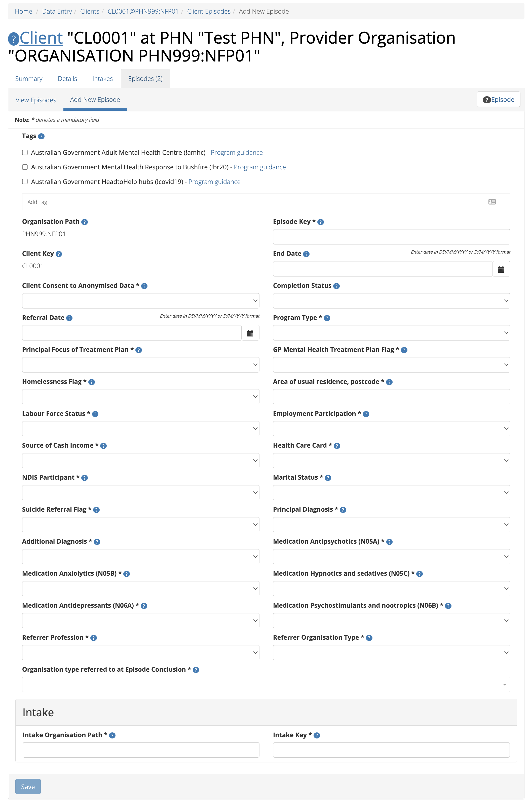

5. Click the blue **Save** button. (If you decide not to add this client's
   episode, you can simply navigate away from this screen)

You will receive confirmation that the client's episode details have been added,
and it will now be displaying these new details in the episode **View Details** tab.

        .. figure:: screen-shots/client-data-saved.png
           :alt: Client Episode Data Saved Successfully

If you receive an error message, the data will need to be corrected before the
record is saved and added to the PMHC MDS.
See Validation Rules - `Episode <https://docs.pmhc-mds.com/en/v1/data-specification/validation-rules.html#episode-current-validations>`__.

.. _closing-episode:

Closing a Client's Episode
--------------------------

You can close a client's episode details through :ref:`view-client-details`
available on the **Data Entry** tab, by following these steps:

1. Once :ref:`view-episodes`
2. From the client's **Episode** table, click the **Episode Key** of the open episode
3. Click the **Edit Details** tab
4. Update the client's episode details, by entering an **End Date** and **Completion Status** (Specification `Episode Data Elements <https://docs.pmhc-mds.com/en/v1/data-specification/data-model-and-specifications.html#episode-data-elements>`__)

5. Click the blue **Save** button. (If you decide not to save changes, you can
   simply navigate away from this screen)

You will receive confirmation that the client's episode details have been saved,
and it will now be displaying these new details in the episode **View Details** tab.

        .. figure:: screen-shots/client-data-saved.png
           :alt: Client Episode Data Saved Successfully

If you receive an error message, the data will need to be corrected before the
record is saved and added to the PMHC MDS.
See Validation Rules - `Episode <https://docs.pmhc-mds.com/en/v1/data-specification/validation-rules.html#episode-current-validations>`__.

.. _delete-episode:

Deleting an Episode
-------------------

You can delete a client's episode through :ref:`view-episodes`
available on the **Data Entry** tab, by following these steps:

1. :ref:`Search<find-client>` for the client
2. From the :ref:`search-client` table, click the **Client Key**
3. Click **Episodes** tab, to :ref:`view Client's Episodes <view-episodes>`
4. From the :ref:`View Episodes <view-episodes>` table, click the **Episode Key**
5. Click the red **Delete** button
6. You will either be displayed a :ref:`confirm-delete-episode` screen or a :ref:`cannot-delete-episode` screen

.. _confirm-delete-episode:

Confirm Delete
~~~~~~~~~~~~~~

**Please note: Once the episode is deleted, you will not be able to recover this episode data.**

1. Click the blue **Confirm** button to delete this episode. (or click the
   orange **Cancel** button if you decide not to delete this episode data)

  .. figure:: screen-shots/client-episodes-delete-confirm.png
     :alt: Client Episode Data Confirm Delete

After you click **Confirm**, you will receive confirmation that the episode has
been deleted, and you will be redirected to :ref:`View Episodes <view-episodes>` where the
episode will no longer be displayed.

    .. figure:: screen-shots/client-episodes-delete-successful.png
       :alt: Client Episode Data Delete Successful

.. _cannot-delete-episode:

Cannot Delete
~~~~~~~~~~~~~

If the episode you are trying to delete has any dependant records, you will not
be able to proceed with deleting this episode until all the related records have
been deleted.

1. You can click on the link provided to view the client's service contacts
   and collection occasions, or click the orange **Dismiss** button

  .. figure:: screen-shots/client-episodes-delete-cannot.png
     :alt: Client Episode Data Cannot Delete

See :ref:`delete-service-contact` and :ref:`delete-collection-occasion`.

.. _service-contact-data:

Service Contacts
^^^^^^^^^^^^^^^^

.. contents::
   :local:
   :depth: 2

.. _view-service-contact:

Viewing a Client's Service Contacts for an Episode
--------------------------------------------------

You can view a client's service contacts through :ref:`view-episodes`
available on the **Data Entry** tab, by following these steps:

1. Navigate to :ref:`view-episodes`
2. From the client's **Episode Details** tab, click the **Service Contacts** tab.
   The heading for this tab displays in brackets the total number of service contacts recorded
   in the PMHC MDS for this episode
3. A table will display all the Service Contacts linked to this client's Episode

   .. figure:: screen-shots/client-service-contacts-view.png
     :alt: Client Episode Service Contacts Table View

4. To view the Service Contact's details, click the blue **Service Contact Key**

   .. figure:: screen-shots/client-service-contacts-details.png
     :alt: Client Episode Service Contacts Details View

A page will display the Service Contacts details as recorded via the `Service Contact Data Elements <http://docs.pmhc-mds.com/en/v1/data-specification/data-model-and-specifications.html#service-contact-data-elements>`_.

.. _edit-service-contact:

Editing a Client's Service Contacts for an Episode
--------------------------------------------------

You can edit a client's service contacts through :ref:`view-episodes`
available on the **Data Entry** tab, by following these steps:

1. Once :ref:`view-service-contact`
2. From the **Service Contacts** table, click the **Service Contact Key**
3. Click the **Edit Service Contact** tab
4. Update the client's service contact details for that service contact.
   Mandatory fields are marked with an * (Specification `Service Contact Data Elements <http://docs.pmhc-mds.com/en/v1/data-specification/data-model-and-specifications.html#service-contact-data-elements>`_)
5. **Please note:** You can edit the Service Contact Key from this screen. See :ref:`edit-service-contact-key`

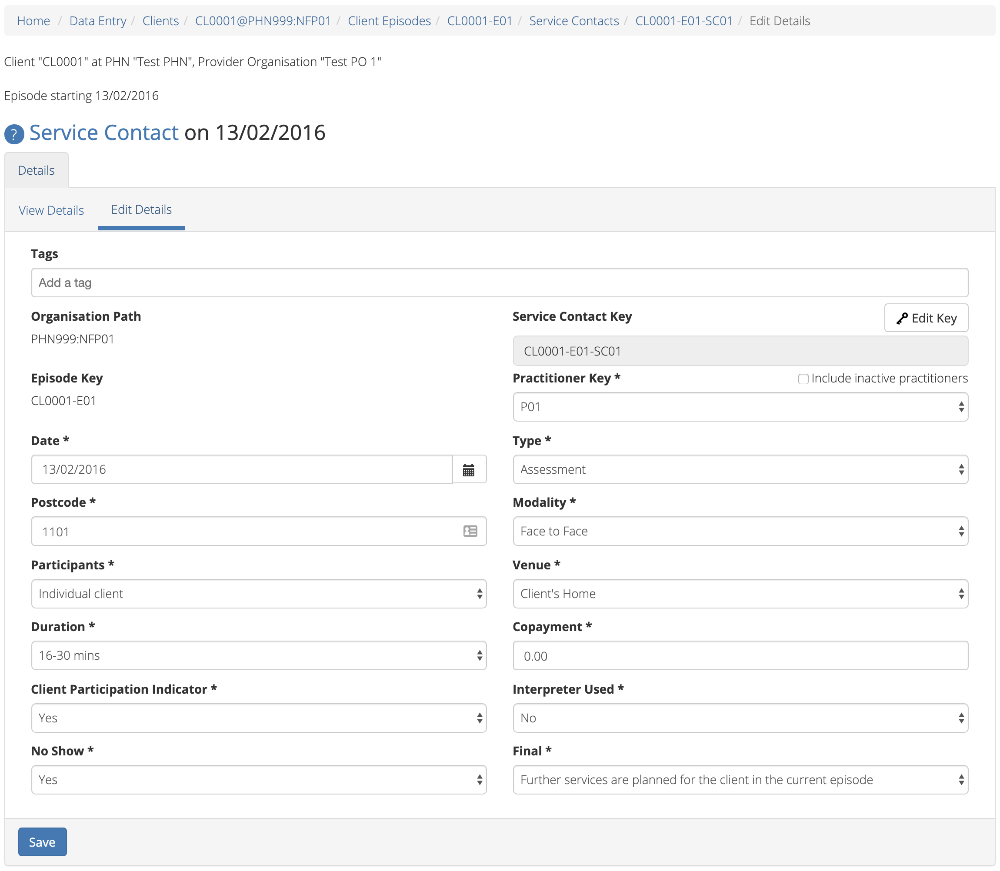

6. Click the blue **Save** button. (If you decide not to save changes, you can
   simply navigate away from this screen)

You will receive confirmation that the client's service contact details have been saved,
and it will now be displaying these new details in the **View Service Contact Details** tab.

        .. figure:: screen-shots/client-data-saved.png
           :alt: Client Data Saved Successfully

If you receive an error message, the data will need to be corrected before the
record is saved and added to the PMHC MDS.
See Validation Rules - `Service Contact <http://docs.pmhc-mds.com/en/v1/data-specification/validation-rules.html#service-contact-current-validations>`_.

.. _edit-service-contact-key:

Editing a Service Contact Key
~~~~~~~~~~~~~~~~~~~~~~~~~~~~~

You can edit a service contact's identification key through :ref:`view-episodes`
available on the **Data Entry** tab, by following these steps:

1. In step five when :ref:`edit-service-contact`
2. From the **Service Contact Edit Details** tab, click the **Edit Key** button

       .. figure:: screen-shots/client-service-contacts-edit-key.png
          :alt: Client Data Edit Service Contact Key

3. Type in the new service contact key and click **Next**
4. Ensure the new key is correct and click save. (If it is incorrect, click
   back to re-enter the key or click the 'cross' in the top right to cancel
   this key change request)

You will receive confirmation that the Service Contact's key has been saved, and the screen
will now be displaying the updated service contact key details in the
service contact's **View Details** tab.

       .. figure:: screen-shots/client-service-contacts-edit-key-saved.png
          :alt: Service Contact Key Saved Successfully

.. _add-service-contact:

Adding a Client's Service Contact data
--------------------------------------

You can add a client's service contacts through the :ref:`view-episodes`
available on the **Data Entry** tab, by following these steps:

1. Navigate to  :ref:`view-service-contact`
2. Ensure the service contact is not already showing
3. Click the **Add Service Contact** tab
4. Enter the client's service contact details for that episode.
   Mandatory fields are marked with an * (Specification `Service Contact Data Elements <http://docs.pmhc-mds.com/en/v1/data-specification/data-model-and-specifications.html#service-contact-data-elements>`_)

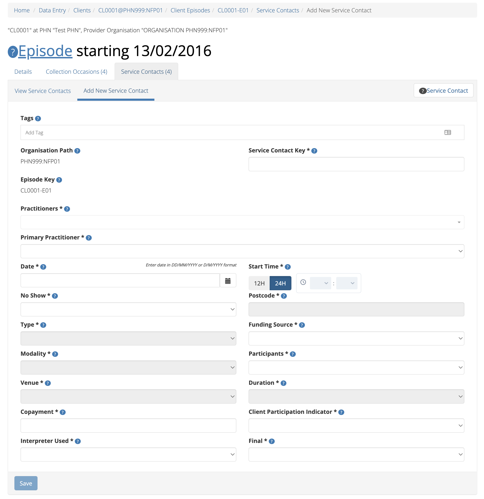

5. Click the blue **Save** button. (If you decide not to add this client's
   episode, you can simply navigate away from this screen)

You will receive confirmation that the client's service contact details have been added,
and it will now be displaying these new details in the **View Service Contact Details** tab.

        .. figure:: screen-shots/client-data-saved.png
           :alt: Client Data Saved Successfully

If you receive an error message, the data will need to be corrected before the
record is saved and added to the PMHC MDS.
See Validation Rules - `Service Contact <http://docs.pmhc-mds.com/en/v1/data-specification/validation-rules.html#service-contact-current-validations>`_.

.. _duplicate-service-contact:

Duplicating a Client's existing Service Contact data
----------------------------------------------------

To improve the speed of data entry, users can can now duplicate a previously
recorded service contact. This process creates a new record with a copy of the
fields recorded in the existing service contact record you have duplicated.

You can duplicate a client's service contacts through :ref:`view-service-contact`
available on the **Data Entry** tab, by following these steps:

1. Navigate to :ref:`view-service-contact`
2. Click the **Duplicate this Service Contact** icon next to a record, or
   open the service contact record and click the **Duplicate** button
3. Complete the mandatory fields marked with an * and review the pre-filled values
   (Specification `Service Contact Data Elements <http://docs.pmhc-mds.com/en/v1/data-specification/data-model-and-specifications.html#service-contact-data-elements>`_)

   .. figure:: screen-shots/client-service-contacts-duplicate.png
     :alt: Client Data Add Service Contact

4. Click the blue **Save** button. (If you decide not to duplicate this
   client's service contact, you can simply navigate away from this screen)

You will receive confirmation that the client's service contact details have been added,
and it will now be displaying these new details in the **View Service Contact Details** tab.

        .. figure:: screen-shots/client-data-saved.png
           :alt: Client Data Saved Successfully

If you receive an error message, the data will need to be corrected before the
record is saved and added to the PMHC MDS.
See Validation Rules - `Service Contact <http://docs.pmhc-mds.com/en/v1/data-specification/validation-rules.html#service-contact-current-validations>`_.

.. _delete-service-contact:

Deleting a Service Contact
--------------------------

You can delete a client's service contacts through ':ref:`view-service-contact`'
available on the **Data Entry** tab, by following these steps:

1. :ref:`Search<find-client>` for the client
2. From the :ref:`search-client` table, click the **Client Key**
3. Click the **Episodes** tab, to :ref:`view Client's Episodes <view-episodes>`
4. From the :ref:`View Episodes <view-episodes>` table, click the **Episode Key**
5. Click the **Service Contacts** tab, to :ref:`View Client's Service Contacts <view-service-contact>`
6. From the :ref:`View service contact <view-service-contact>` table, click the **Service Contact Key**
7. Click the red **Delete** button
8. You will be prompted to confirm the deletion

  **Please note: You are not able to recover the data for a deleted service contact.**

9. Click the blue **Confirm** button to delete this service contact. (or click
   the orange **Cancel** button if you decide not to delete this service contact data)

  .. figure:: screen-shots/client-service-contacts-delete-confirm.png
     :alt: Client Service Contact Data Confirm Delete

After you click **Confirm**, you will receive confirmation that the service contact has
been deleted, and you will be redirected to the :ref:`View Service Contacts <view-service-contact>` where the
service contact will no longer be displayed.

    .. figure:: screen-shots/client-service-contacts-delete-successful.png
       :alt: Client Service Contact Data Delete Successful

.. _outcome-collection-occasion-data:

Outcome Collection Occasions
^^^^^^^^^^^^^^^^^^^^^^^^^^^^

.. contents::
   :local:
   :depth: 2

.. _view-collection-occasion:

Viewing a Client's Outcome Collection Occasions for an Episode
--------------------------------------------------------------

You can view a client's outcome collection occasions through :ref:`view-episodes`
available on the **Data Entry** tab, by following these steps:

1. When :ref:`Viewing the Client's Episode <view-episodes>`
2. Click the **Episode Collection Occasions** tab
   This tab displays in brackets the total number of collection occasions recorded
   in the PMHC MDS for this episode.

A table will display all the collection occasions linked to this client's episode.

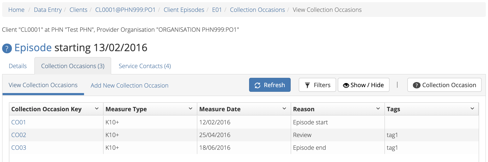

3. To view the collection occasion's details, click the blue **Collection Occasion Key**

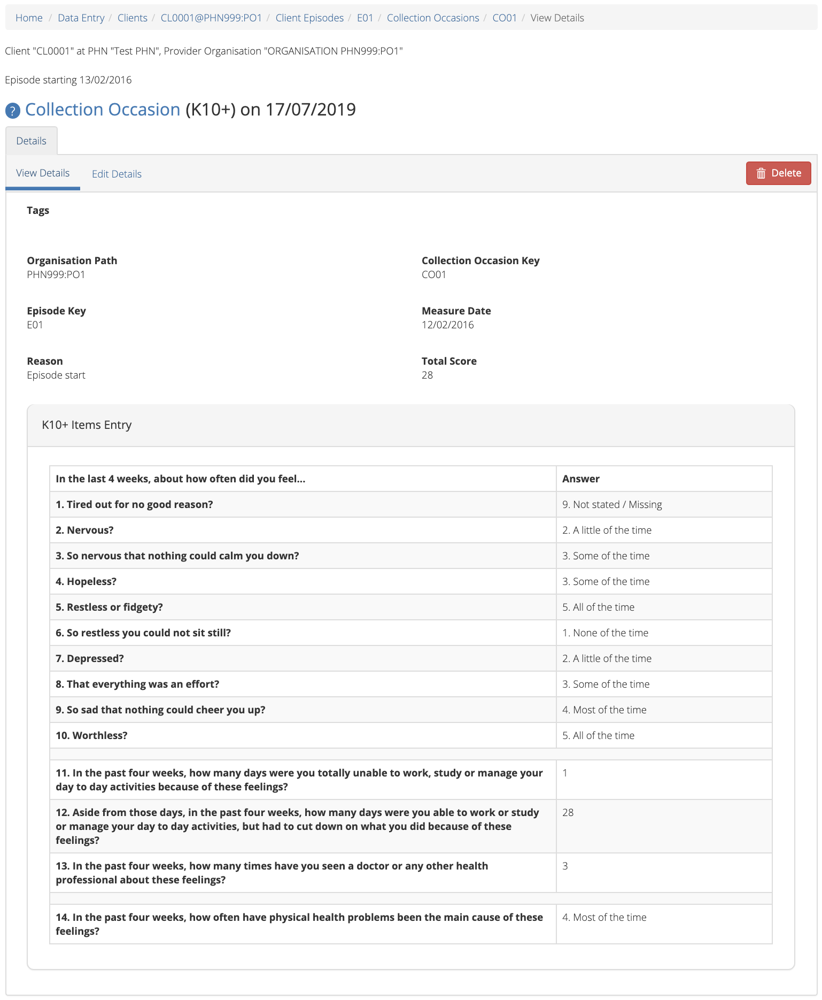

A page will display the collection occasion's details as recorded via the
`Outcome Collection Occasion Data Elements <http://docs.pmhc-mds.com/en/v1/data-specification/data-model-and-specifications.html#outcome-collection-occasion-data-elements>`_.

.. _edit-collection-occasion:

Editing a Client's Outcome Collection Occasions for an Episode
--------------------------------------------------------------

You can edit a client's outcome collection occasions through :ref:`view-collection-occasion`
available on the **Data Entry** tab, by following these steps:

1. Navigate to :ref:`view-collection-occasion`
2. Click the **Collection Occasion Key**
3. Click **Edit Details** tab
4. Update the client's collection occasion's details. Mandatory fields are marked with an *
   (Specification `Outcome Collection Occasion Data Elements <http://docs.pmhc-mds.com/en/v1/data-specification/data-model-and-specifications.html#outcome-collection-occasion-data-elements>`_)
5. **Please note:** You can edit the **Collection Occasion Key** from this screen. See :ref:`edit-collection-occasion-key`

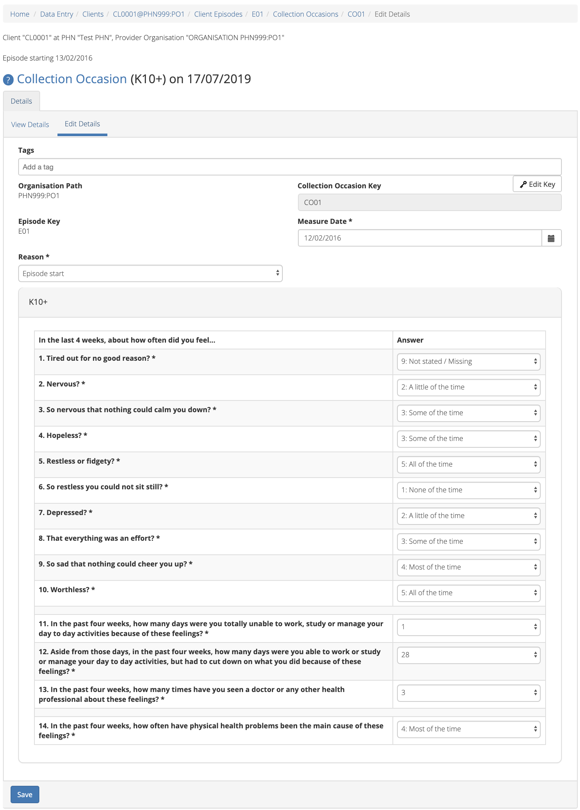

6. Click the blue **Save** button. (If you decide not to save changes, you can
   navigate away from this screen)

You will receive confirmation that the client's collection occasion's details have been saved,
and it will now be displaying these new details in the **View Collection Occasion Details** tab.

        .. figure:: screen-shots/client-data-saved.png
           :alt: Client Data Saved Successfully

If you receive an error message, the data will need to be corrected before the
record is saved and added to the PMHC MDS.
See Validation Rules for: `Outcome Collection Occasion Validations <https://docs.pmhc-mds.com/projects/data-specification/en/v2/validation-rules.html#current-validations>`_

.. _edit-collection-occasion-key:

Editing a Collection Occasion Key
~~~~~~~~~~~~~~~~~~~~~~~~~~~~~~~~~

You can edit a collection occasion's identification key through :ref:`view-episodes`
available on the **Data Entry** tab, by following these steps:

1. In step five when :ref:`edit-collection-occasion`
2. From the **Collection Occasion Edit Details** tab, click the **Edit Key** button

       .. figure:: screen-shots/client-collection-occasions-edit-key.png
          :alt: Client Data Edit Collection Occasion Key

3. Type in the new collection occasion key and click **Next**
4. Ensure the new key is correct and click **Save**. (If it is incorrect, click
   back to re-enter the key or click the 'cross' in the top right to cancel
   this key change request)

You will receive confirmation that the collection occasion's key has been saved, and the screen
will now be displaying the updated collection occasion key details in the **Collection Occasion View Details** tab.

       .. figure:: screen-shots/client-collection-occasions-edit-key-saved.png
          :alt: Collection Occasion Key Saved Successfully

.. _add-collection-occasion:

Adding a Client's Outcome Collection Occasion data
--------------------------------------------------

You can add a client's outcome collection occasions through :ref:`view-collection-occasion`
available on the **Data Entry** tab, by following these steps:

1. Navigate to :ref:`view-collection-occasion`
2. Check that the collection occasion is not already showing
3. Click the **Add New Collection Occasion** tab
4. Enter the client's collection occasion details for that episode.
   Mandatory fields are marked with an * (Specification `Outcome Collection Occasion Data Elements <http://docs.pmhc-mds.com/en/v1/data-specification/data-model-and-specifications.html#outcome-collection-occasion-data-elements>`_)

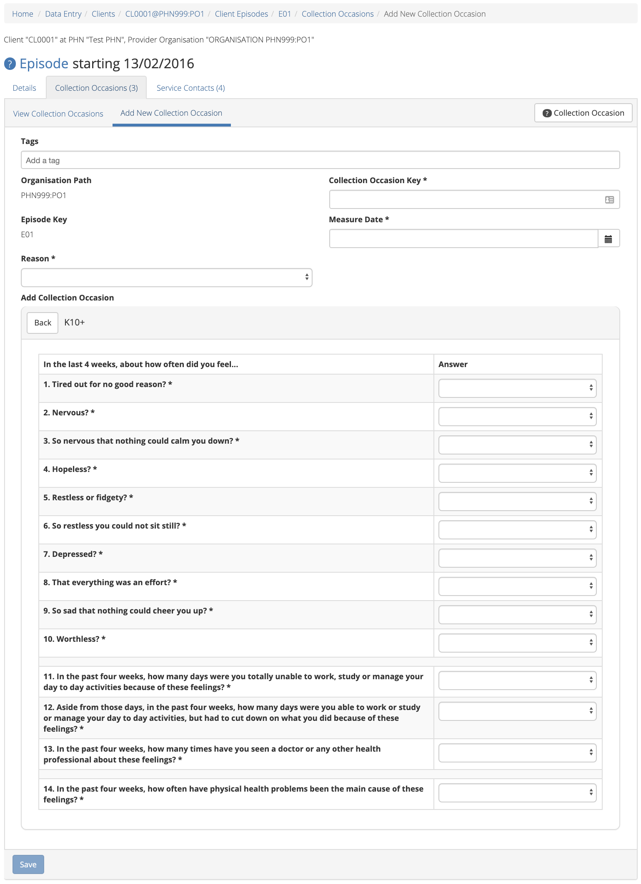

5. Click the blue **Save** button. (If you decide not to add this collection
   occasion, you can navigate away from this screen)

You will receive confirmation that the client's collection occasion's details have been added,
and it will now be displaying these new details in the **View Collection Occasion Details** tab.

        .. figure:: screen-shots/client-data-saved.png
           :alt: Client Data Saved Successfully

If you receive an error message, the data will need to be corrected before the
record is saved and added to the PMHC MDS.
See Validation Rules for: `Outcome Collection Occasion Validations <https://docs.pmhc-mds.com/projects/data-specification/en/v2/validation-rules.html#current-validations>`_

.. _delete-collection-occasion:

Deleting an Outcome Collection Occasion
---------------------------------------

You can delete a client's outcome collection occasion through :ref:`view-collection-occasion`
available on the **Data Entry** tab, by following these steps:

1. :ref:`Search<find-client>` for the client
2. From the :ref:`search-client` table, click the **Client Key**
3. Click the **Episodes** tab, to :ref:`view Client's Episodes <view-episodes>`
4. From the :ref:`View Episodes <view-episodes>` table, click the **Episode Key**
5. Click the **Collection Occasions** tab, to :ref:`View Collection Occasions <view-collection-occasion>`
6. From the :ref:`View Collection Occasions <view-collection-occasion>` table, click the **Collection Occasion Key**
7. Click the red **Delete** button
8. You will be prompted to confirm the deletion
9. **Please note: Data can not be recovered for deleted collection occasions**
10. Click the blue **Confirm** button to delete this collection occasion. (or
    click the orange **Cancel** button if you decide not to delete this collection occasion data)

  .. figure:: screen-shots/client-collection-occasions-delete-confirm.png
     :alt: Client Collection Occasion Data Confirm Delete

After you click **Confirm**, you will receive confirmation that the collection occasion has
been deleted, and you will be redirected to the :ref:`View Collection Occasions <view-collection-occasion>` where the
collection occasion will no longer be displayed.

    .. figure:: screen-shots/client-collection-occasions-delete-successful.png
       :alt: Client Collection Occasion Data Delete Successful

.. _measure-data:

Collection Occasion Measures
^^^^^^^^^^^^^^^^^^^^^^^^^^^^

.. contents::
   :local:
   :depth: 2

.. _view-collection-occasion-measure:

Viewing a Client's Collection Occasion Measures for an Episode
--------------------------------------------------------------

You can view a Client's Measures added to a Collection Occasion through :ref:`view-collection-occasion`
available on the Data Entry tab, by following these steps:

1. Once :ref:`Viewing the Collection Occasion <view-collection-occasion>`.
2. Scroll down to the Measures

A table will display all the Measures linked to this Client's Episode Collection Occasion.

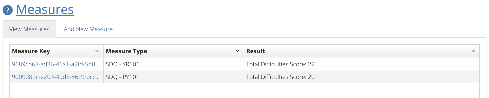

3. To view the Measure details, click the Blue Measure Key.

.. figure:: screen-shots/client-collection-occasions-measures-details.png
   :alt: Client Episode Collection Occasions Details View

A page will display the Measure details as recorded via the `Outcome Collection Occasion Data Elements <http://docs.pmhc-mds.com/en/v1/data-specification/data-model-and-specifications.html#outcome-collection-occasion-data-elements>`_.

  * See `K10+ Measure data specifications <https://docs.pmhc-mds.com/projects/data-specification/en/v2/data-model-and-specifications.html#k10>`_.
  * See `K5 Measure data specifications <https://docs.pmhc-mds.com/projects/data-specification/en/v2/data-model-and-specifications.html#k5>`_.
  * See `SDQ Measure data specifications <https://docs.pmhc-mds.com/projects/data-specification/en/v2/data-model-and-specifications.html#sdq>`_.

.. _add-collection-occasion-measure:

Adding an Client's Collection Occasion Measures data
----------------------------------------------------

You can add a Client's Measure for a Collection Occasion through :ref:`view-collection-occasion`
available on the Data Entry tab, by following these steps:

1. Once :ref:`view-collection-occasion`.
2. Firstly double check the measure is not already showing.
3. Click the Add New Measure tab.

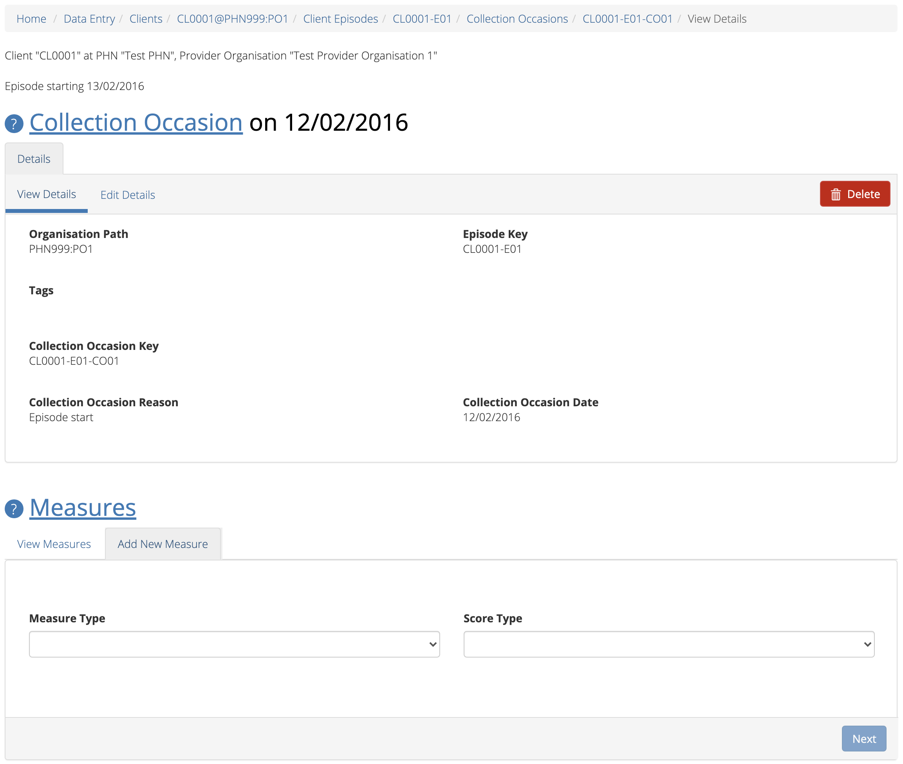

4. Select the Collection Occasion Measure type.

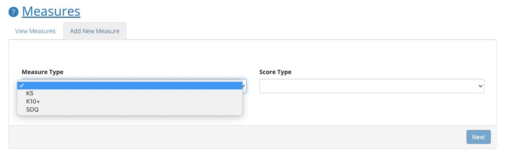

5. Choose the Score Type, if it isn't already pre-filled.
6. Click the blue **Next** button.
7. Enter the Client's Measure details for the Collection Occasion. Mandatory fields are marked with an * .

  * See `K10+ Measure data specifications <https://docs.pmhc-mds.com/projects/data-specification/en/v2/data-model-and-specifications.html#k10>`_.
  * See `K5 Measure data specifications <https://docs.pmhc-mds.com/projects/data-specification/en/v2/data-model-and-specifications.html#k5>`_.
  * See `SDQ Measure data specifications <https://docs.pmhc-mds.com/projects/data-specification/en/v2/data-model-and-specifications.html#sdq>`_.

6. Click the blue **Save** button. (If you decide not to add this client's measure, you can simply navigate away from this screen)

You will receive confirmation that the Client's Measure details have been added,
and it will now be displaying these new details in the View Measure tab.

        .. figure:: screen-shots/client-collection-occasions-measures-saved-add.png
           :alt: Client Data Saved Successfully

If you receive an error message, the data will need to be corrected before the
record is saved and added to the PMHC MDS.
See Validation Rules for: `K10+ <http://docs.pmhc-mds.com/en/v1/data-specification/validation-rules.html#k10p-current-validations>`_ `K5 <http://docs.pmhc-mds.com/en/v1/data-specification/validation-rules.html#k5-current-validations>`_ `SDQ <http://docs.pmhc-mds.com/en/v1/data-specification/validation-rules.html#sdq-current-validations>`_.

.. _edit-collection-occasion-measure:

Editing a Client's Measures for a Collection Occasion
-----------------------------------------------------

You can edit a Client's Measure for a Collection Occasion through :ref:`view-collection-occasion`
available on the Data Entry tab, by following these steps:

1. Once :ref:`view-collection-occasion`.
2. Scroll down to the Measures
3. Click the Blue Measure Key.
4. Click Edit Measure
5. Update the Client's Measure details. Mandatory fields are marked with an * .

  *Please note: You can edit the Measure Key from this screen. See* :ref:`edit-collection-occasion-measure-key`.

    .. figure:: screen-shots/client-collection-occasions-measures-edit.png
       :alt: Client Collection Occasions Edit Details

6. Click the blue **Save** button. (If you decide not to save changes, you can simply navigate away from this screen)

You will receive confirmation that the Client's Collection Occasions details have been saved,
and it will now be displaying these new details in the View Collection Occasion Details tab.

        .. figure:: screen-shots/client-collection-occasions-measures-saved-edit.png
           :alt: Client Data Saved Successfully

If you receive an error message, the data will need to be corrected before the
record is saved and added to the PMHC MDS.
See Validation Rules for: `K10+ <http://docs.pmhc-mds.com/en/v1/data-specification/validation-rules.html#k10p-current-validations>`_ `K5 <http://docs.pmhc-mds.com/en/v1/data-specification/validation-rules.html#k5-current-validations>`_ `SDQ <http://docs.pmhc-mds.com/en/v1/data-specification/validation-rules.html#sdq-current-validations>`_.

.. _edit-collection-occasion-measure-key:

Editing a Measure Key
~~~~~~~~~~~~~~~~~~~~~

You can edit an measure's identification key through :ref:`view-collection-occasion`
available on the Data Entry tab, by following these steps:

1. In step four when :ref:`edit-collection-occasion-measure`.
2. From the Edit Measure details tab, click the **Edit Key** button.

       .. figure:: screen-shots/client-collection-occasions-measures-edit-key.png
          :alt: Client Data Edit Collection Occasion Measure Key

3. Type in the new measure key and click 'Next'.
4. Double check the new key is correct and click save. (If it is incorrect, click back to re-enter the key or click the 'cross' in the top right to cancel this key change request)

You will receive confirmation that the Measure's key has been saved, and the screen
will now be displaying the updated measure key details in the View Measure details tab.

       .. figure:: screen-shots/client-collection-occasions-measures-edit-key-saved.png
          :alt: Collection Occasion Key Saved Successfully

.. _delete-collection-occasion-measure:

Deleting a Measure from a Collection Occasion
---------------------------------------------

You can delete a Client's Measure from a Collection Occasion through ':ref:`view-collection-occasion-measure`'
available on the Data Entry tab, by following these steps:

1. Once :ref:`view-collection-occasion`.
2. Scroll down to the Measures
3. Click the Blue Measure Key.
4. Click Edit Measure
5. Click the red **Delete** button.
6. You will be displayed a 'Confirm Deletion' screen.

  **Please note: Once the measure is deleted, you will not be able to recover this measure data.**

7. Click the blue **Confirm** button to delete this measure. (or click the orange **Cancel** button if you decide not to delete this measure data)

  .. figure:: screen-shots/client-collection-occasions-measures-delete-confirm.png
     :alt: Client Measure Data Confirm Delete

After you click 'Confirm', you will receive confirmation that the measure has
been deleted, and you will be redirected to the :ref:`View Measures <view-collection-occasion-measure>` where the
measure will no longer be displayed.

.. _practitioner:

Practitioners
^^^^^^^^^^^^^

.. contents::
   :local:
   :depth: 2

.. _find-practitioner:

Finding a Practitioner
----------------------

You can search for practitioners assigned to an organisation through the
**Data Entry** tab, by following these steps:

1. Click the **Practitioners** tab

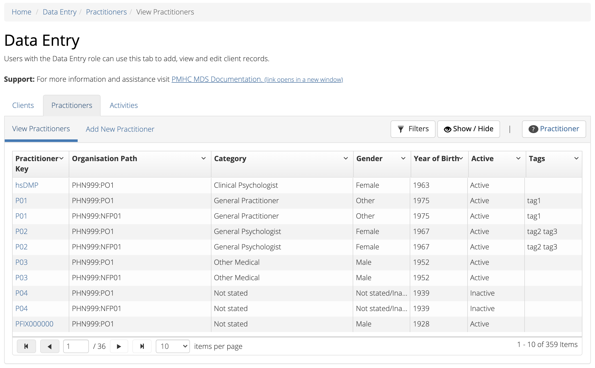

.. _view-practitioner:

Viewing a Practitioner
----------------------

You can view a practitioner's details through :ref:`find-practitioner`
on the **Data Entry** tab, by following these steps:

1. Click the :ref:`Practitioners <find-practitioner>` tab
2. Click the practitioner's key in blue displayed within the table

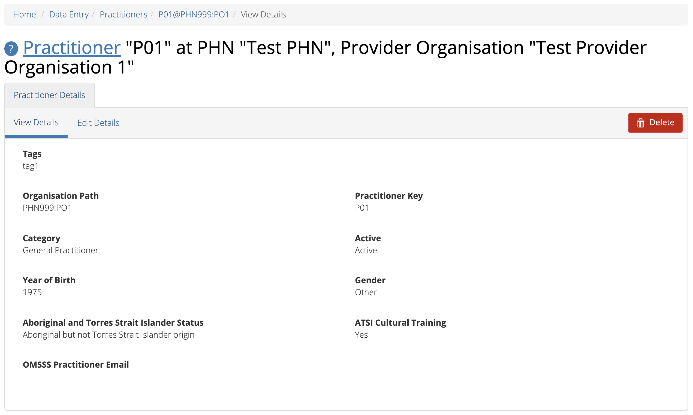

**Please note:** You can also view a practitioner's details through the **Client Data** tab.
See :ref:`view-practitioner-details`

.. _view-practitioner-details:

Viewing a Practitioner Providing Client Services
------------------------------------------------

You can view a practitioner's details through :ref:`view-service-contact`
on the **Data Entry** tab, by following these steps:

1. Navigate to :ref:`view-service-contact`
2. From the **View Details** tab, click the **Practitioner Key**

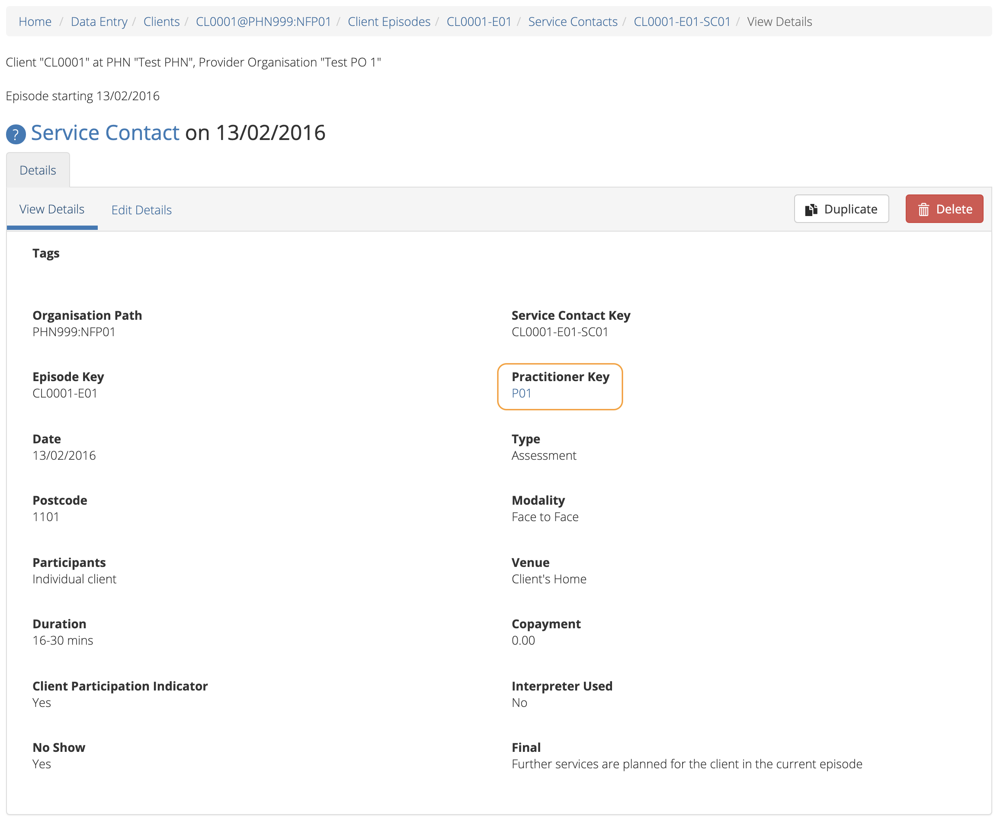

A page will display the practitioner's details as recorded via
the `Practitioner Data Elements <http://docs.pmhc-mds.com/en/v1/data-specification/data-model-and-specifications.html#practitioner-data-elements>`_.

.. _edit-practitioner:

Editing a Practitioner
----------------------

You can view a practitioner's details through :ref:`find-practitioner`
on the **Data Entry** tab, by following these steps:

1. Click the :ref:`Practitioners <find-practitioner>` tab
2. Click the practitioner's key in blue displayed within the table
3. From the **View Practitioner Details** tab, click the **Edit Details** tab
4. Update the practitioner's details. Mandatory fields are marked with an *
5. **Please note:** You can edit the **Practitioner Key** from this screen. See :ref:`edit-practitioner-key`

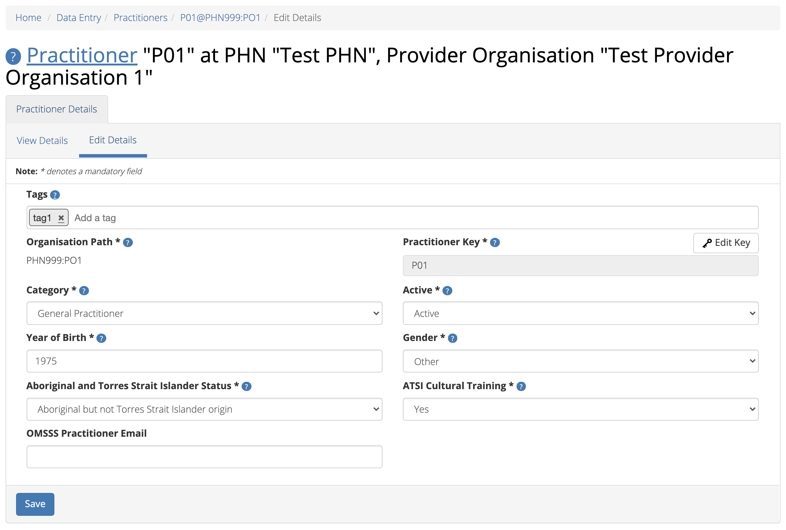

6. Click the blue **Save** button. (If you decide not to save changes, you can navigate away from this screen)

You will receive confirmation that the practitioner's details have been added,
and it will now be displaying these new details in the **View Practitioner Details** tab.

        .. figure:: screen-shots/client-data-saved.png
           :alt: Client Data Saved Successfully

If you receive an error message, the data will need to be corrected before the
record is saved and added to the PMHC MDS.
See Validation Rules - `Practitioner <http://docs.pmhc-mds.com/en/v1/data-specification/validation-rules.html#practitioner-current-validations>`__.

.. _edit-practitioner-key:

Editing a Practitioner Key
~~~~~~~~~~~~~~~~~~~~~~~~~~

You can edit a practitioner's identification key through :ref:`edit-practitioner`
available on the **Data Entry** tab, by following these steps:

1. In step five, when :ref:`edit-practitioner`
2. From the **Practitioner Edit Details** tab, click the **Edit Key** button

       .. figure:: screen-shots/practitioner-view-edit-key.png
          :alt: Practitioner Data Edit Practitioner Key

3. Type in the new practitioner key and click **Next**
4. Ensure the new key is correct and click **Save**. If it is incorrect, click
   back to re-enter the key or click the 'cross' in the top right to cancel this key change request.

You will receive confirmation that the **Practitioners Key** has been saved, and the screen
will now be displaying the updated practitioner key details in the **Practitioner View Details** tab.

       .. figure:: screen-shots/practitioner-view-key-saved.png
          :alt: Practitioner Key Saved Successfully

.. _add-practitioner:

Adding a Practitioner
----------------------

You can view a practitioner's details through :ref:`find-practitioner`
on the **Data Entry** tab, by following these steps:

1. Click the :ref:`Practitioners <find-practitioner>` tab
2. Click the **Add New Practitioner** tab
3. Enter the practitioner's details. Mandatory fields are marked with an *

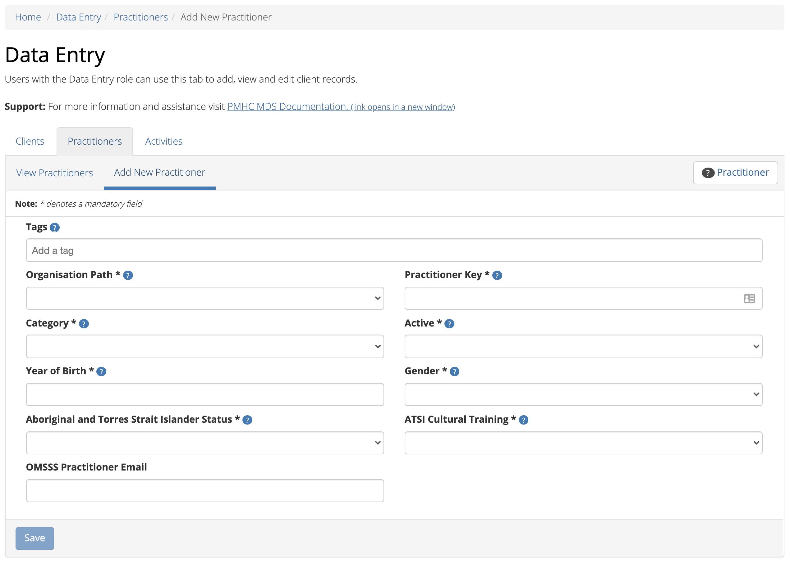

4. Click the blue **Save** button.  (If you decide not to save changes, you can
   navigate away from this screen)

You will receive confirmation that the practitioner's details have been added,
and it will now display these new details in the **View Practitioner Details** tab.

        .. figure:: screen-shots/client-data-saved.png
           :alt: Client Data Saved Successfully

If you receive an error message, the data will need to be corrected before the
record is saved and added to the PMHC MDS.
See Validation Rules - `Practitioner <http://docs.pmhc-mds.com/en/v1/data-specification/validation-rules.html#practitioner-current-validations>`__.

You can add a practitioners individually through the data entry interface or
alternatively, practitioner records can be uploaded in bulk. See :ref:`upload`.

.. _delete-practitioner:

Deleting a Practitioner
-----------------------

You can delete a practitioner's details through :ref:`edit-practitioner`
on the **Data Entry** tab, by following these steps:

1. Click the :ref:`Practitioners <find-practitioner>` tab
2. Click the practitioner's key in blue displayed within the table
3. Click the red **Delete** button
4. You will either be shown a :ref:`confirm-delete-practitioner` screen or a :ref:`cannot-delete-practitioner` screen

.. _confirm-delete-practitioner:

Confirm Delete
~~~~~~~~~~~~~~

**Please note: Data from deleted practitioners can not be recovered.**

1. Click the blue **Confirm** button to delete this practitioner.
   (or click the orange **Cancel** button to cancel the deletion)

  .. figure:: screen-shots/practitioner-delete-confirm.png
     :alt: Practitioner Data Confirm Delete

After you click **Confirm**, you will receive confirmation that the practitioner has
been deleted, and you will be redirected to the :ref:`View Practitioners<view-practitioner>` where the
practitioner will no longer be displayed.

    .. figure:: screen-shots/practitioner-delete-successful.png
       :alt: Practitioner Data Delete Successful

.. _cannot-delete-practitioner:

Cannot Delete
~~~~~~~~~~~~~

If the practitioner you are trying to delete has any dependant records, you will not
be able to proceed with deleting this practitioner until all the related records have
been edited or deleted.

1. Click the orange **Dismiss** button

  .. figure:: screen-shots/practitioner-delete-cannot.png
     :alt: Client Episode Data Cannot Delete

See :ref:`edit-service-contact` or :ref:`delete-service-contact`.

.. _inactive-practitioner:

Inactive Practitioners
----------------------

Currently a practitioner can not be deleted from the PMHC MDS if they have any dependant records.

You can change the practitioner from 'active' to 'inactive' by editing their details.
By doing this, the inactive practitioner keys will no longer be displayed in the
**Practitioner Key** drop down list displayed on the **Service Contact** forms.

See :ref:`edit-practitioner`.
