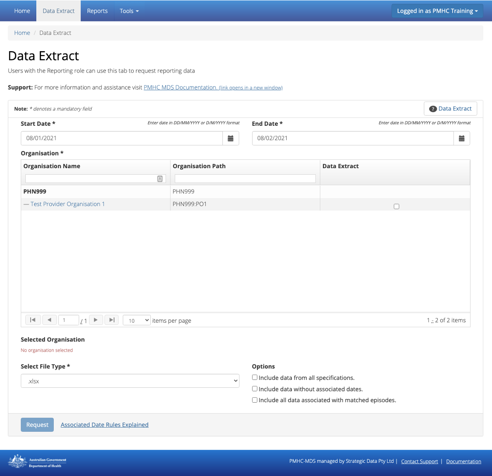

.. _data-extraction:

Data Extract
============

.. contents::
   :local:
   :depth: 2

You will only be able to see the **Data Extract** tab if you have been assigned
the 'Reporting' :ref:`roles`, when logged into the PMHC MDS on https://pmhc-mds.net.

If you don’t have access to the **Data Extract** tab and you believe you should, please
contact someone in your provider organisation or provider organisation's PHN
who has the 'User Management' role. If you are unsure who has the 'User Management'
role please email the PMHC Helpdesk at support@pmhc-mds.com

After navigating to the **Data Extract** tab, you will see a form
to request and download a data extract.

.. _view-data-extract:

How to download an organisation's data
^^^^^^^^^^^^^^^^^^^^^^^^^^^^^^^^^^^^^^

You can extract a PHN's or provider organisation's PMHC MDS data by completing
the Download Data fields in the Data Extraction tab, by following these steps:

1. Navigate to the **Data Extract** tab
2. If you are allowed to download data from more than one organisation you will be
   asked to select an organisation name
3. Click the first calendar icon to select the start date and then the second
   calendar icon to select the end date. See :ref:`data-extract-dates`
4. Click the checkboxes next to the name/path of the organisation/s from the drop down list.
5. Select the appropriate file type to be downloaded
6. Click the checkboxes as relevant:

   * :ref:`data-extract-all-specifications`
   * :ref:`data-extract-data-without-dates`
   * :ref:`data-extract-all-specifications`

   .. figure:: screen-shots/data-extract-view-form.png
      :alt: PMHC MDS File Selected

7. Click the blue **Request** button
8. A dialogue box will be displayed, showing that the file is being requested from the server

   .. figure:: screen-shots/data-extract-message-requesting.png
      :alt: PMHC MDS File Selected

9. When the file is ready, a 'File ready for download' message will be displayed

   .. figure:: screen-shots/data-extract-message-download.png
      :alt: PMHC MDS File Selected

10. Click the blue **Download** button
11. The data extract will be downloaded to your computer

.. _data-extract-dates:

Dates explained for Data Extract
^^^^^^^^^^^^^^^^^^^^^^^^^^^^^^^^

The Data Extract dates are based on the Client's Service Contact dates for the PMHC MDS.

The default data extract file will include all service contacts that have been recorded
within the date range of the request, the associated client and episode and measures records.

It will not include any records that are outside the date range of the request.

.. _data-extract-options:

Data extract options
^^^^^^^^^^^^^^^^^^^^

.. _data-extract-all-epsiode-data:

Include all data associated with matched episodes
-------------------------------------------------

If you would like to include all the associated data for active episodes
within the data extract date range, check the checkbox labelled
**Include all data associated with matched episodes**. The data extract will
then also include ALL service contacts and ALL measures including those that are
outside the data extract date range.

.. _data-extract-data-without-dates:

Include data without associated dates
-------------------------------------

As the query is date based, the following data will by default, not be included
in the extract:

   * The start date of an episode is derived from the date of the first service contact.
     Therefore, if an episode doesn't have any associated service contacts, there will be
     no start date for the episode and they will not be included in the data extract
   * Clients that don't have any associated episodes, or who are associated
     with an episode with no service contacts also will not be included in the data extract
   * Practitioners who are not associated with a service contact will not be included
     in the data extract

If you would like to include these inactive episodes, inactive clients and
inactive practitioners check the checkbox labelled **Include data without associated dates**.

.. _data-extract-all-specifications:

Include data from all specifications
------------------------------------

If you would like to include data from all other PMHC MDS extensions, check the
checkbox labelled **Include data from all specifications**. This downloads a file
that is a combination of all of the extensions listed at https://docs.pmhc-mds.com/.
The resulting file cannot be uploaded. This is a download only format. It is based
on the most recent version used by either the core specification or an extension.

Please note: In the interim, until all extensions data is transitioned to V4,
fields with changes to their specifications between versions will show twice in these META files. 

  For example "Referral Date": In versions 2 and 3, Referral date was not required. In version 4
  it is required. For episodes where no referral date was supplied,
  the column corresponding to versions 2 (or 3) will be blank, whereas the column
  corresponding to version 4 will have the missing date value '09099999'. If you
  are using the data from a file exported in the META format for re-upload, use the appropriate column for
  the specification you are uploading. (See `Referral Date Definition <https://docs.pmhc-mds.com/projects/data-specification/en/v4/data-model-and-specifications.html#referral-date>`_).
