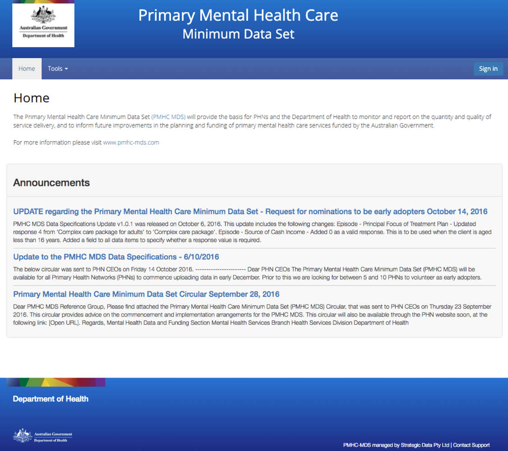
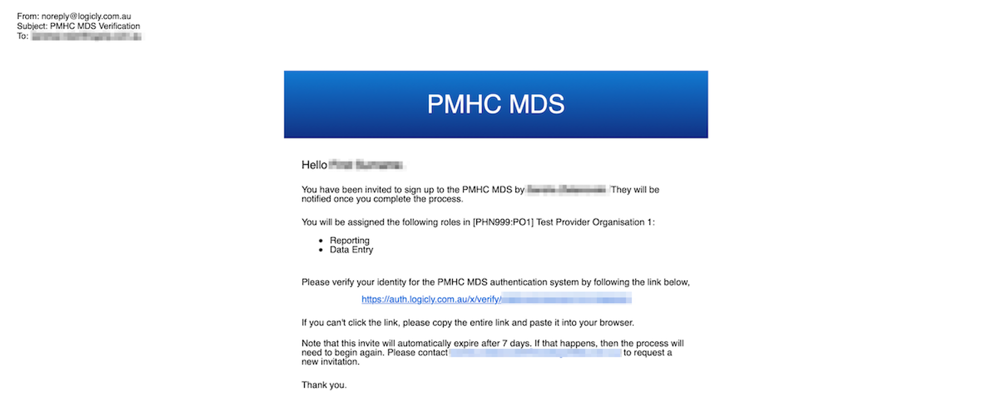
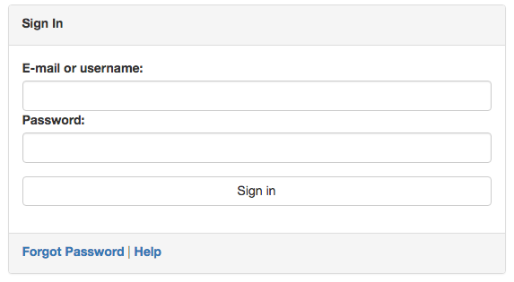
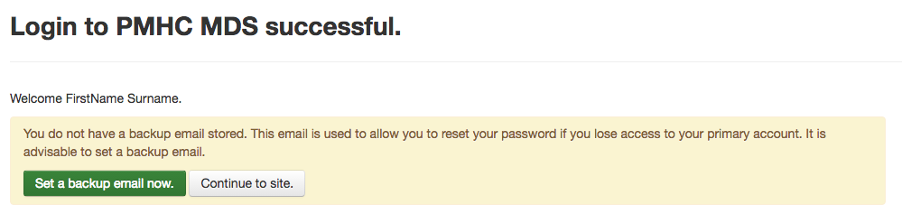
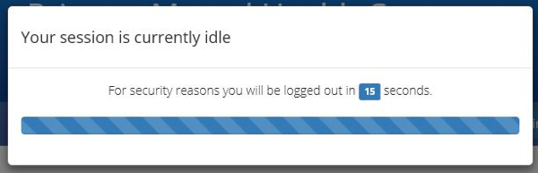
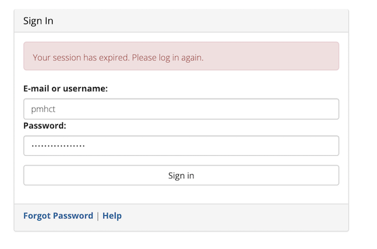
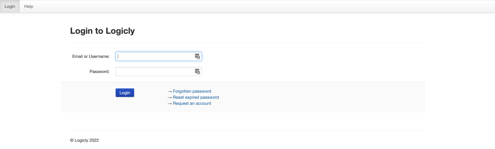

.. _home:

Home, Sign-in & Passwords
=========================

.. contents::
   :local:
   :depth: 2

To use the PMHC MDS navigate to https://pmhc-mds.net.

The first page you will see is the **Home** page. The home page shows you the
most recent announcements made via the :ref:`mailing-list-FAQs`.

An announcements archive link is now available on the **Home** tab under the three
most recent announcements - Click `View Archive <https://www.pmhc-mds.com/communications/>`_
to view all the PMHC MDS announcements.

.. _accepting-invitation:

Accepting an invitation to become a PMHC MDS User
^^^^^^^^^^^^^^^^^^^^^^^^^^^^^^^^^^^^^^^^^^^^^^^^^

To become a PMHC MDS user you will be sent an invitation by email and a
verification code via SMS. In order to gain access to the PMHC MDS you
will need to accept this invitation within 7 days, by following these steps:

1. Click on the link contained in the email. You will be shown a page where
   you will need to input the SMS you have been sent

   .. figure:: screen-shots/account-verify-user.png
      :alt: PMHC MDS Verify User

2. Input your verification code
3. Click **Submit**
4. You will be prompted to enter a new password

*Please note: This is a single use token - please don't navigate away from this page until you have successfully set your password.*

   .. figure:: screen-shots/account-activate-password.png
      :alt: PMHC MDS Activate Account

5. Enter your password
6. Confirm your password
7. Click **Submit**
8. Your account will be activated

   .. figure:: screen-shots/account-activated.png
      :alt: PMHC MDS Account Activated

9. Navigate to https://pmhc-mds.net/ and follow the :ref:`logging-in`
   instructions

.. _logging-in:

Logging In
^^^^^^^^^^

After navigating to https://pmhc-mds.net/, click **Sign in**.

This will open a window to log in. Enter your email address or username
and then your password and click **Sign in**.

.. _setting-backup-email:

If it is your first time logging in, you will be asked to set a backup email
address.

The backup email address is used when resetting your password. If you forget
your password an email is sent to both your primary email address and your
backup email address. This allows you to regain access to your account in the
event that you no longer have access to your primary email address.

1. Click **Set a backup email now**
2. This will open the **Manage details** page

   .. figure:: screen-shots/backup-set-email.png
      :alt: PMHC MDS Setting Backup Email

3. Under **Manage Security Credentials** there is an 'Email address' field
4. Enter your backup email, in the email address field, under **Manage Security
   Credentials**
5. Click **Submit**

   .. figure:: screen-shots/backup-email-success.png
      :alt: PMHC MDS Backup Email Success message

6. You now need to confirm your email address. You will be sent an email
   to the address you specified and an SMS to the mobile phone number on
   record. Please follow the link in the email and enter the code that
   was sent to your mobile

   .. figure:: screen-shots/account-verify-user.png
      :alt: PMHC MDS User Verification

7. Click **Submit**
8. Your backup email is now confirmed

   .. figure:: screen-shots/backup-email-confirm-update.png
      :alt: PMHC MDS Confirm Update Email

9. Navigate back to https://pmhc-mds.net/ and sign in
10. The interface you will be able to access after login will depend upon the
    :ref:`roles` you have been assigned

.. _logging-out:

Logging Out
^^^^^^^^^^^

Logout by:

1. Clicking on the button to the right of the menubar that says **Logged in as [Name]**
2. Click **Logout** from the options that open

We strongly encourage users to logout when they have completed their tasks.

*Please note - the PMHC MDS will automatically log users out after 15
minutes of inactivity.  You will see a pop up box that provides a countdown
feature prior to automatically logging out the idle user.*

The login screen will confirm when an auto-logout has occurred to an idle user.

.. _updating-your-details:

Updating your details
^^^^^^^^^^^^^^^^^^^^^

To edit your details:

1. Click the button to the right of the menubar that says **Logged in as [Name]**
2. From the menu that opens, click **Profile**
3. You will be taken to the Profile Management page
4. Login using your PMHC MDS email / username and password

5. You will see the **Manage Details** page

   .. figure:: screen-shots/account-manage-details.png
      :alt: PMHC MDS Manage Details

  * To update your name, click the **Change personal details** link
  * To update your primary email address, click the **Change email address** link
  * To update your backup email address, click the **Change backup email address**
    link
  * To update your mobile phone number, click the **Change mobile phone number**
    link
  * Please note: The last section on the page, **Password lifetime**, tells you when
    you last changed your password and when it will expire. Passwords must
    be changed every 90 days. See ::ref:`passwords`

6. Once you have entered your changed details, click **Submit** (Please note: you can only change one contact detail at a time)

7. An email with further instructions will be sent from
   noreply@logicly.com.au to the email address the PMHC MDS has on file
   for the user. An SMS with a verification code
   will also be sent to the mobile phone number on record.
   (Please note: This infromation will be sent to both the old and the new details to confirm the change)

   .. figure:: screen-shots/account-update-details-request.png
      :alt: PMHC MDS Reset Password Request

8. Open the email sent from noreply@logicly.com.au and open the link in the email

   .. figure:: screen-shots/account-update-details-email.png
      :alt: PMHC MDS Reset Password Email

9. Enter the verification code you were sent via SMS

   .. figure:: screen-shots/account-verify-user.png
      :alt: PMHC MDS User Verification

10. Click **Submit**

.. _passwords:

Passwords Requirements
^^^^^^^^^^^^^^^^^^^^^^

As required by the Australian Government's Protective Security Policy Framework
passwords must be changed every three months. If you do not change your password
it will expire and you will not be able to login to the system without resetting
your password.

Passwords must be:

* 13 or more characters with no complexity requirements; or
* a minimum of 10 characters with at least 3 of the following character sets

  - lowercase characters (a-z)
  - uppercase characters (A-Z)
  - digits (0-9)
  - punctuation and special characters

* changed at least every 90 days;
* changed by users no more than once a day; and
* not reused from any of the preceding eight changes.

Please note: Users will be reminded via an email sent from noreply@logicly.com.au
14 days prior to their password expiry date, and on PMHC MDS login 7 days prior
to their password expiry - See see :ref:`soon-to-expire-password`.

If a password expires the user will not be able to access the PMHC MDS until they
reset their password - see :ref:`forgotten-password`.

.. _soon-to-expire-password:

Password Expiry Notifications
^^^^^^^^^^^^^^^^^^^^^^^^^^^^^

As required by the Australian Government's Protective Security Policy Framework
passwords must be changed every three months.

Users will be reminded via an email sent from noreply@logicly.com.au each
day for 14 days prior to their password expiry date, and will also be
reminded on PMHC MDS login 7 days prior to their password expiry.

It is quicker to reset your password before it expires. Passwords can be reset
by clicking the password reset link, which will open https://auth.logicly.com.au/.
This link can be accessed in one of two ways:

1. Either on the password reminder email; or

   .. figure:: screen-shots/account-password-expiry-reminder-email.png
      :alt: PMHC MDS Resetting Password

2. Under the PMHC MDS login click the **Sign in** button.

   .. figure:: screen-shots/account-password-expiry-reminder-MDS-login.png
      :alt: PMHC MDS Resetting Password

When your profile management page opens, you will be shown this screen:

   .. figure:: screen-shots/account-password-change.png
      :alt: PMHC MDS Resetting Password

**Please note:** If you see the message "Password unacceptably weak" after
entering your new password, the password is not of sufficient complexity.
Please check the password requirements. (Current users have indicated they
find it easier to create a password that is 13 or more characters to avoid
the complexity requirements). Iif you receive a message that your current
password is incorrect, please reset your password through the link, :ref:`forgotten-password`.

1. Click **Submit**
2. You will receive confirmation when your new password has been successfully saved

   .. figure:: screen-shots/account-password-changed-success.png
      :alt: PMHC MDS Password Reset Success

3. Log out of the profile management page
4. Navigate back to the PMHC MDS https://pmhc-mds.com/ and sign in

.. _forgotten-password:

Forgotten or Expired Password
^^^^^^^^^^^^^^^^^^^^^^^^^^^^^

As required by the Australian Government's Protective Security Policy Framework
passwords must be changed every three months. If you do not change your
password it will expire and you will not be able to login to the system
without resetting your password.

If you have forgotten your password or it has expired:

1. Navigate to https://pmhc-mds.net/ and click **Sign in**
2. Click **Forgot Password**

   .. figure:: screen-shots/account-password-resetting.png
      :alt: PMHC MDS Resetting Password

3. You will be prompted to enter your email address or user name recorded
   for the PMHC MDS
4. Click the **I'm not a robot** checkbox
5. Click **Submit**
6. An email with further instructions will be sent from
   noreply@logicly.com.au to the email address the PMHC MDS has on file
   for the user. Additionally, if you have set a backup email, then
   an email will also be sent there. An SMS with a verification code
   will also be sent to the mobile phone number on record

   .. figure:: screen-shots/account-password-reset-request.png
      :alt: PMHC MDS Reset Password Request

7. Open the email sent from noreply@logicly.com.au and open the link in the email

   .. figure:: screen-shots/account-password-reset-email.png
      :alt: PMHC MDS Reset Password Email

8. Enter the verification code you were sent via SMS

   .. figure:: screen-shots/account-verify-user.png
      :alt: PMHC MDS User Verification

9. Click **Submit**
10. This will open the **Password reset** window

   .. figure:: screen-shots/account-password-reset.png
      :alt: PMHC MDS Password Reset

11. Enter your new password
12. Confirm you new password
13. Click **Submit**
14. Your password will be reset

   .. figure:: screen-shots/account-password-reset-success.png
      :alt: PMHC MDS Password Reset Success

15. Logout of the profile management page
16. Navigate back to https://pmhc-mds.com/ and sign in
