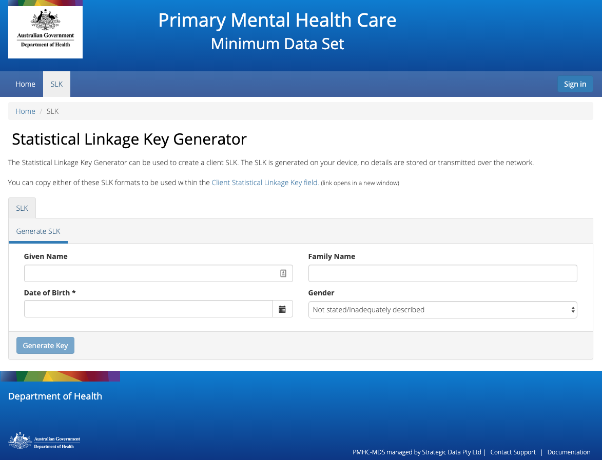
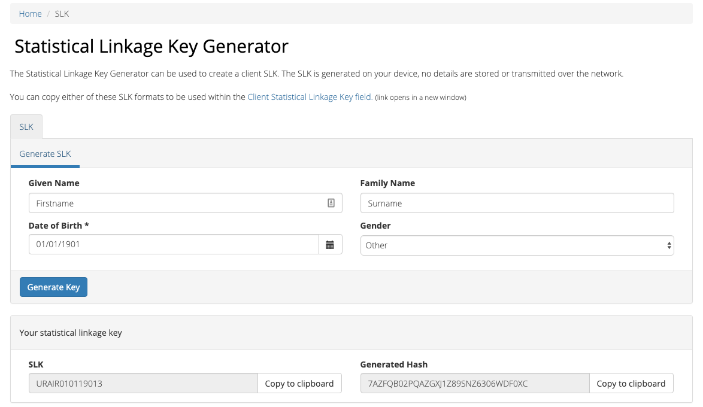

.. _slk-generator:

SLK
===

We have provided a stand-alone generator that can be used without logging into
the PMHC MDS on https://pmhc-mds.net. This allows users to generate a client's
Statistical Linkage Key (SLK) to enter into upload files.

To generate a SLK:

1. Navigate to the **SLK** tab. This will open up the SLK generator
2. Enter the following client details: **Given Name**, **Family Name**, **Date of Birth** and
   **Gender**
3. Click on the blue **Generate Key** button

4. The client's **SLK Key** and **Generated Hash** key will now be displayed
5. Click **Copy to clipboard** next to either of these items
6. Paste this information into your data file

*Please note: you can only copy one SLK at a time to the clipboard.*
