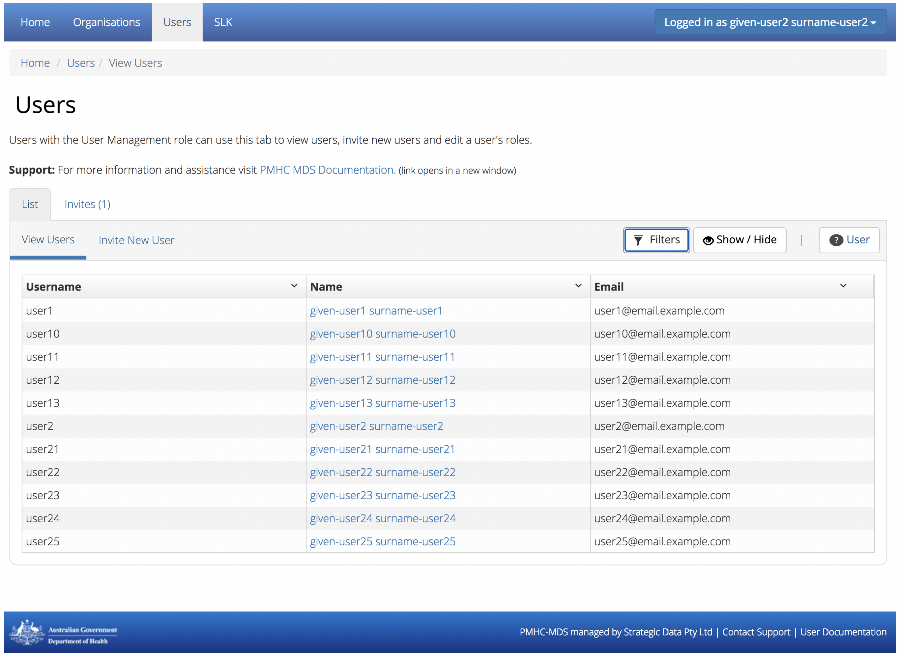
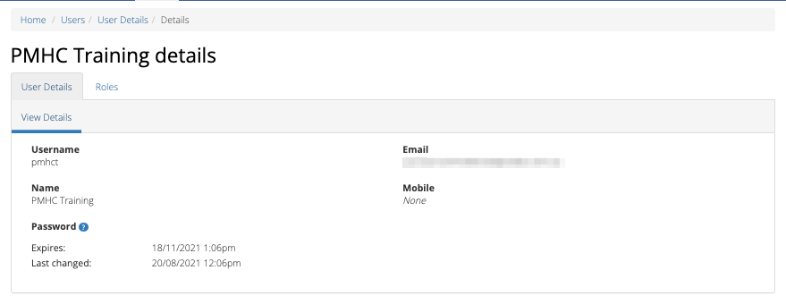
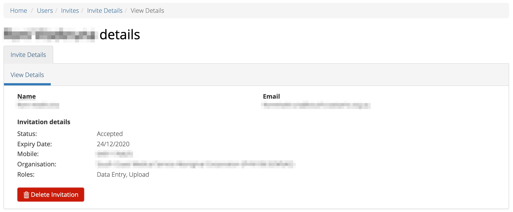
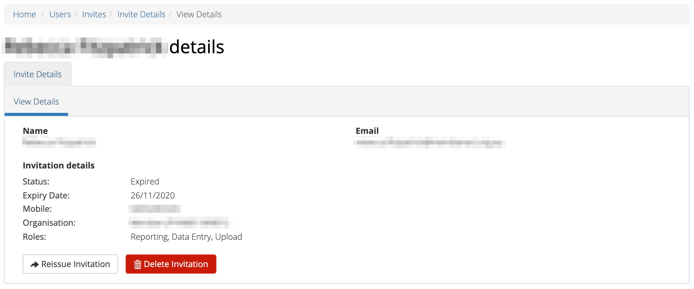
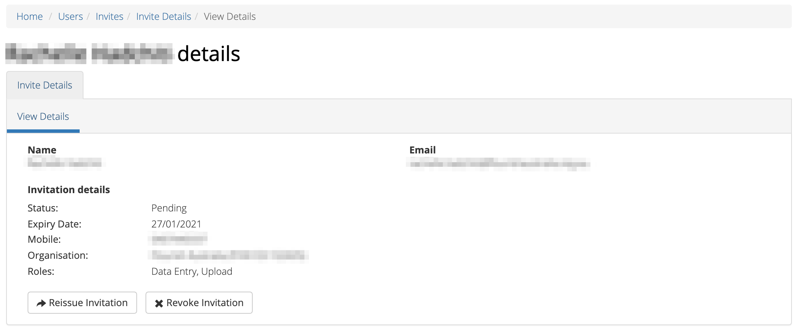
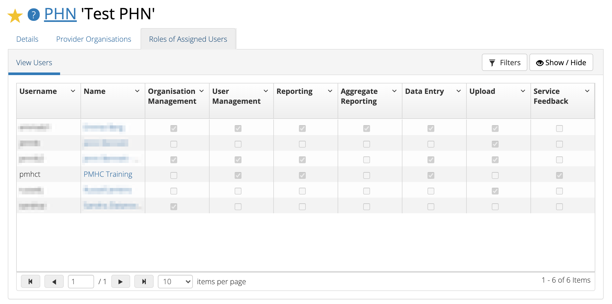

.. _users:

Users
=====

.. contents::
   :local:
   :depth: 2

You will only be able to see the **Users** tab if you have been assigned
the 'User Management' role, when logged into the PMHC MDS on https://pmhc-mds.net.

If you don’t have access to the **Users** tab and you believe you should, please
contact someone in your provider organisation or provider organisation's PHN
who has the 'User Management' role.

If you are unsure who has the 'User Management' role please email the
PMHC Helpdesk at support@pmhc-mds.com

After navigating to the **Users** tab, you will be presented with a list of the
users that are assigned to the organisations for which you have the
'User Management' role.

.. _roles:

Users Roles
^^^^^^^^^^^

Access to the PMHC MDS is based around roles. The following table provides a summary of each of
the roles that currently exist within the PMHC MDS:

+----------------------------+------------------------------------------------------------------------------------------------------------------------------------+
| **Role**                   | **Tasks allowed**                                                                                                                  |
+============================+====================================================================================================================================+
| Organisation Management    | A user with the Organisation Management role for a PHN can manage provider organisations for that PHN.                             |
+----------------------------+------------------------------------------------------------------------------------------------------------------------------------+
| User Management            | A user with the User Management role for an organisation can manage user accounts for that  associated organisation.               |
+----------------------------+------------------------------------------------------------------------------------------------------------------------------------+
| Upload                     | A user with the Upload role can upload data to the associated organisation.                                                        |
+----------------------------+------------------------------------------------------------------------------------------------------------------------------------+
| Reporting                  | A user with the Reporting role can run reports and also download data from the associated organisation.                            |
+----------------------------+------------------------------------------------------------------------------------------------------------------------------------+
| Aggregate Reporting        | A user with the Aggregate Reporting role can run reports from the associated organisation.                                         |
+----------------------------+------------------------------------------------------------------------------------------------------------------------------------+
| Data Entry                 | A user with the Data Entry role can enter client data and practitioners from the associated organisation.                          |
+----------------------------+------------------------------------------------------------------------------------------------------------------------------------+

Each role allows a user to perform specific tasks. A user can have more than one role.
Each role is granted for a user against an organisation. An organisation can
either be a Primary Health Network or a provider organisation. If a user is granted
a role for a Primary Health Network (PHN) they will also have this role for any
provider organisations of that PHN. A user can be invited to have a role at more
than one organisations. There is no limit to the number of users per organisation.

What users see after they have logged in will depend upon the roles that have been
assigned. The table below lists the tabs that will be shown for each role:

+-------------------------+------------------------------+
| Role                    | Tab                          |
+=========================+==============================+
| Organisation Management | Organisations                |
+-------------------------+------------------------------+
| User Management         | Organisations, Users         |
+-------------------------+------------------------------+
| Upload                  | Upload                       |
+-------------------------+------------------------------+
| Reporting               | Reports, Data Extract        |
+-------------------------+------------------------------+
| Aggregate Reporting     | Reports                      |
+-------------------------+------------------------------+
| Data Entry              | Data Entry                   |
+-------------------------+------------------------------+
| All users               | SLK                          |
+-------------------------+------------------------------+

.. _finding-a-user:

Finding a user
^^^^^^^^^^^^^^

You can sort and filter the listed users through the **Users** tab.

*Please note: Newly invited users will not be visible until they have successfully
accepted their invitation.*

Sort the listed users by simply clicking on the column header. Alternately
you can click on the arrow beside a column header for more sort options, as follows:

- **Sort Ascending**
- **Sort Descending**
- **Remove Sort**
- **Hide Column**

To filter the listed users:

1. Click the grey **Filters** button
2. Start typing in an edit box now displayed under the column headers
3. To remove the filter, click the grey cross within the edit box beside any
   entered text

   .. figure:: screen-shots/users-filter.png
      :alt: PMHC MDS Users Filter

.. _view-users-details:

Viewing a User's details
^^^^^^^^^^^^^^^^^^^^^^^^

You can view a user's details through the user tab, by following these steps:

#. Navigate to the **Users** tab
#. Click on the user's name in blue displayed within the table

A page will display showing the user's details and the :ref:`roles` they have at
particular organisations. See :ref:`view-role`.

.. _editing_user:

Editing a User's details
^^^^^^^^^^^^^^^^^^^^^^^^

A user can edit their own contact details.

See :ref:`updating-your-details`.

.. _adding-a-user:

Adding a new user
^^^^^^^^^^^^^^^^^

**Note:** PHNs can devolve 'user management' authority to one or more users in a
provider organisation so that the provider organisation can manage their own
logins, or a PHN can choose to keep user management authority at the level of
the PHN requiring each provider organisation to contact the PHN when they need
a new user added.

Each individual staff member should be set up with their own unique login access.
Generic login accounts are not encouraged to be set up and used within the PMHC MDS,
and usernames / passwords should not be shared with other individuals. This process
ensures that when a staff member leaves, their access can be easily disabled and
it doesn't affect other users or the security of the organisation's data. A user's
account, should not be passed from one staff member to the next.

Before inviting a user, it is always best to inform them that they will receive a
PMHC MDS invitation by email from noreply@strategicdata.com and a verification code via SMS.
You can also provide them with the link to the online :ref:`user-docs` to read
the steps they will need to complete the steps outlined in :ref:`accepting-invitation`.

The next step to adding a new user is to invite them through the **Users** tab,
by following these steps:

1. Navigate to the **Users** tab
2. Click the **Invite New User** tab

   .. figure:: screen-shots/user-invite.png
      :alt: PMHC MDS Invite User

3. Complete all the fields with the new users contact details. (Mandatory fields are marked with an **\*** )
4. Select an organisation, either a PHN or Provider Organisation
5. Assign one or more :ref:`roles`. (Extra roles can be added after the user has access to the system. See :ref:`edit-role`)

   .. figure:: screen-shots/user-invite-filled-in.png
      :alt: PMHC MDS Invite User Complete

6. Click the blue **Invite** button
7. You will receive confirmation that the user has been sent an email to invite
   them to the PMHC MDS. They will also be sent an SMS containing a
   verification code. The user will need to follow the instructions in the
   email before they can gain access to the system. See :ref:`accepting-invitation`
   This invitation will be valid for 7 days. Invitations are listed in the **View Invitations** table.
8. When the user has accepted the invitation you will be sent an email to let you know.
   This user will then be listed in the **View Users** table

   .. figure:: screen-shots/user-invite-accepted-email.png
      :alt: PMHC MDS Invite Accepted

*Please note: An invitation for a new user is valid for **7 days**. If you receive an error that a previous invitation already exists for a user, you can either reissue or revoke the invitation. See :ref:`view-invite-details`.

.. _adding-an-existing-user:

Adding an existing user
^^^^^^^^^^^^^^^^^^^^^^^

Note: An existing user must have completed the required steps for :ref:`accepting-invitation`
from their initial PMHC MDS invitation before they can be added again.

Before adding an existing user please ensure you have the same email and mobile
number as their current PMHC MDS Profile. By ensuring these are identical, the system
will automatically pick up if a user already exists in the PMHC MDS.

You can invite an existing user through the **Users** tab, by following these steps:

1. Navigate to the **Users** tab
2. Click the **Invite New User** tab
3. Complete all the mandatory fields marked with an **\*** in the **Invite User** form, ensuring these are the same details as their existing PMHC MDS Profile
4. Select an organisation and assign their :ref:`roles`

   .. figure:: screen-shots/user-invite.png
      :alt: PMHC MDS Invite User

5. Click the blue **Invite** button
6. You will receive confirmation that the roles have been added to the existing user

*Please note: The user will receive notification that they have been granted these additional roles at the relevant organisation.*

.. _view-invite:

Viewing Invitations
^^^^^^^^^^^^^^^^^^^

You can view user invitation details through the **Users** tab, by following these steps:

#. Navigate to the **Users** tab
#. Click on the **Invites** tab

A table will display a list of users that have been sent a recent invitation. These are either:

   * **Pending** - these are active invitations which have not been accepted yet
   * **Revoked** - these were active invitations which were revoked
   * **Expired** - these are inactive invitations which were not accepted within 7 days
   * **Accepted** - these are invitations that have been successfully accepted and the user will be listed in the **Users** tab

   .. figure:: screen-shots/user-view-invites.png
      :alt: PMHC MDS View Invites

*Please note: Deleted invitations will not be display the in the View Invitations tab.*
*Please note: Invitations sent prior to this feature launch on 29 April 2020 will not display the Organisation and Inviters details.*

.. _view-invite-details:

Viewing a user's invitation details
^^^^^^^^^^^^^^^^^^^^^^^^^^^^^^^^^^^

You can view a user's invitation details through the **Users** tab, by following these steps:

#. Navigate to the **Users** tab
#. Click on the **Invites** tab
#. Click on the user's email in blue displayed within the table

A page will display the user's invitation details, as entered on the invitation form.

*Please note: For privacy reasons, only the user who issued the invitation will be able to see the invitee's mobile number.*

On the page you can:

   * :ref:`reissue-invite`
   * :ref:`delete-invite`

.. _reissue-invite:

Reissue an invitation
^^^^^^^^^^^^^^^^^^^^^

You can reissue a pending or expired invitation through the **Users** tab, by following these steps:

#. Navigate to the **Users** tab
#. Click on the **Invites** tab
#. Click on the user's email in blue displayed within the table

#. Review all details are correct
#. Click the 'Reissue Invitation' button to resend the invitation using the same details
#. Click the Reissue' button to resend the email and SMS invitation details. (or click the 'Cancel' button if you decide not to reissue this invite)

*Please note: If any of the details are incorrect on the previous invite,
you will need to remove the invitation before being able to send a new invite.* See: :ref:`revoke-invite`.

.. _revoke-invite:

Revoke a pending invitation
^^^^^^^^^^^^^^^^^^^^^^^^^^^

A pending invitation is an active invitation which has not been accepted yet.

The user has seven days to accept an invitation.

When a pending invitation is revoked, this will inactivate the invite so that
the user will no longer be able to accept the invite. You may need to inactivate
an invitation if the invitee's details have been incorrectly entered, or if the
single-use verification token has already been used once (is expired), or if the
user should no longer be granted access.

You can revoke a user's invitation through the **Users** tab, by following these steps:

#. Navigate to the **Users** tab
#. Click on the **Invites** tab
#. Click on the user's email in blue displayed within the table

#. Click **Revoke Invitation** to inactivate the pending invite.
#. Click 'Revoke' to confirm that you are sure. (or click the 'Cancel' button
   if you decide not to revoke this invite)

*Please note: Once a previous pending invitation has been revoked, you will
then be able to send a new invitation to the user.*

.. _delete-invite:

Delete an invitation
^^^^^^^^^^^^^^^^^^^^

An expired invitation is an inactive invitation which was not accepted within
seven days of being issued. If you don't intend to reissue the expired
invitation, you can delete an expired invitation to remove this invitation from the list.

Accepted invitations will also be shown in the 'invitation' tab. You can also
delete an accepted invitation to manually remove the accepted invite from this list.

You can delete a user's invitation through the **Users** tab, by following these steps:

#. Navigate to the **Users** tab
#. Click on the **Invites** tab
#. Click on the user's email in blue displayed within the table

#. Click **Delete Invitation** to inactivate the pending invite.
#. Click 'Revoke' to confirm that you are sure. (or click the 'Cancel' button if you decide not to revoke this invite)

*Please note: A pending invitation can not be deleted.* See :ref:`revoke-invite`.

.. _view-role:

Viewing a user's roles
^^^^^^^^^^^^^^^^^^^^^^

A user can have more than one role. Each role is granted for a user against the appropriate
organisation.

You can edit and assign extra roles to an existing user by following these steps:

1. Navigate to the **Users** tab
2. Click the user's name in blue displayed within the table
3. Click the **Roles** tab to show the user's assigned roles

   .. figure:: screen-shots/user-roles.png
      :alt: PMHC MDS User Roles

A tick displays the user currently has this role assigned at the relevant organisation.

.. _edit-role:

Editing a user's roles
^^^^^^^^^^^^^^^^^^^^^^

A user can have more than one role. Each role is granted for a user against the
appropriate organisation.

You can edit and assign extra :ref:`roles <roles>`  to an existing user by following these steps:

1. Navigate to the **Users** tab
2. Click the user's name in blue displayed within the table
3. Click the **Roles** tab
4. Click the **Edit Roles** tab

   .. figure:: screen-shots/user-edit-role.png
      :alt: PMHC MDS Edit Users Role

6. A tick indicates the user currently has this role assigned at the relevant organisation.
   Multiple roles can be assigned and these roles are shown as blue ticks

   * **Add** a role by clicking the empty checkbox
   * **Remove** a role by clicking the selected checkbox

7. All changes are automatically saved
8. You will need to notify the user of these role changes. The system will not automatically do this

*Please note: you will still see users in your list that have had all their roles removed.*

.. _delete_user:

Deleting a user
^^^^^^^^^^^^^^^

A user can be deleted from an organisation by removing all the roles the user has at that organisation.

See :ref:`edit-role`.

.. _viewing-organisational-users:

Viewing all Organisational Users
^^^^^^^^^^^^^^^^^^^^^^^^^^^^^^^^

You can view users assigned to an organisation through the organisation tab, by following these steps:

1. Navigate to the tab showing either the PHNs details or the provider organisations details
2. Click on the PHNs or provider organisations name in blue displayed within the table list.
   If you are unsure how to view the details see :ref:`view-PHN` or :ref:`view-provider-organisation`
3. Under the **Users** tab, you can view a table list of the
   organisation's users
4. You can filter the users within this table list,
   click the grey **Filters** button and start typing in an edit box now
   displayed under the column headers. To remove the filter, click the grey
   cross within the edit box beside any entered text

.. _adding-roles:

Assigning Extra Roles to an Organisational User
^^^^^^^^^^^^^^^^^^^^^^^^^^^^^^^^^^^^^^^^^^^^^^^

You can assign extra roles to an existing organisational user, by following these steps:

1. :ref:`Navigate to the relevant client details <view-client-details>`
2. Click the user's name
3. Follow on from Step 3 at :ref:`edit-role`
