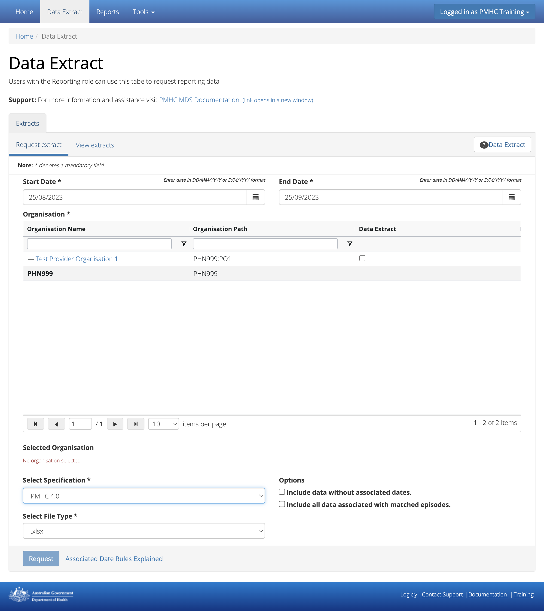

.. _data-extraction:

Data Extract
============

.. contents::
   :local:
   :depth: 1

You will only be able to see the **Data Extract** tab if you have been assigned
the 'Reporting' :ref:`roles`, when logged into the PMHC MDS on https://pmhc-mds.net.

If you don’t have access to the **Data Extract** tab and you believe you should, please
contact someone in your provider organisation or provider organisation's PHN
who has the 'User Management' role. If you are unsure who has the 'User Management'
role please email the PMHC Helpdesk at support@pmhc-mds.com

After navigating to the **Data Extract** tab, you will see a form
to request a data extract.

.. _request-data-extract:

How to request an organisation's data
^^^^^^^^^^^^^^^^^^^^^^^^^^^^^^^^^^^^^

You can request a organisation's PMHC MDS data by completing
the **Request extract** fields in the **Data Extract** tab, by following these steps:

1. Navigate to the **Data Extract** tab
2. On the **Request extract** tab, click the first calendar icon to select the start date
   and then the second calendar icon to select the end date. See :ref:`data-extract-dates`
3. Click the checkbox next to the organisation name/path. You can use the filter
   options under the organisation name or organisation path to find the relevant
   organisation. Only one PHN/organisation can be request at a time
4. Select the data specification type, if other than PMHC 4.0  See :ref:`data-extract-specification`
5. Click the options checkboxes as relevant. See :ref:`data-extract-options`
6. Select the appropriate file type to be downloaded

   .. figure:: screen-shots/data-extract-request-form.png
      :alt: PMHC MDS Extract Request Form

7. Click the blue **Request** button
8. You will receive confirmation that the extract has been successfully requested,
   and the screen will now be blank ready for the next extract request

      .. figure:: screen-shots/data-extract-message-requested.png
         :alt: PMHC MDS Extract Requested Successfully

*Note:* If you are not sure how data is displayed in a extract, please click on
the **Associated Date Rules Explained** link to see the dates, specifications and
options explained

9. Requested extracts will be available under the next tab, **View extracts** tab.
See :ref:`view-data-extract`.

.. _view-data-extract:

How to download a requested extract
^^^^^^^^^^^^^^^^^^^^^^^^^^^^^^^^^^^

You can download the requested organisation's data by viewing a
the **View extracts** table in the **Data Extract** tab, by following these steps:

1. Navigate to the **Data Extract** tab
2. Open the **View extracts** tab
3. Find the extract you would like to download in the View Extracts table

   .. figure:: screen-shots/data-extract-view-extracts.png
      :alt: PMHC MDS View Extracts table

4. Click the **Download** icon located to the far right of each extract request
   in the 'Actions' column.

*Note:* If the download icon is not displayed in the 'Actions' column, the system
is still in the process of downloading it. You can use the 'Refresh' icon to check
if the download has completed.

5. You will receive confirmation that the extract has been successfully requested
   via your browser

Requested extracts will be available under the **View Extracts** tab for 7 days.

.. _data-extract-dates:

Dates explained for Data Extract
^^^^^^^^^^^^^^^^^^^^^^^^^^^^^^^^

The Data Extract dates are based on the Client's Service Contact dates for the PMHC MDS.

The default data extract file will include all service contacts that have been recorded
within the date range of the request, the associated client and episode and measures records.

It will not include any records that are outside the date range of the request.

.. _data-extract-specification:

Data Extract Specification
^^^^^^^^^^^^^^^^^^^^^^^^^^

.. _data-extract-specification-pmhc:

PMHC 4.1
--------

If you would like to download a file that includes data from the Primary Mental
Health Care Minimum Data Set (PMHC MDS), select the dropdown option
labelled **PMHC 4.1**. This downloads a file that is the base PMHC MDS data which
is not linked to any extensions dataset.
(See `PMHC-MDS Data Specification <https://docs.pmhc-mds.com/projects/data-specification/en/latest/index.html#>`_).

The resulting file can be uploaded.

.. _data-extract-specification-headspace:

headspace 4.1 (PMHC extension)
------------------------------

If you would like to download a file that includes data from headspace extension,
select the dropdown option labelled **headspace 4.1**. This downloads a file that
is the data that has been updated from headspace headoffice hAPI system.
(See `headspace Specification <https://docs.pmhc-mds.com/projects/data-specification-headspace/en/v4.1/index.html>`_).

The resulting file cannot be uploaded. This is a download only format.

.. _data-extract-specification-TWB:

The Way Back 3.0 (PMHC extension)
---------------------------------

If you would like to download a file that includes data from The Way Back Support
Services extension (current 3.0), select the dropdown option labelled **WAYBACK 3.0**.
This downloads a file that is a combination of the base PMHC MDS data extensions linked
to the PMHC episode with the tag `!wayback` and/or a linked TWB-Episode record.
(See `The Way Back Data Specification <https://docs.pmhc-mds.com/projects/data-specification-wayback/en/v3/data-specification/data-model-and-specifications.html>`_).

The resulting file can be uploaded.

.. _data-extract-specification-survey:

SURVEY 1.0 (YES-PHN Results)
----------------------------

If you would like to download a file that includes data from the YES PHN Survey
results, select the dropdown option labelled **SURVEY 1.0**. This downloads a
file that is a combination of the YES-PHN data collected via invitations sent
using the Online Measures Self Service System (OMSSS) and YES-PHN data collected
outside of OMSSS uploaded using the PMHC MDS Survey Specification.
(See `YES Invitation Data Specification <https://docs.pmhc-mds.com/projects/data-specification-yes-invitation/en/v1/>`_ and `Survey Specification <https://docs.pmhc-mds.com/projects/data-specification-survey/en/v1/>`_).

The data is extracted in the `Survey Specification <https://docs.pmhc-mds.com/projects/data-specification-survey/en/v1/>`_ format and can therefore be reuploaded.

.. _data-extract-all-specifications:

Include data from all specifications (includes extensions)
----------------------------------------------------------

If you would like to download a file that includes data from all PMHC MDS extensions (current and past),
select the dropdown option labelled **Include data from all specifications**.
This downloads a file that is a combination of all of the extensions listed at https://docs.pmhc-mds.com/.

The resulting file cannot be uploaded. This is a download only format. It is based
on the most recent version used by either the core specification or an extension.

Please note: In the interim, until all extensions data is transitioned to Version 4,
fields with changes to their specifications between versions will show twice in these META files.

  For example "Referral Date": In versions 2 and 3, Referral date was not required. In version 4
  it is required. For episodes where no referral date was supplied,
  the column corresponding to versions 2 (or 3) will be blank, whereas the column
  corresponding to version 4 will have the missing date value '09099999'. If you
  are using the data from a file exported in the META format for re-upload, use the appropriate column for
  the specification version you are uploading. (See `Referral Date Definition <https://docs.pmhc-mds.com/projects/data-specification/en/v4/data-model-and-specifications.html#referral-date>`_).

.. _data-extract-options:

Data extract options
^^^^^^^^^^^^^^^^^^^^

.. _data-extract-data-without-dates:

Include data without associated dates
-------------------------------------

As the query is date based, the following data will by default, not be included
in the extract:

   * The start date of an episode is derived from the date of the first service contact.
     Therefore, if an episode doesn't have any associated service contacts, there will be
     no start date for the episode and they will not be included in the data extract
   * Clients that don't have any associated episodes, or who are associated
     with an episode with no service contacts also will not be included in the data extract
   * Practitioners who are not associated with a service contact will not be included
     in the data extract

If you would like to include these inactive episodes, inactive clients and
inactive practitioners check the checkbox labelled **Include data without associated dates**.

.. _data-extract-all-epsiode-data:

Include all data associated with matched episodes
-------------------------------------------------

If you would like to include all the associated data for active episodes
within the data extract date range, check the checkbox labelled
**Include all data associated with matched episodes**. The data extract will
then also include ALL service contacts and ALL measures including those that are
outside the data extract date range.
