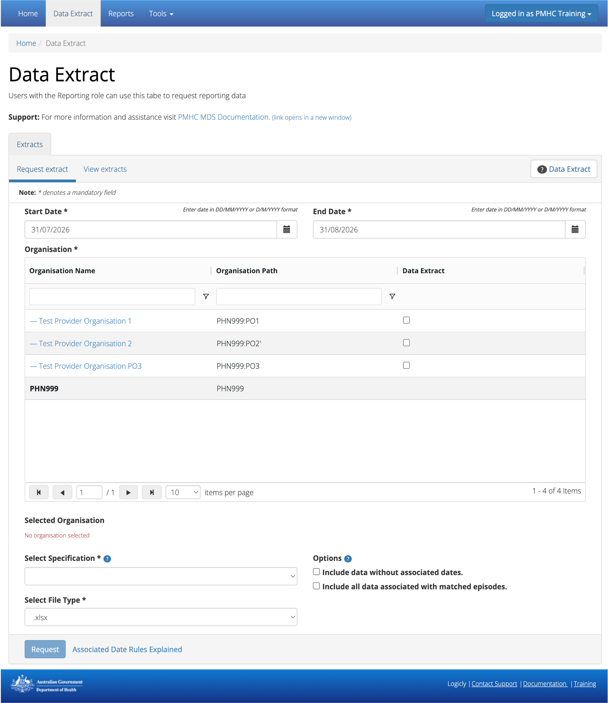

.. _data-extraction:

Data Extract
============

.. contents::
   :local:
   :depth: 1

You will only be able to see the **Data Extract** tab if you have been assigned
the 'Reporting' :ref:`roles`, when logged into the PMHC MDS on https://pmhc-mds.net.

If you don’t have access to the **Data Extract** tab and you believe you should, please
contact someone in your provider organisation or provider organisation's PHN
who has the 'User Management' role. If you are unsure who has the 'User Management'
role please email the PMHC Helpdesk at support@pmhc-mds.com

After navigating to the **Data Extract** tab, you will see a form
to request a data extract.

.. _request-data-extract:

How to request an organisation's data
^^^^^^^^^^^^^^^^^^^^^^^^^^^^^^^^^^^^^

You can request a organisation's PMHC MDS data by completing
the **Request extract** fields in the **Data Extract** tab, by following these steps:

1. Navigate to the **Data Extract** tab
2. On the **Request extract** tab, click the first calendar icon to select the start date
   and then the second calendar icon to select the end date. See :ref:`data-extract-dates`
3. Click the checkbox next to the organisation name/path. You can use the filter
   options under the organisation name or organisation path to find the relevant
   organisation. Only one PHN/organisation can be request at a time
4. Select the data specification type, if other than PMHC 4.0  See :ref:`data-extract-specification`
5. Click the options checkboxes as relevant. See :ref:`data-extract-options`
6. Select the appropriate file type to be downloaded

   .. figure:: screen-shots/data-extract-request-form.png
      :alt: PMHC MDS Extract Request Form

7. Click the blue **Request** button
8. You will receive confirmation that the extract has been successfully requested,
   and the screen will now be blank ready for the next extract request

      .. figure:: screen-shots/data-extract-message-requested.png
         :alt: PMHC MDS Extract Requested Successfully

*Note:* If you are not sure how data is displayed in a extract, please click on
the **Associated Date Rules Explained** link to see the dates, specifications and
options explained

9. Requested extracts will be available under the next tab, **View extracts** tab.
See :ref:`view-data-extract`.

.. _view-data-extract:

How to download a requested extract
^^^^^^^^^^^^^^^^^^^^^^^^^^^^^^^^^^^

You can download the requested organisation's data by viewing a
the **View extracts** table in the **Data Extract** tab, by following these steps:

1. Navigate to the **Data Extract** tab
2. Open the **View extracts** tab
3. Find the extract you would like to download in the View Extracts table

   .. figure:: screen-shots/data-extract-view-extracts.png
      :alt: PMHC MDS View Extracts table

4. Click the **Download** icon located to the far right of each extract request
   in the 'Actions' column.

*Note:* If the download icon is not displayed in the 'Actions' column, the system
is still in the process of downloading it. You can use the 'Refresh' icon to check
if the download has completed.

5. You will receive confirmation that the extract has been successfully requested
   via your browser

Requested extracts will be available under the **View Extracts** tab for 7 days.

.. _data-extract-dates:

Dates explained for Data Extract
^^^^^^^^^^^^^^^^^^^^^^^^^^^^^^^^

The Data Extract dates are based on the dates of the client’s data in the PMHC MDS.
Dates are included in the Service Contact, Collection Occasion and Intake records.

The default data extract file will include all service contacts, collection occasions
and intakes that have been recorded within the date range of the request, and the
associated client, episode, measure and universal aftercare data records.

It will not include any records that are outside the date range of the request.

.. _data-extract-specification:

Data Extract Specification
^^^^^^^^^^^^^^^^^^^^^^^^^^

An extract in the core data specification or one of the current extension data
specifications should meet most needs to review current data or re-upload modified
data. The ‘Include data from all specifications’ (or META format) option should
only be used when there is a specific requirement for all specifications, both
core and extension data (current and historic).

.. contents::
   :local:
   :depth: 1

.. _data-extract-specification-pmhc:

PMHC (core)
-----------

To download the core PMHC MDS data, select the "PMHC" option from the dropdown
menu in the current version specification. This downloads a file in the current
core PMHC MDS data specification. Information about the current core PMHC MDS
data specification can be found at `PMHC-MDS Data Specification <https://docs.pmhc-mds.com/projects/data-specification/en/latest/index.html#>`_.

This file will include all data added into the PMHC MDS under any previous core
specification or extension specification, except for headspace.

Where the data was transitioned from an extension to the core (e.g. Wayback and HeadtoHelp),
the core and extension records will be contained in the file.

Where the data was added using any other extension (e.g. National Suicide Prevention Trial)
the core records will be contained in the file, but not the extension records.

**The resulting file can be uploaded by either PHNs or Provider Organisations.**

.. _data-extract-specification-headspace:

headspace (PMHC extension)
--------------------------

To download only headspace data, select the "**headspace**" option from the
dropdown menu in the current version specification. This downloads a file that
contains only the data that has been uploaded from headspace’s hAPI system.
(See `headspace Specification <https://docs.pmhc-mds.com/projects/data-specification-headspace/en/latest/index.html>`_).

**The resulting file can be uploaded by headspace Head Office.**

**This is a download only format for all PHNs and Provider Organisations.**

.. _data-extract-specification-survey:

SURVEY (YES-PHN Results)
------------------------

To download data from the YES PHN Survey results, select the "SURVEY" option from
the dropdown menu in the current version specification.  This downloads a file that
contains a combination of the YES-PHN data collected via invitations sent using the
Online Measures Self Service System (OMSSS) and YES-PHN data collected outside of
OMSSS uploaded using the PMHC MDS Survey Specification.
(See `YES Invitation Data Specification <https://docs.pmhc-mds.com/projects/data-specification-yes-invitation/en/v1/>`_ and `Survey Specification <https://docs.pmhc-mds.com/projects/data-specification-survey/en/v1/>`_).

The data in some fields will be suppressed in this data extract to avoid spilling
any potentially identifying information. These are outlined in the data specification
documentation in the relevant definition fields.

**Re-upload of the extracted file is not advised due to the suppressed data.**

.. _data-extract-all-specifications:

Include data from all specifications (includes past extensions)
---------------------------------------------------------------

If you would like to download a file that includes data from all PMHC MDS extensions (current and past),
select the dropdown option labelled **Include data from all specifications**.
This downloads a file that is a combination of all of the extensions listed at https://docs.pmhc-mds.com/.

The resulting file cannot be uploaded. This is a download only format. It is based
on the most recent version used by either the core specification or for both current extensions and unsupported past extensions.

**Please note:** Where dataset specifications have fields with the same name but
different definitions, there will be multiple columns for that field in these META files.

These are:

  "**Referral Date**": The Referral Date was made mandatory in the Version 4 core
  PMHC specification. In earlier versions it was not required. For episodes where
  no referral date was supplied, the column corresponding to versions prior to 4
  will be blank, whereas the column corresponding to version 4 onwards will have
  the missing date value ‘09099999’.

  "**Funding Source**": The Service Contact Funding Source field was introduced
  into the core PMHC specification in version 4. There were two earlier extension
  datasets ('headspace 2.0', 'WAYBACK 3.0') that had this field with different
  values; these will show in a separate column to any values from versions and
  extensions from version 4 onwards.

.. _data-extract-options:

Data extract options
^^^^^^^^^^^^^^^^^^^^

.. _data-extract-data-without-dates:

Include data without associated dates
-------------------------------------

As the query is date based, the following data will by default, not be included
in the extract:

   * **Inactive Episodes**: An episode's start date is determined by its first
     recorded service contact. Consequently, any episode without associated
     service contacts has no start date and will be excluded from the extract.
   * **Inactive Clients**: Clients who have no episodes or intakes, or whose
     episodes do not contain any service contacts or collection occasions, will
     not be included in the data extract.
   * **Inactive practitioners**: Practitioners who are not linked to any service
     contact will be left out of the data extract.

If you would like to include these inactive episodes, inactive clients, and
inactive practitioners, check the checkbox labelled **Include data without associated dates**.

.. _data-extract-all-epsiode-data:

Include all data associated with matched episodes
-------------------------------------------------

If you would like to include all the associated data for active episodes
within the data extract date range, check the checkbox labelled
**Include all data associated with matched episodes**. This setting expands the
data extract for those active episodes to include ALL service contacts and ALL measures,
including those that are outside the data extract date range.
