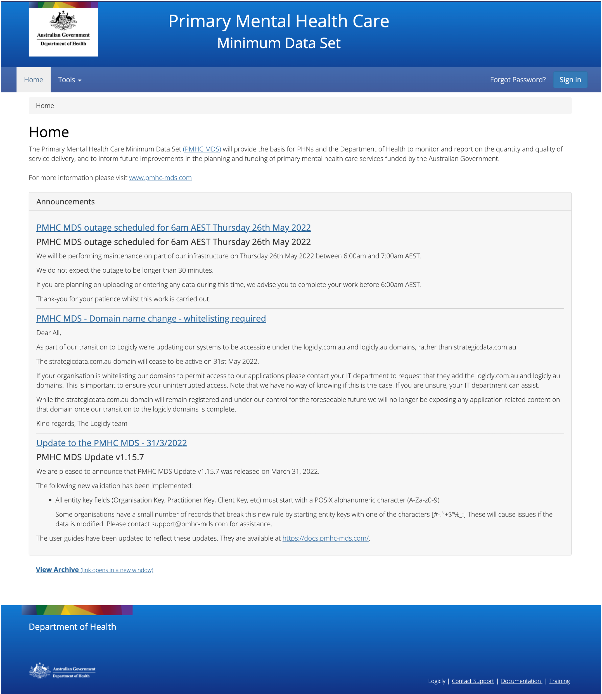
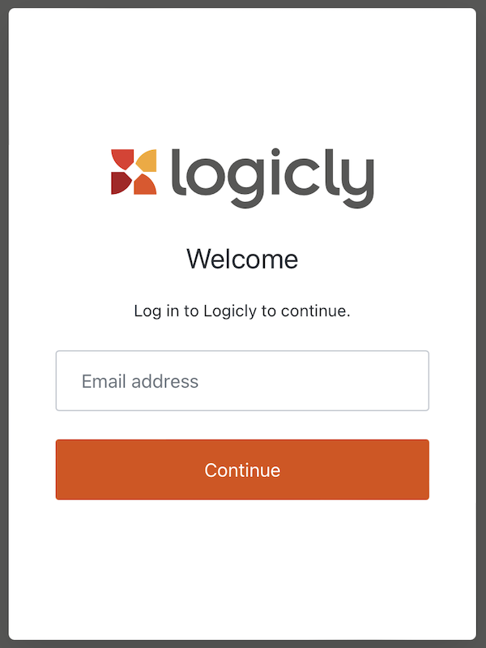
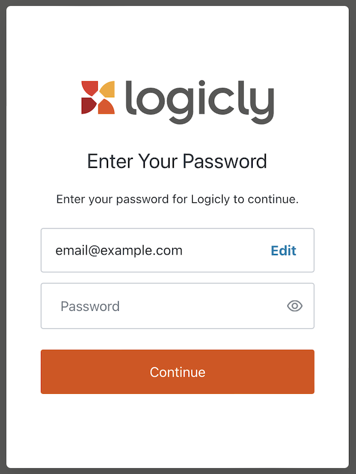
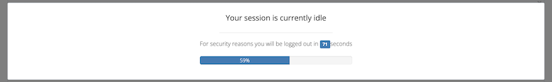
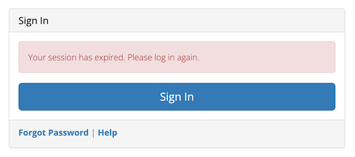
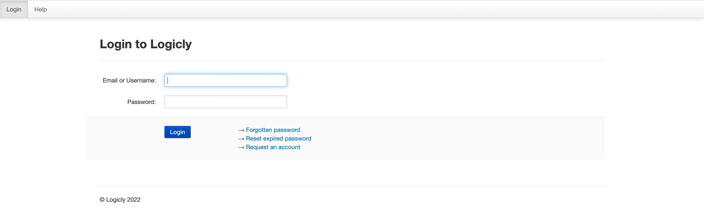

.. _home:

Home, Sign-in & Passwords
=========================

.. contents::
   :local:
   :depth: 1

To use the PMHC MDS navigate to https://pmhc-mds.net.

The first page you will see is the **Home** page. The home page shows you the
most recent announcements made via the :ref:`mailing-list-FAQs`.

An announcements archive link is now available on the **Home** tab under the three
most recent announcements - Click `View Archive <https://www.pmhc-mds.com/communications/>`_
to view all the PMHC MDS announcements.

.. _access:

Access to the PMHC MDS
^^^^^^^^^^^^^^^^^^^^^^

To access the PMHC MDS, you'll need a Logicly account, which you'll create when
accepting a PMHC MDS invitation.

A user with the User Management role in the PMHC MDS can manage access for new
and existing users in their organisation.

If unsure who has this role at for organisation, please contact support@pmhc-mds.com
and confirm your commissioning PHN name to enable us to search for these details.

.. _accepting-invitation:

Accepting an invitation to become a PMHC MDS User
^^^^^^^^^^^^^^^^^^^^^^^^^^^^^^^^^^^^^^^^^^^^^^^^^

To become a PMHC MDS user you will be sent an PMHC invitation which will enable
you to set up a Logicly account.

For more information, follow the the steps outlined at `Accepting a Logicly account invitation <https://docs.logicly.com.au/en/latest/account-management/index.html#accepting-a-logicly-account-invitation>`_

.. _logging-in:

Logging In
^^^^^^^^^^

After navigating to https://pmhc-mds.net/, click **Sign in**.

This will open a window to log in. Enter your email address and click **Continue**.

On the next window, enter then your password and click **Continue**.

To maintain compliance with current best practices in security policy,
Multi Factor Authentication (MFA) has been implemented for user access
to the PMHC MDS. On first log in you will be prompted to set up MFA. For assistance
in setting up and using MFA, follow the Logicly details at
`MFA documentation <https://docs.logicly.com.au/en/latest/mfa-user-guide/index.html>`_ .

.. _logging-out:

Logging Out
^^^^^^^^^^^

Logout by:

1. Clicking on the button to the right of the menubar that says **Logged in as [Name]**
2. Click **Logout** from the options that open

We strongly encourage users to logout when they have completed their tasks.

*Please note - the PMHC MDS will automatically log users out after 15
minutes of inactivity.  You will see a pop up box that provides a countdown
feature prior to automatically logging out the idle user.*

The login screen will confirm when an auto-logout has occurred to an idle user.

.. _updating-your-details:

Updating your details
^^^^^^^^^^^^^^^^^^^^^

If your email address has changed, it is important that you update your account.
These instructions require you to have a working login which you know.
Ensure you are logged in to proceed.

If you are unable to login and need your email address updated to regain access
then follow the instructions under :ref:`request-your-details-be-updated`.

To edit your details:

1. Click the button to the right of the menubar that says **Logged in as [Name]**
2. From the menu that opens, click **Profile**
3. You will be taken to the Profile Management page
4. Login using your PMHC MDS email and password

5. You will see the **Manage Details** page

   .. figure:: screen-shots/account-manage-details.png
      :alt: PMHC MDS Manage Details

  * To update your name, click the **Change personal details** link
  * To update your primary email address, click the **Change email address** link
  * To update your backup email address, click the **Change backup email address**
    link
  * Please note: The last section on the page, **Password lifetime**, tells you when
    you last changed your password and when it will expire. Passwords must
    be changed every year. See ::ref:`passwords`

6. Once you have entered your changed details, click **Submit** (Please note: you
   can only change one contact detail at a time)

7. An email with further instructions will be sent from
   noreply@logicly.com.au to the email address the PMHC MDS has on file
   for the user. (Please note: This information will be sent to both the old and
   the new details to confirm the change)

   .. figure:: screen-shots/account-update-details-request.png
      :alt: PMHC MDS Reset Password Request

8. Open the email sent from noreply@logicly.com.au and open the link in the email

   .. figure:: screen-shots/account-update-details-email.png
      :alt: PMHC MDS Reset Password Email

9. The screen will confirm the update has been completed.

   .. figure:: screen-shots/account-update-details-confirm.png
      :alt: PMHC MDS Reset Password Email

.. _request-your-details-be-updated:

Request your details be updated
^^^^^^^^^^^^^^^^^^^^^^^^^^^^^^^

If you can't access your profile, `contact the PMHC Helpdesk <mailto:support@pmhc-mds.com>`_
so that your records can be updated. When contacting the PMHC Helpdesk you will
be asked to arrange for a :ref:`letter of authority <letter-of-authority-faq>`
stating the change(s) you require.

.. _passwords:

Passwords Requirements
^^^^^^^^^^^^^^^^^^^^^^

As required by the Australian Government's Protective Security Policy Framework
passwords must be changed every twelve months. If you do not change your password
it will expire and you will not be able to login to the system without resetting
your password.

Passwords must:

Use a strong random password or a passphrase. In either case this must be at
least 14 characters. Random passwords are best suited to users relying on a
password manager as they can be generated by the password manager and need not
be remembered. Use a passphrase if it must be remembered.

When using a passphrase ensure that they aren't easily guessable by:

* Using at least 4 random words. e.g. "magpie knuckle asteroid penance"
* Not using a list of categorised words. e.g. "apple kiwi melon pear"
* Not using a real sentence in a natural language. e.g. "The quick brown fox"
* Not using well known phrases such as those constructed from song lyrics, movies, literature or any other publicly available material. e.g. "super califragilistic expialidocious"

Please note: Users will be reminded via an email sent from noreply@logicly.com.au
14 days prior to their password expiry date, and on PMHC MDS login 7 days prior
to their password expiry - See :ref:`soon-to-expire-password`.

If a password expires the user will not be able to access the PMHC MDS until they
reset their password - See :ref:`forgotten-password`.

.. _soon-to-expire-password:

Password Expiry Notifications
^^^^^^^^^^^^^^^^^^^^^^^^^^^^^

As required by the Australian Government's Protective Security Policy Framework
passwords must be changed every twelve months.

Users will be reminded via an email sent from noreply@logicly.com.au each
day for 14 days prior to their password expiry date, and will also be
reminded on PMHC MDS login 7 days prior to their password expiry.

It is quicker to reset your password before it expires. Passwords can be reset
by clicking the password reset link, which will open https://auth.logicly.com.au/.
This link can be accessed in one of two ways:

1. Either on the password reminder email; or

   .. figure:: screen-shots/account-password-expiry-reminder-email.png
      :alt: PMHC MDS Resetting Password

2. Under the PMHC MDS login click the **Sign in** button.

   .. figure:: screen-shots/account-password-expiry-reminder-MDS-login.png
      :alt: PMHC MDS Resetting Password

When your profile management page opens, you will be shown this screen:

   .. figure:: screen-shots/account-password-change.png
      :alt: PMHC MDS Resetting Password

**Please note:** If you see the message "Password unacceptably weak" after
entering your new password, the password is not of sufficient complexity.
Please check the password requirements. (Current users have indicated they
find it easier to create a password that is 13 or more characters to avoid
the complexity requirements). Iif you receive a message that your current
password is incorrect, please reset your password through the link, :ref:`forgotten-password`.

1. Click **Submit**
2. You will receive confirmation when your new password has been successfully saved

   .. figure:: screen-shots/account-password-changed-success.png
      :alt: PMHC MDS Password Reset Success

3. Log out of the profile management page
4. Navigate back to the PMHC MDS https://pmhc-mds.com/ and sign in

.. _forgotten-password:

Forgotten or Expired Password
^^^^^^^^^^^^^^^^^^^^^^^^^^^^^

As required by the Australian Government's Protective Security Policy Framework
passwords must be changed every three months. If you do not change your
password it will expire and you will not be able to login to the system
without resetting your password.

   .. figure:: screen-shots/account-sign-in-error.png
      :alt: PMHC MDS Wrong Username or Password

If you have forgotten your password or it has expired:

1. Navigate to https://pmhc-mds.net/
2. Click **Forgot Password?** (next to **Sign in** button)

   .. figure:: screen-shots/account-password-resetting.png
      :alt: PMHC MDS Resetting Password

3. You will be prompted to enter your email address or user name recorded
   for the PMHC MDS
4. Click the **I'm not a robot** checkbox
5. Click **Submit**
6. An email with further instructions will be sent from
   support@logicly.com.au to the email address the PMHC MDS has on file
   for the user
7. You will be prompted to enter your email address again
8. An email with further instructions will be sent from
   noreply@logicly.com.au to the email address the PMHC MDS has on file
   for the user. Additionally, if you have set a backup email, then
   an email will also be sent there.

   .. figure:: screen-shots/account-password-reset-request.png
      :alt: PMHC MDS Reset Password Request

9. Open the email sent from noreply@logicly.com.au and open the link in the email

   .. figure:: screen-shots/account-password-reset-email.png
      :alt: PMHC MDS Reset Password Email

10. This will open the **Password reset** window

   .. figure:: screen-shots/account-password-reset.png
      :alt: PMHC MDS Password Reset

11. Enter your new password
12. Confirm you new password
13. Click **Submit**
14. Your password will be reset

   .. figure:: screen-shots/account-password-reset-success.png
      :alt: PMHC MDS Password Reset Success

15. Logout of the profile management page
16. Navigate back to https://pmhc-mds.com/ and sign in

.. _blocked-user:

Account Blocked
^^^^^^^^^^^^^^^

To ensure security, the system blocks users who make too many incorrect attempts
to access their account on the PMHC MDS.

   .. figure:: screen-shots/account-blocked.png
      :alt: PMHC MDS Account Blocked

When this ocurrs, an automated email will be sent to the email address the
PMHC MDS has on file for the user.

   .. figure:: screen-shots/account-blocked-email-text.png
      :alt: PMHC MDS Account Blocked Email Text

1. Open the "Account blocked" email sent from support@logicly.com.au and follow
   the instructions in that email to unblock your account

      .. figure:: screen-shots/account-blocked-email-image.png
         :alt: PMHC MDS Account Blocked Email Display

2. If your IP address is displayed correctly, click the **Unblock** button

The system will confirm if the unblock was successful.

   .. figure:: screen-shots/account-unblocked.png
      :alt: PMHC MDS Account Unblocked Success

Please note: Reset your password before attempting to log in again - See :ref:`forgotten-password`.
