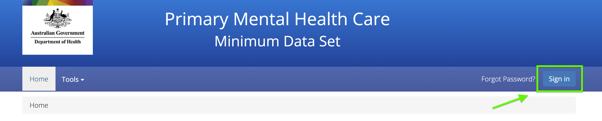
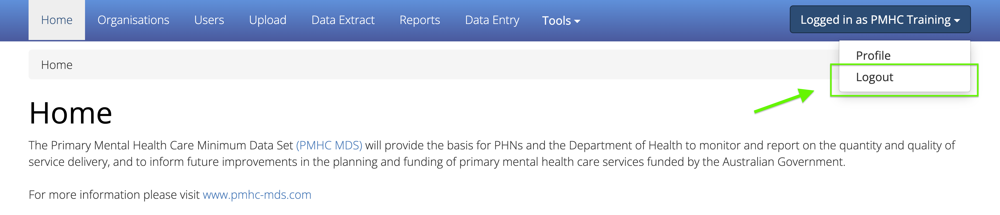

.. _home:

Home, Sign-in & Passwords
=========================

.. contents::
   :local:
   :depth: 1

To use the PMHC MDS navigate to https://pmhc-mds.net.

The first page you will see is the **Home** page. The home page shows you the
most recent announcements made via the :ref:`mailing-list-FAQs`.

.. figure:: screen-shots/home-page.png
   :alt: PMHC MDS Home Page

An announcements archive link is now available on the **Home** tab under the three
most recent announcements - Click `View Archive <https://pmhc-mds.com/communications/>`_
to view all the PMHC MDS announcements.

.. _access:

Access to the PMHC MDS
^^^^^^^^^^^^^^^^^^^^^^

To access the PMHC MDS, you'll need a Logicly account, which you'll create when
accepting a PMHC MDS invitation.

A user with the User Management role in the PMHC MDS can manage access for new
and existing users in their organisation.

If unsure who has this role at for organisation, please contact support@pmhc-mds.com
and confirm your commissioning PHN name to enable us to search for these details.

.. _accepting-invitation:

Accepting an invitation to become a PMHC MDS User
^^^^^^^^^^^^^^^^^^^^^^^^^^^^^^^^^^^^^^^^^^^^^^^^^

To become a PMHC MDS user you will be sent an PMHC invitation which will enable
you to set up a Logicly account.

For more information, follow the the steps outlined at `Accepting a Logicly account invitation <https://docs.logicly.com.au/en/latest/account-management/index.html#accepting-a-logicly-account-invitation>`_

.. _logging-in:

Logging In
^^^^^^^^^^

After navigating to https://pmhc-mds.net/, click **Sign in**.

This will open a window to log in. Enter your email address and click **Continue**.

.. figure:: screen-shots/log-in-step-1.png
   :width: 400
   :alt: PMHC MDS Sign In Step 1

On the next window, enter your password and click **Continue**.

.. figure:: screen-shots/log-in-step-2.png
   :width: 400
   :alt: PMHC MDS Sign In Step 2

To maintain compliance with current best practices in security policy,
Multi Factor Authentication (MFA) has been implemented for user access
to the PMHC MDS. On first log in you will be prompted to set up MFA. For assistance
in setting up and using MFA, follow the Logicly details at
`MFA documentation <https://docs.logicly.com.au/en/latest/mfa-user-guide/index.html>`_ .

.. _logging-out:

Logging Out
^^^^^^^^^^^

We strongly encourage users to logout when they have completed their tasks.

Logout by:

1. Clicking on the button to the right of the menubar that says **Logged in as [Name]**
2. Click **Logout** from the options that open

*Please note - the PMHC MDS will automatically log users out after 15
minutes of inactivity.  You will see a pop up box that provides a countdown
feature prior to automatically logging out the idle user.*

.. figure:: screen-shots/account-logout-count-down.png
   :alt: PMHC MDS Auto Log Out Count Down

The login screen will confirm when an auto-logout has occurred to an idle user.

.. figure:: screen-shots/account-auto-logout-confirmation.png
   :alt: PMHC MDS Auto Log Out Confirmation

.. _updating-your-details:

Updating your details
^^^^^^^^^^^^^^^^^^^^^

If your email address has changed, it is important that you update your account.
You must be logged in to proceed with these instructions.

For more information, follow the the steps outlined at `Updating Logicly account contact details <https://docs.logicly.com.au/en/latest/account-management/index.html#updating-your-details>`_

If you are unable to log in - See :ref:`request-your-details-be-updated`.

.. _request-your-details-be-updated:

Request your details be updated
^^^^^^^^^^^^^^^^^^^^^^^^^^^^^^^

If you can't access your Logicly profile, `contact the PMHC Helpdesk <mailto:support@pmhc-mds.com>`_
so that your records can be updated. When contacting the PMHC Helpdesk you will
be asked to arrange for a :ref:`letter of authority <letter-of-authority-faq>`
stating the change(s) you require.

.. _passwords:

Passwords Requirements
^^^^^^^^^^^^^^^^^^^^^^

As required by the Australian Government's Protective Security Policy Framework
passwords must be changed every twelve months. If you do not change your password
it will expire and you will not be able to login to the system without resetting
your password.

When creating a password, if you see the message "Password unacceptably weak"
the password is not of sufficient complexity. To learn more about the password
complexity requirements, please refer to `Logicly password requirements <https://docs.logicly.com.au/en/latest/account-management/index.html#password-requirements>`_.

.. _soon-to-expire-password:

Password Expiry Notifications
^^^^^^^^^^^^^^^^^^^^^^^^^^^^^

As required by the Australian Government's Protective Security Policy Framework
passwords must be changed every twelve months.

Users will be reminded via an email sent from noreply@logicly.com.au each
day for 14 days prior to their password expiry date, and will also be
reminded on PMHC MDS login 7 days prior to their password expiry.

It is quicker to reset your password before it expires. Passwords can be reset
by clicking the password reset link, which will open https://auth.logicly.com.au/.

For more information, follow the the steps outlined at `Password Expiry Notifications <https://docs.logicly.com.au/en/latest/account-management/index.html#password-expiry-notifications>`_.

After your new password has been successfully saved, log out of the Logicly profile
management page. Navigate back to the PMHC MDS https://pmhc-mds.net and sign in.

.. _forgotten-password:

Forgotten or Expired Password
^^^^^^^^^^^^^^^^^^^^^^^^^^^^^

As required by the Australian Government's Protective Security Policy Framework
passwords must be changed every three months. If you do not change your
password it will expire and you will not be able to login to the system
without resetting your password.

   .. figure:: screen-shots/account-sign-in-error.png
      :alt: PMHC MDS Wrong Username or Password

If you have forgotten your password or it has expired, you can use the automated
‘Forgot Password’ system to reset your password. Navigate to https://pmhc-mds.net/
and click **Forgot Password?** (next to **Sign in** button).

   .. figure:: screen-shots/account-password-reset-link.png
      :alt: PMHC MDS Forgot Password Link

For more information, follow the the steps outlined at `Forgotten Password <https://docs.logicly.com.au/en/latest/account-management/index.html#password-expiry-notifications>`_.

After your new password has been successfully saved, log out of the Logicly profile
management page. Navigate back to the PMHC MDS https://pmhc-mds.net and sign in.

.. _blocked-user:

Account Blocked
^^^^^^^^^^^^^^^

To ensure security, the system blocks users who make too many incorrect attempts
to access their account on the PMHC MDS.

   .. figure:: screen-shots/account-blocked.png
      :alt: PMHC MDS Account Blocked

When this occurs, an automated email will be sent to the email address the
PMHC MDS has on file for the user.

For more information, follow the the steps outlined at `Logicly Account Blocked <https://docs.logicly.com.au/en/latest/account-management/index.html#account-blocked>`_.

Please note: Reset your password before attempting to log in again - See :ref:`forgotten-password`.
