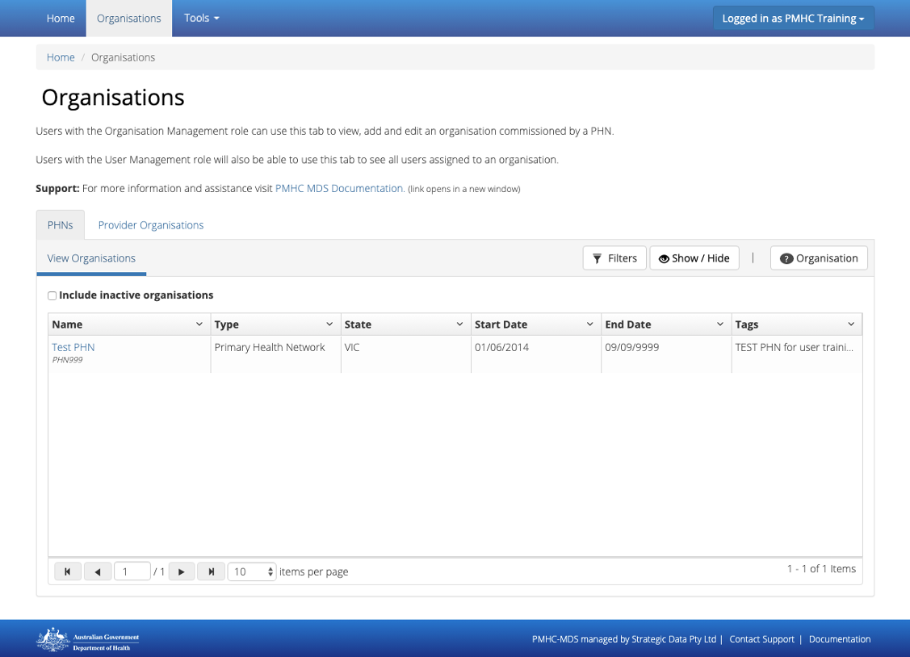
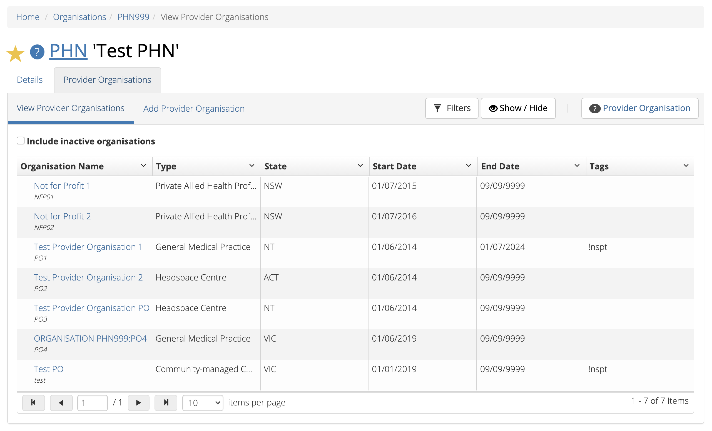
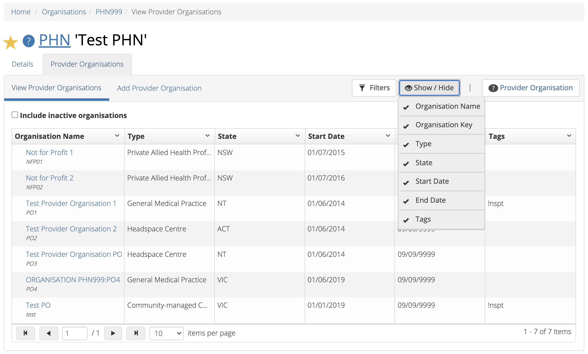
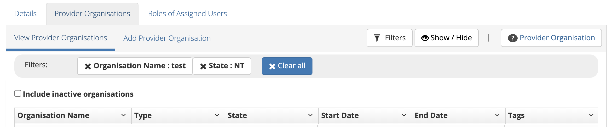

.. _organisations:

Organisations
=============

.. contents::
   :local:
   :depth: 1

You will be able to see the **Organisations** tab if you have been assigned
the 'Organisation Management', or the 'User Management' role, when logged
into the PMHC MDS on https://pmhc-mds.net.

If you believe you should have access to an organisation and it doesn't appear
in your list please contact someone who has the 'User Management' role in that
provider organisation or the provider organisation's commissioning PHN.

If you are unsure who has the 'User Management' role please email the PMHC
helpdesk at support@pmhc-mds.com.

After navigating to the **Organisations** tab, you will be presented with a list of
top level organisations for which you have been assigned the 'Organisation Management'
or the 'User Management' role.

.. _view-phn:

Viewing a PHN
^^^^^^^^^^^^^

You can view a PHN organisation's details through the **Organisations** tab, by
following these steps:

1. Navigate to the **Organisations** tab
2. Click on the PHN name in blue text displayed within the table

The PHN organisation's details will be displayed, along with the **Provider Organisations** tab.
If you have the 'User Management' role, a 'Users' tab listing
the users that belong to this PHN will also be included.

   .. figure:: screen-shots/organisation-phn-view.png
      :alt: PMHC MDS View Organisation

.. _search-provider-organisation:

Searching for a Provider Organisation
^^^^^^^^^^^^^^^^^^^^^^^^^^^^^^^^^^^^^

You can search for a provider organisation by sorting and filtering
the provider organisations of a PHN. Follow these steps:

1. Navigate to the **Organisations** tab
2. Click the PHN name in blue text displayed within the table
3. Click  the **Provider Organisations** tab

4. Sort the listed provider organisations by simply clicking on a column header
   of the **Provider Organisations** table. Alternately, you can click on the arrow beside a
   column header for more sort options, as follows:

   - **Sort Ascending**
   - **Sort Descending**
   - **Remove Sort**
   - **Hide Column**

You can also show or hide columns by unselecting and reselecting the items listed after pressing the **Show/Hide** button.

To filter the listed provider organisations:

1. Click the grey **Filters** button
2. Start typing in any of the column header edit boxes now displayed above the column headers
3. Click the blue **Apply** button

   .. figure:: screen-shots/organisation-provider-filter.png
      :alt: PMHC MDS Provider Organisations Filter

4. To remove the filters, click the black cross on the applied filter name or the **Clear all** button if more than one filter is applied

.. _view-provider-organisation:

Viewing a Provider Organisation
^^^^^^^^^^^^^^^^^^^^^^^^^^^^^^^

You can view a provider organisation's details through the **Organisations** tab, by
following these steps:

1. Navigate to the **Organisations** tab
2. Click the PHN name in blue text displayed within the table
3. Click the **Provider Organisations** tab
4. Click the provider organisation's name from the **View Provider Organisations** table

   .. figure:: screen-shots/organisation-provider-view.png
      :alt: PMHC MDS View Provider Organisation

.. _add-provider-organisation:

Adding a Provider Organisation
^^^^^^^^^^^^^^^^^^^^^^^^^^^^^^

If you have the 'Organisation Management' role you can add provider organisations
through the organisation tab by following these steps:

1. Navigate to the **Organisations** tab
2. Click the PHN name in blue text displayed within the table
3. Click the **Provider Organisations** tab
4. Click the **Add Provider Organisation** tab

   .. figure:: screen-shots/organisation-provider-add.png
      :alt: PMHC MDS Add Provider Organisation

5. Complete all the mandatory fields marked with an **\*** in the form
6. Click the blue **Save** button
7. You will receive confirmation that the organisation has been saved, and it will
   now be displaying in the PHN's Provider Organisations list

        .. figure:: screen-shots/client-data-saved.png
           :alt: Provider Organisation Saved Successfully

.. _edit-provider-organisation:

Editing a Provider Organisation
^^^^^^^^^^^^^^^^^^^^^^^^^^^^^^^

If you have the 'Organisation Management' role you can edit a Provider Organisation's
details through the organisation tab, by following these steps:

1. Navigate to the **Organisations** tab
2. Click the PHN name in blue text displayed within the table

   .. figure:: screen-shots/organisation-phn-view.png
      :alt: PMHC MDS View PHN

3. Click the **Provider Organisation** tab
4. Click the **Provider Organisation** name in blue text displayed within the
   table

   .. figure:: screen-shots/organisation-provider-view.png
      :alt: PMHC MDS View Provider Organisation

3. If you have permission to edit the Provider Organisation an **Edit Details** tab will
   be displayed
4. Click the blue **Edit** button

   .. figure:: screen-shots/organisation-provider-edit.png
      :alt: PMHC MDS Edit Organisation

4. Update the organisation's details. Mandatory fields are marked with an **\***
5. Click the blue **Save** button
6. You will receive confirmation that the updated organisation details have been saved

        .. figure:: screen-shots/client-data-saved.png
           :alt: Updated Provider Organisation Saved Successfully

.. _inactivate-provider-organisation:

Inactivate a Provider Organisation
^^^^^^^^^^^^^^^^^^^^^^^^^^^^^^^^^^

You can make a provider organisation inactive by entering an **End Date** in the
provider organisation details. The **End Date** can be in the future.

Once an end date is saved, there will be a 90 day grace period, in which the users
of this inactive provider organisation can finalise adding their data. Users of
an inactive provider organisation will not be able to add data after the grace
period has passed.

*Please note: Service Contact data and Outcome Collection Occasion data will not
be able to be recorded after an organisation's end date.*

*Please note: Only organisations that are active within a reporting period will
be displayed in the reports organisation field.*

.. _view-inactive-provider-organisation:

Viewing an inactive Provider Organisation
^^^^^^^^^^^^^^^^^^^^^^^^^^^^^^^^^^^^^^^^^

You can view an inactive provider organisation's details through the **Organisations** tab, by
following these steps:

1. Navigate to the **Organisations** tab
2. Click the PHN name in blue text displayed within the table
3. Click the **Provider Organisations** tab
4. Select the **Include inactive organisations** checkbox
5. Click the provider organisation's name from the table

Inactive organisations will be displayed with a **ZZZ** icon and will be greyed out.

   .. figure:: screen-shots/organisation-provider-view-inactive.png
      :alt: PMHC MDS View inactive Provider Organisations

.. _delete-provider-organisation:

Deleting a Provider Organisation
^^^^^^^^^^^^^^^^^^^^^^^^^^^^^^^^

You cannot delete a provider organisation. If you believe an organisation should be
deleted please email support@pmhc-mds.com.

Please note that a provider organisation cannot be deleted if it contains any
data within the PMHC MDS. Data can be reviewed through :ref:`data-extraction` and
:ref:`reports`. To delete data in bulk, please refer to :ref:`deletion-upload-file`.
If you wish to delete data record by record, please see :ref:`Deletion of client data via data entry<delete-client>`.
