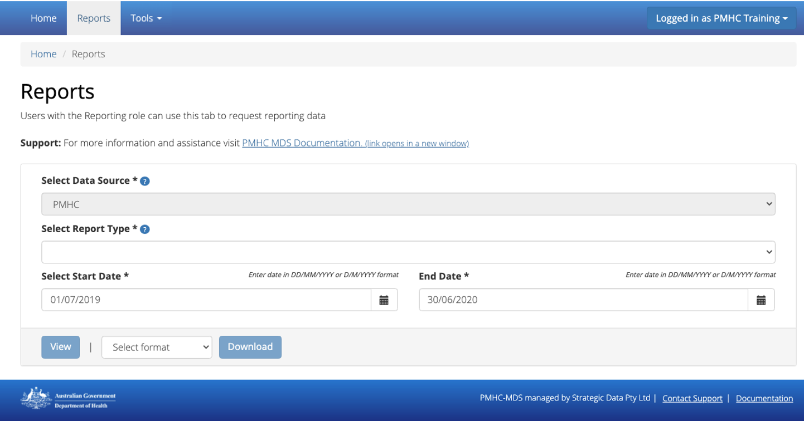
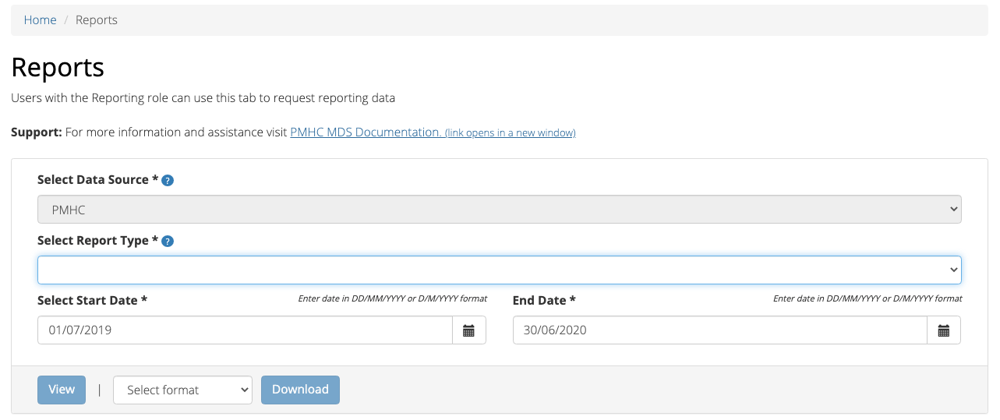
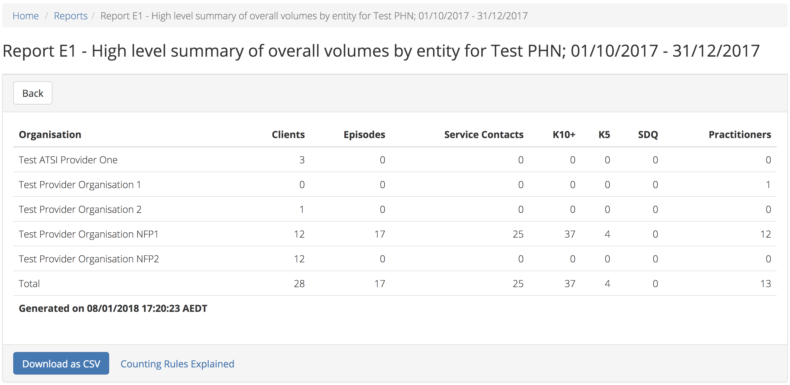
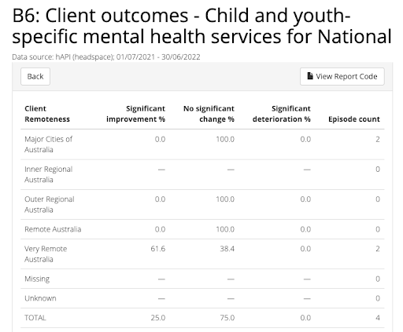

.. _reports:

Reports
=======

.. contents::
   :local:
   :depth: 1

You will only be able to see the **Reports** tab if you have been assigned
the 'Reporting' :ref:`roles`, when logged into the PMHC MDS on https://pmhc-mds.net.

If you don’t have access to the **Reports** tab and you believe you should, please
contact someone in your provider organisation or provider organisation's PHN
who has the 'User Management' role. If you are unsure who has the 'User Management'
role please email the PMHC Helpdesk at support@pmhc-mds.com

After navigating to the **Reports** tab, you will be able to view and export various
:ref:`system-report-types`.

.. _produce-system-report:

How to produce a Standard report
^^^^^^^^^^^^^^^^^^^^^^^^^^^^^^^^

You can produce a standard system report by completing the fields in the **Reports**
tab by following these steps:

1. Navigate to the **Reports** tab

2. If you are allowed to produce reports for more than one data source you
   will be asked to select a data source
3. Select the type of report you would like to produce
4. If you are allowed to produce reports for more than one organisation you
   will be asked to select an organisation name
5. Select the name of the organisation from the drop down list
6. Click the first calendar icon to select the start date and then the second
   calendar icon to select the end date
7. If you click the **Include only records with Client Consent** tickbox, the
   data for clients that have not consented to their anonymised data being
   provided to the Department of Health, Disability and Aging (DoHDA) will be excluded from your report. (See `Episode — Client Consent to Anonymised Data <http://docs.pmhc-mds.com/en/v1/data-specification/data-model-and-specifications.html#dfn-client-consent>`_ )
8. Click the blue **Request** button
9. Your report will be displayed on screen and can be downloaded as a CSV

*Note:* If you are not sure what data is displayed in a report, please click
on the **Counting Rules Explained** link.

.. _system-report-data-sources:

Data Sources for reports
^^^^^^^^^^^^^^^^^^^^^^^^

The overarching program areas and extensions that are associated with the data
in the PMHC MDS are available to partition reports.

The following are listed as the data sources currently available for reports:

.. contents::
   :local:
   :depth: 3

.. _data-source-all-program-types:

All PMHC Program Types
----------------------

The All PMHC Program Types data source includes all the following PMHC Program Types:

.. contents::
   :local:
   :depth: 3

Data linked to Beyond Blue The Way Back extension is included in all of these Program Types.
In order to partition reports by Way Back data a separate selection has been provided.

The PMHC data source does not include any hAPI headspace extension data.

.. _flexible-funding-pool:

Flexible Funding Pool
+++++++++++++++++++++

Other Programs commissioned through Primary Mental Health Care Schedule that are
not otherwise described by another category. (See `PMHC Program Type <https://docs.pmhc-mds.com/projects/data-specification/en/latest/data-model-and-specifications.html#program-type>`_).

.. _head-to-health:

Head to Health
++++++++++++++

The Head to Health Program includes Head to Health Adult Centres and Satellites
and pop-up clinics. (See `PMHC Program Type <https://docs.pmhc-mds.com/projects/data-specification/en/latest/data-model-and-specifications.html#program-type>`_).

.. _amhc:

AMHC
++++

The Head to Health Program that are delivering the Adult Mental Health Centre (AMHC)
trial sites. (See `PMHC Program Type <https://docs.pmhc-mds.com/projects/data-specification/en/latest/data-model-and-specifications.html#program-type>`_).

.. _psychosocial:

Psychosocial
++++++++++++

Mental health services delivered through the National Psychosocial Support Services
Program. (See `PMHC Program Type <https://docs.pmhc-mds.com/projects/data-specification/en/latest/data-model-and-specifications.html#program-type>`_).

.. _bushfire-recovery-20:

Bushfire Recovery 20
++++++++++++++++++++

Mental health services in fire affected communities can use this field for episodes
delivered through the Australian Government Mental Health Response to Bushfire Trauma.
(See `PMHC Program Type <https://docs.pmhc-mds.com/projects/data-specification/en/latest/data-model-and-specifications.html#program-type>`_).

.. _supporting_recovery:

Supporting Recovery
+++++++++++++++++++

Mental health services delivered through the Supporting Recovery pilot. (See
`PMHC Program Type <https://docs.pmhc-mds.com/projects/data-specification/en/latest/data-model-and-specifications.html#program-type>`_).

.. _mmhc:

MMHC
++++

Mental health services delivered through MMHC. (See
`PMHC Program Type <https://docs.pmhc-mds.com/projects/data-specification/en/latest/data-model-and-specifications.html#program-type>`_).

.. _the-way-back-pmhc-subset:

The Way Back (PMHC subset)
--------------------------

This PMHC subset report only includes Beyond Blue The Way Back Support Services
data linked to the episode tag `!wayback`.  (See `The Way Back Data Specification <https://docs.pmhc-mds.com/projects/data-specification-wayback/en/v3/data-specification/data-model-and-specifications.html>`_).

.. _hapi-headspace:

hAPI (headspace)
----------------

hAPI is data that headspace National Office upload from their internal hAPI
client information management system (See `headspace Data Specification <https://docs.pmhc-mds.com/projects/data-specification-headspace/en/latest/data-specification/data-model-and-specifications.html>`_).

Some of the standard reports, namely the :ref:`category-d` and :ref:`category-e` series are not
pertinent for headspace. However there are two headspace only
reports - the :ref:`category-a12` and the :ref:`category-b7` - and
contact-based reports are enhanced to allow breakdowns by funding source.

.. _system-report-tag-filter:

Filter by Tag
^^^^^^^^^^^^^

The Department reserved tags identify specific data record types in the PMHC MDS and begin with an exclamation mark (!).

The following tags can currently be used to filter data for reports:

* `!amhc - Australian Government Mental Health Centres <https://docs.pmhc-mds.com/projects/data-specification/en/latest/reserved-tags.html?highlight=!amhc#amhc-australian-government-mental-health-centres>`_
* `!br20 - Australian Government Mental Health Response to Bushfire <https://docs.pmhc-mds.com/projects/data-specification/en/latest/reserved-tags.html?highlight=!amhc#br20>`_
* `!covid19 - Episode occurred as result of COVID-19 pandemic <https://docs.pmhc-mds.com/projects/data-specification/en/latest/reserved-tags.html?highlight=!amhc#covid19-australian-government-headtohelp-hubs>`_
* `!wayback - The Way Back Support Service <https://docs.pmhc-mds.com/projects/data-specification-wayback/en/v3/data-specification/identifier-management.html#identifier-pmhc-twb-episode-tag>`_

*Note: Local tags can not be used to filter standard reports.*

.. _system-report-types:

Types of Standard reports
^^^^^^^^^^^^^^^^^^^^^^^^^

The reports are grouped into five categories, each designed to serve different
purposes.

.. contents::
   :local:
   :depth: 1

.. _category-a:

Category A: Monitoring progress of MDS implementation
-----------------------------------------------------

These reports are designed to assist monitoring MDS uptake and compliance with
key business rules.

The reports provide summary data on:

* Volumes ('active clients'/'active episodes'/contacts)
* Data quality in terms of compliance with key business rules

Available Category A reports:

.. contents::
   :local:
   :depth: 1

*Note:* A subset of these reports is included in :ref:`category-e` without
any filtering for active clients or episodes to enable organisational data
managers to monitor 'raw' upload and data supply to the MDS.

.. _category-a1:

A1 — High level summary of overall volumes by entity
++++++++++++++++++++++++++++++++++++++++++++++++++++

This report is designed to provide a 'one page' view, with data aggregated for
the specified reporting period, covering counts of clients, episodes and
service contacts. The A1 allows data to be broken down into entities or by
Principal Focus of Treatment Plan or by Practitioner types.

Key specifications:

* To be counted, a client must have had one or more Service Contacts in the
  reporting period, defined for this report's purposes as 'Active Clients'.
  Clients are counted uniquely regardless of number of episodes
* Episodes to be counted if one or more Service Contacts were recorded in the
  period — defined for this report purpose as 'Active Episodes'
* All Service Contacts in the period are reported except those that are flagged
  as 'No Show'
* Only service contacts with primary practitioners are included in the report
* Only primary practitioners are counted in the Practitioner Category breakdowns

.. _category-a1a:

A1a — High level summary of overall intakes
++++++++++++++++++++++++++++++++++++++++++++++++++++

This report is designed to provide a view analogous to the A1 for intakes,
with data aggregated for the specified reporting period. The count is not incorporated
with the A1 because it is based on different inclusion criteria. Additionally,
intakes have no stratification options because PHN/PO is the only applicable
stratification and this is presented automatically. (The A1 allows stratification
by Practitioner Category and Principle Focus of Treatment Plan as well as PHN/PO)

Key specifications:

* To be counted, an intake must have a 'Date client contacted Intake' within the reporting period

.. _category-a2:

A2 — Volume trends
++++++++++++++++++++++++++

This report is designed to show volume trends in clients, episodes, service contacts
and intakes. Each data point in the table and the chart shows weekly or monthly data,
depending on the option selected.

Key specifications:

* The inclusion criterion for intakes is a 'Date client contacted Intake' within the reporting period
* Other items (clients/episodes/contacts) are based on 'Active Episodes'. An Active Episode is one
  associated with at least one attended contact during the reporting period
* The Service Contacts column reports all the contacts associated with the active episodes, except those
  contacts that are identified as 'no show'

.. _category-a3:

A3 — Data quality report — Missing and invalid client data
++++++++++++++++++++++++++++++++++++++++++++++++++++++++++

The A3 reports are designed to identify Client data elements with significant
amounts of missing or invalid data.

Two formats of this report are offered to users:

.. contents::
   :local:
   :depth: 1

Key specifications:

* Clients to be counted uniquely regardless of number of episodes. To be
  counted, a client must have had one or more Service Contacts in the
  reporting period i.e. ‘Active Clients’
* Service Contacts flagged as ‘No Show’ are not included for this purpose
* Missing/invalid data defined as: Data elements with null or invalid values, or
  where ‘system generated’ codes have been reported to denote ‘not stated’,
  ‘inadequately defined’ or ‘missing’

.. _category-a3-1:

A3-1 — Data quality report — Missing and invalid client data — Summary
''''''''''''''''''''''''''''''''''''''''''''''''''''''''''''''''''''''

Summary format provides a simple listing of missing/invalid data rates for
relevant Client data elements, aggregated across the organisation, region or
nationally.

.. _category-a3-2:

A3-2 — Data quality report — Missing and invalid client data — Detail
''''''''''''''''''''''''''''''''''''''''''''''''''''''''''''''''''''''

Detailed format presents missing/invalid data rates at the entity level (PHN
and Provider Organisation). For this version, the user selects the specific
Client data element to be targeted for the report from a list of possible options.

Missing/invalid client data elements that can be selected for the A3-2
report are:

* Date of Birth
* Date of Birth Flag
* Gender
* ATSI status
* Country of Birth
* Main Language Spoken at Home
* Proficiency in Spoken English

*Note:* For a user with the Reporting role at a single Provider Organisation,
this report is redundant as it would only ever have a single row, which is
already present in the output of the A3-1 report. Therefore this report is
not made available to these users.

.. _category-a4:

A4 — Data quality report — Missing and invalid episode data
+++++++++++++++++++++++++++++++++++++++++++++++++++++++++++

The A4 reports are designed to identify data Episode elements with significant
amounts of missing or invalid data.

Two formats of this report are offered to users:

.. contents::
   :local:
   :depth: 1

Some Episode data elements are not included in the options list as they are
allowed to have a blank value (eg. Episode End Date), or there
is no missing value provided in the specification and the system doesn't allow
blank values to be submitted (eg. Principal Focus of Treatment Plan):

* Client Consent to Anonymised Data
* Episode End Date
* Episode Completion Status
* Episode Start Date
* Medication - Antipsychotics (N05A)
* Medication - Anxiolytics (N05B)
* Medication - Hypnotics and sedatives (N05C)
* Medication - Antidepressants (N06A)
* Medication - Psychostimulants and nootropics (N06B)
* Program Type
* Principal Focus of Treatment Plan

Key specifications:

* Report counts only ‘active episodes’. An Episode is defined as ‘active’ if it
  has one or more Service Contacts recorded in the period
* Service Contacts flagged as ‘No Show’ are not included for this purpose
* Missing/invalid data defined as: Episode data elements with null or invalid
  values, or where ‘system generated’ codes have been reported to denote
  ‘not stated’, ‘inadequately defined’ or ‘missing’

.. _category-a4-1:

A4-1 — Data quality report — Missing and invalid episode data — Summary
'''''''''''''''''''''''''''''''''''''''''''''''''''''''''''''''''''''''

Summary format provides a simple listing of missing/invalid data rates
for relevant Episode data elements, aggregated across the organisation,
region or nationally.

.. _category-a4-2:

A4-2 — Data quality report — Missing and invalid episode data — Detail
''''''''''''''''''''''''''''''''''''''''''''''''''''''''''''''''''''''

Detailed format presents missing/invalid Episode data rates at the
entity level (PHN and Provider Organisation). For this version, the user selects
the specific Episode data element to be targeted for the missing/invalid data
report from a list of possible options.

Missing/invalid episode data elements that can be selected for the A4-2 report
are:

* Episode Referral Date
* Referrer Profession
* Referrer Organisation Type
* Suicide Referral Flag
* GP Mental Health Treatment Plan Flag
* Homelessness flag
* Area of Usual Residence, Postcode
* Labour Force Status
* Employment Participation
* Source of Cash Income
* Health Care Card
* NDIS Participant
* Marital Status
* Principal Diagnosis
* Additional Diagnosis
* Continuity of Support
* Organisation Type Referred to at Episode Conclusion

*Note:* For a user with the Reporting role at a single Provider Organisation,
this report is redundant as it would only ever have a single row, which is
already present in the output of the A4-1 report. Therefore this report is
not made available to these users.

.. _category-a4a:

A4a — Data quality report — Missing and invalid intake data
+++++++++++++++++++++++++++++++++++++++++++++++++++++++++++

The A4a reports are designed to identify data Intake elements with significant
amounts of missing or invalid data.

Two formats of this report are offered to users:

.. contents::
   :local:
   :depth: 1

Some Intake data elements are not included in the options list as they are
allowed to have a blank value (eg. Date referred to other service at Intake conclusion), or there
is no missing value provided in the specification and the system doesn't allow
blank values to be submitted (eg. Program Type):

* Client Consent to Anonymised Data
* Program Type
* Date referred to other service at Intake conclusion
* Referred to Organisation Path

Key specifications:

* Intakes are included if the Date client contacted Intake is during the the reporting period
* Missing/invalid data defined as: Intake data elements with invalid
  values, or where ‘system generated’ codes have been reported to denote
  ‘not stated’, ‘inadequately defined’ or ‘missing’

.. _category-a4a-1:

A4a-1 — Data quality report — Missing and invalid episode data — Summary
''''''''''''''''''''''''''''''''''''''''''''''''''''''''''''''''''''''''

Summary format provides a simple listing of missing/invalid data rates
for relevant Intake data elements, aggregated across the organisation,
region or nationally.

.. _category-a4a-2:

A4a-2 — Data quality report — Missing and invalid episode data — Detail
'''''''''''''''''''''''''''''''''''''''''''''''''''''''''''''''''''''''

Detailed format presents missing/invalid Intake data rates at the
entity level (PHN and Provider Organisation). For this version, the user selects
the specific Intake data element to be targeted for the missing/invalid data
report from a list of possible options.

Missing/invalid intake data elements that can be selected for the A4-2 report
are:

* Referrer Profession
* Referrer Organisation Type
* Suicide Referral Flag
* Organisation Type Referred to at Episode Conclusion

*Note:* For a user with the Reporting role at a single Provider Organisation,
this report is redundant as it would only ever have a single row, which is
already present in the output of the A4a-1 report. Therefore this report is
not made available to these users.

.. _category-a5:

A5 — Data quality report — Missing and invalid service contact data
+++++++++++++++++++++++++++++++++++++++++++++++++++++++++++++++++++

The A5 reports are designed to identify Service Contact data elements with
significant amounts of missing or invalid data.

Two formats of this report are offered to users:

.. contents::
   :local:
   :depth: 1

Episodes that only have contacts marked "no show" are included in this report.

Some service contact data elements are not included in the options list as there
is no missing value provided in the specification and the system doesn't allow
blank values to be submitted:

* Service Contact Date
* Service Contact Final
* Service Contact Type
* Service Contact Modality
* Service Contact Duration
* Service Contact Copayment
* Service Contact Client Participation Indicator
* Service Contact No Show

.. note::
   When the **hAPI** Data Source is selected an extra **Funding Source** selector
   is provided for all A5 reports. Unlike the :ref:`category-b7`, which has 8
   funding categories (including Missing), the filters on the A5 are less
   fine grained and include only 5 funding categories (including 'Missing').

.. _category-a5-1:

A5-1 — Data quality report — Missing and invalid service contact data — Summary
'''''''''''''''''''''''''''''''''''''''''''''''''''''''''''''''''''''''''''''''

Summary format provides a simple listing of missing/invalid data rates
for relevant Service Contact data elements, aggregated across the
organisation, region or nationally.

.. _category-a5-2:

A5-2 — Data quality report — Missing and invalid service contact data — Detail
'''''''''''''''''''''''''''''''''''''''''''''''''''''''''''''''''''''''''''''''

Detailed format presents missing/invalid Service Contact data rates at
the entity level (PHN and Provider Organisation). For this version, the user
selects the Service Contact data to be targeted for the missing/invalid data
report from a list of possible options.

Missing/invalid episode data elements that can be selected for the A5-2 report
are:

* Service Contact Postcode
* Service Contact Participants
* Service Contact Venue
* Service Contact Interpreter Used
* Service Contact Type
* Service Contact Duration
* Service Contact Start Time

*Note:* For a user with the Reporting role at a single Provider Organisation,
this report is redundant as it would only ever have a single row, which is
already present in the output of the A5-1 report. Therefore this report is
not made available to these users.

.. _category-a6:

A6 — Data quality report — Missing and invalid practitioner data
++++++++++++++++++++++++++++++++++++++++++++++++++++++++++++++++

The A6 reports are designed to identify Practitioner data elements with
significant amounts of missing data.

Two formats of this report are offered to users:

.. contents::
   :local:
   :depth: 1

Key specifications:

* Report is confined only to ‘active practitioners’. A Practitioner is defined as
  ‘active’ if it they have recorded one or more Service Contacts in the period
* Service Contacts flagged as ‘No Show’ are not included for this purpose

.. _category-a6-1:

A6-1 — Data quality report — Missing and invalid practitioner data — Summary
''''''''''''''''''''''''''''''''''''''''''''''''''''''''''''''''''''''''''''

Summary format provides a simple listing of missing/invalid data rates
for relevant data elements, aggregated across the organisation, region or
nationally.

.. _category-a6-2:

A6-2 — Data quality report — Missing and invalid practitioner data — Detail
'''''''''''''''''''''''''''''''''''''''''''''''''''''''''''''''''''''''''''

Detailed format presents missing/invalid data rates at the entity level
(PHN and Provider Organisation). For this version, the user selects the
Practitioner data to be targeted for the missing/invalid data report from a list
of options.

Missing/invalid episode data elements that can be selected for the A6-2
report are:

* Practitioner Category
* ATSI Cultural Training Flag
* Practitioner Year of Birth
* Gender
* Aboriginal and Torres Strait Islander Status

*Note:* For a user with the Reporting role at a single Provider Organisation,
this report is redundant as it would only ever have a single row, which is
already present in the output of the A6-1 report. Therefore this report is
not made available to these users.

.. _category-a7:

A7 — Open episodes with no service contact activity for 90+ days
++++++++++++++++++++++++++++++++++++++++++++++++++++++++++++++++

The A7 report is designed to allow monitoring of adherence to the requirement
to close episodes where there are no further services scheduled for the client.

Setting of the 90 day threshold does not imply a strict business rule to close
episodes where no contact has occurred for this period, but rather to identify
episodes that may warrant review.

Key specifications:

* Open Episodes defined as those without an End Date or an End Date after the
  end date of the report
* Service Contacts flagged as ‘No Show’ are not included for this purpose

Unlike the A8 report, this report has no requirement to start during the reporting period.

.. _category-a8:

A8 — Data quality report — Recording of outcome measures for open episodes
++++++++++++++++++++++++++++++++++++++++++++++++++++++++++++++++++++++++++

The A8 report is designed to show the percentage of open (not yet completed)
episodes that have an outcome measure recorded at the Episode Start collection
occasion. Its purpose is to allow monitoring of adherence to the minimum
requirements for outcome recording — i.e. measures to be recorded at Episode
Start and Episode End.

Report A9 examines a related aspect — the extent to which Completed Episodes
have both Episode Start and Episode End measures.

Key specifications:

* Open Episodes defined as those without an End Date or an End Date after the
  end date of the report
* For this report, Episodes must also have an Episode Start Date equal to or greater than
  the report start date
* Only Episodes with one or more Service Contacts in the reporting period are
  included in the analysis (referred to as 'active episodes')
* Service Contacts flagged as ‘No Show’ are not included for this purpose
* Measures that have a total score of ‘99 = Not stated / Missing’ are invalid and counted as ‘no measure’

.. _category-a9:

A9 — Data quality report — Recording of outcome measures for completed episodes
+++++++++++++++++++++++++++++++++++++++++++++++++++++++++++++++++++++++++++++++

The A9 report is designed to show the percentage of completed episodes that have
outcome measures recorded. Its purpose is to allow monitoring of adherence to
the minimum requirements for outcome recording — i.e. measures to be recorded
at Episode Start and Episode End.

*Note:* that unlike the requirements set out in	at Episode Start and Episode End.
:ref:`category-out-3` for the Out series reports where the same measure must be
collected at start and finish, the A9 will accept any combination of measures
provided there is at least one at the start of the episode and one at the end
of the episode.

Key specifications:

* Episodes must have an Episode End Date within the reporting period.
* Episodes must have had one or more Service Contacts not flagged as ‘No Show’,
  but not necessarily during the reporting period
* Measures that have a total score of ‘99 = Not stated / Missing’ are invalid and counted as ‘no measure’

.. _category-a10:

A10 — Data quality report — Missing and invalid Referral Dates
++++++++++++++++++++++++++++++++++++++++++++++++++++++++++++++

The A10 report is designed to show the counts of episodes with missing and
invalid Referral Dates. Its purpose is to allow monitoring of adherence to the
minimum requirements for outcome recording — i.e. measures to be recorded at
Episode Start and Episode End. For this report there are no date selections.

Key specifications:

* The three columns relating to Service Contacts ignore contacts flagged as ‘No Show’
* The Service Contact used in Episodes with Referral date is the one with the
  earliest date that is also not marked as ‘No Show’
* Referral > Date 1 year before Service Contact is defined as a Referral Date
  more than 365 days prior to the earliest (non no-show) Service Contact

.. _category-a11:

A11 — Data quality report — Episodes with no service contact
++++++++++++++++++++++++++++++++++++++++++++++++++++++++++++

The A11 report is designed to show the number of episodes with no service
contact. Episodes with and without referral dates are reported separately.
Note that there are no date selectors on this report - it shows every recorded
episode that has no (non no-show) Service Contact.

Key specification:

* Episodes that only have contacts marked "no show" are included in this report.

.. _category-a12:

A12 — Episodes shared across multiple organisations
+++++++++++++++++++++++++++++++++++++++++++++++++++

This report applies to hAPI (headspace) data only.

The PMHC model specifies that all activity (service contacts and collection
occasions) for an episode must occur at the same organisation. The headspace
model allows an episode of care to be delivered by multiple organisations.
For compatibility with the PMHC, reports based on hAPI data exclude episodes
(and corresponding service contacts, collection occasions and potentially
clients) that involve more than one organisation.

For each entity (headspace centre or PHN) the A12 reports 2 lines:

* "As lead organisation"
* "As delivery organisation"

The headspace enhancement of the PMHC MDS model adds a "delivery organisation"
to both the service contact records and the collection occasion records. This
can be different to the organisation that initiated the episode (the
"lead organisation"). The A12 reports any episode that has at least one
collection occasion or service contact delivered by an organisation that
is not the lead organisation. Thus any particular organisation can operate
in lead and/or delivery context.

The "As lead organisation" means the entity initiated the episode but at
least one collection occasion or service contact was delivered away from
that entity. All activity pertaining to such episodes is reported in this row.

"As delivery organisation" reports all activity for all episodes the entity
was not the lead organisation for, but delivered at least one collection
occasion or service contact for. This second view is a better indicator of
work that an organisation was involved with but does not get included in the bulk
of the headspace reports. Note that a single episode can appear more than
once in the "As delivery organisation" line but only ever once in the "As
lead organisation" line.

The A12 tallies the number of contacts/episodes/contacts/collections occasions
that are delivered by multiple organisations. It is based on
`Active Episodes <https://docs.pmhc-mds.com/projects/data-specification/en/v2/data-model-and-specifications.html#active-episode>`_,
and the number of episodes delivered at multiple organisations is what is reported in the "Active Episodes" column.

The "Service Contacts" column counts all the non no-show contacts in the
reporting period that are associated with the `Active Episodes <https://docs.pmhc-mds.com/projects/data-specification/en/v2/data-model-and-specifications.html#active-episode>`_.
Similarly the `Active Clients <https://docs.pmhc-mds.com/projects/data-specification/en/v2/data-model-and-specifications.html#active-client>`_
is the enumeration of all clients for whom ALL episodes
active during the reporting period were delivered at multiple organisations.
A single episode during the reporting period delivered at only one
organisation excludes client from this count.

.. _category-b:

Category B: Monitoring overall service delivery
-----------------------------------------------

These reports are designed to present a range of data in the form of summary
tables. Their purpose is to allow the user to monitor overall service delivery
based on counts of clients, episodes, and service contacts, stratified in
various ways that depend on the data being sourced.

There are five reports in this series, each covering a specific data category
(Clients, Episode, Service Contacts, Provider Organisations, and Practitioners).

.. contents:: Available category B reports
   :local:
   :depth: 1

.. _category-b1:

B1 — Activity report — Client characteristics
+++++++++++++++++++++++++++++++++++++++++++++

The B1 report is designed to allow selection of a Client
stratification variable of interest, with a menu of options covering all
core Client data fields.

Key specifications:

* Client to be counted uniquely regardless of number of episodes. To be
  counted, a client must have had one or more Service Contacts in the
  reporting period
* Counts of Episodes to be based only on 'active' Episodes, defined as those
  that had one or more Service Contacts recorded in the period
* Service Contacts flagged as ‘No Show’ are not included for this purpose
* Age is calculated at start of episode
* Only service contacts with primary practitioners are included in the report

.. _category-b2:

B2 — Activity report — Episode characteristics
++++++++++++++++++++++++++++++++++++++++++++++

The B2 report is designed to allow selection of an Episode stratification
variable of interest, with a menu of options covering all core Episode data
fields.

Key specifications:

* An Episode is defined as 'active' and in-scope for inclusion in this report
  if it had one or more Service Contacts recorded in the period. No distinction
  is made between Open and Completed Episodes, except for the "Organisation
  Referred to at Episode Conclusion" which only applies to closed episodes
* Service Contacts flagged as ‘No Show’ are not included for this purpose
* Only service contacts with primary practitioners are included in the report
* :ref:`interp_remoteness_counts` is pertinent to the B2 report

.. _category-b2a:

B2a — Activity report — Intake characteristics
++++++++++++++++++++++++++++++++++++++++++++++

The B2a report is designed to allow selection of an Intake stratification
variable of interest, with a menu of options covering all core Intake data
fields.

Key specifications:

* To be counted, an intake must have a Date client contacted Intake within the reporting period

.. _category-b3:

B3 — Activity report — Service Contact characteristics
++++++++++++++++++++++++++++++++++++++++++++++++++++++

The B3 report is designed to allow selection of a Service Contact
stratification variable of interest, with a menu of options covering all
core Service Contact fields.

.. note::
   When the **hAPI** Data Source is selected an extra **Funding Source** selector
   is provided for the B3 report. Unlike the :ref:`category-b7`, which has 8
   funding categories (including Missing), the filters on the B3 are less
   fine grained and include only 5 funding categories (including 'Missing').

Key specifications:

* Reporting by ‘Service Contact No Show’ element counts all service contacts
  by whether they are flagged as ‘No Show’
* Otherwise, Service Contacts flagged as ‘No Show’ are not included in this report
* Only service contacts with primary practitioners are included in the report
* :ref:`interp_remoteness_counts` is pertinent to the B3 report

.. _category-b4:

B4 — Activity report — Provider Organisation characteristics
++++++++++++++++++++++++++++++++++++++++++++++++++++++++++++

The B4 report is designed to allow selection of a Provider Organisation
stratification variable of interest, with a menu of options covering all
core Provider Organisation data fields.

Key specifications:

* A Provider Organisation is defined as 'active' if it has recorded and in-scope
  for this report if there is one or more Service Contacts recorded for the
  Provider Organisation in the period
* Service Contacts flagged as ‘No Show’ are not included for this purpose
* Only service contacts with primary practitioners are included in the report

.. _category-b5:

B5 — Activity report — Practitioner characteristics
+++++++++++++++++++++++++++++++++++++++++++++++++++

The B5 report is designed to allow selection of a Practitioner stratification
variable of interest, with a menu of options covering all core Practitioner
data fields.

Key specifications:

* A Primary Practitioner is defined as 'active' and in-scope for this report if they
  have recorded one or more Service Contacts in the period
* Service Contacts flagged as ‘No Show’ are not included for this purpose
* Only service contacts with primary practitioners are included in the report

.. _category-b6:

B6 — Client Outcomes
++++++++++++++++++++

The B6 report is an extension of the outcome indicators that note significant
clinical changes between episode start and finish. Out-1 and Out-2
(:ref:`category-out-1-2`) are restricted to episodes with a Principal Focus of
Treatment Plan classified as "Low intensity psychological interventions" and
"Psychological therapies delivered by mental health professionals"
respectively. The B6 extends this to any type of focus.

* The change for an episode is based on the effect size statistic which is
  defined as (score at episode start − score at episode end) / standard
  deviation of episode start scores for all episodes
* Effect sizes of +0.5 or more constitute 'Significant improvement',
  −0.5 or less constitute 'Significant deterioration'.
  Effect sizes between −0.5 and 0.5 indicate 'No significant change'
* :ref:`interp_remoteness_counts` is pertinent to the B6 report

.. _category-b7:

B7 — Activity Report — hAPI Funding Source
++++++++++++++++++++++++++++++++++++++++++

This report applies to hAPI (headspace) data only.

Unlike data reported by PHNs, which is funded exclusively by the PHNs, data
reported to hAPI is funded by many different sources. The B7 report provides
a detailed breakdown of the funding source under which service contacts where
delivered. Only non no-show contacts during the reporting period are included.

In addition, the B7 aggregates the contacts into episode and client counts.
An episode may have activity with more than one funding source, in which case
it will be counted in every row for which it has a contact funded by the
pertinent source. Unless all contacts for all episodes are funded by the
same source, the total number of episodes reported will be lower than the
sum of the number of episodes in all funding sources. The same principle
applies to Client counts.

Key specifications:

* Service Contacts flagged as ‘No Show’ are not included for this purpose
* Only service contacts with primary practitioners are included in the report

.. _category-b8:

B8 — YES PHN index
++++++++++++++++++

This report applies to YES-PHN data only.

Your Experience of Service Primary Health Network (YES-PHN) Survey aims to help
providers and consumers to work together to build better services. Completion of
the survey is voluntary. All information collected in this survey is anonymous.

Detailed description and explanation about using and interpreting the YES-PHN
is available at https://www.amhocn.org/__data/assets/pdf_file/0018/700452/yes_phn_guidance_v1.0_20200408.pdf.
The YES PHN index in the B8 report reflects the definition in this document and
reports the proportion of respondents with an experience of service score over 80.

The B8 report provides a summary average experience score, outcome score and
YES-PHN index. Only completed YES-PHN surveys during the reporting period are
included.

Key specifications:

* The collection date must be within the reporting period
* Any YES-PHN surveys with more than half of the items missing is excluded

.. _category-b9:

B9 - Activity Report - Number of practitioners
++++++++++++++++++++++++++++++++++++++++++++++

The B9 is designed to monitor the composition of multi-practitioner teams delivering
a single contact. It counts the number of contacts made up of different sized
practitioner teams. It reports both the total number of practitioners involved
with each contact, and the number of unique practitioner categories involved.

Over time, the PMHC has recorded practitioners in three different ways. Initially
only a single practitioner (and their category) was recorded. With the introduction
of Head To Health programs it was expanded to also include a count of different
practitioner categories. With the release of version 4 all practitioners and
their categories can be recorded. The B9 does not adjust for these historical
changes, so therefore contacts conducted prior to version 4 will always be
counted in the ‘1’ column for both Number of Practitioners and Number of
Practitioner Categories.

Key specifications:

* The contact must not be a “no show” contact
* The contact must take place during the reporting period

.. _category-c:

Category C: Monitoring implementation of stepped care
-----------------------------------------------------

This group of reports is based on composite data, built from cross-tabulation of
data drawn from multiple levels of the PMHC data model – Clients, Episodes, Service
Contacts, Practitioners.

Their purpose is to allow the user to monitor selected aspects of the implementation
of the stepped care model.

The stepped care reports represent work in progress and will be subject to ongoing
improvement with PHN feedback on their utility.

.. contents:: Available category C reports
   :local:
   :depth: 1

.. _category-c1:

C1 — Stepped care report — Episode type by Client characteristics
+++++++++++++++++++++++++++++++++++++++++++++++++++++++++++++++++

Purpose: To provide summary information on the characteristics of clients who
receive different types of services, grouped by ‘episode type’.

Client data fields to be selected by user from a list of options.

Key specifications:

* Only ‘active episodes’ are reported. An Episode is defined as ‘active’ and
  in scope for inclusion in this report if it had one or more Service Contacts
  recorded in the period. No distinction is made between Open and Completed
  Episodes
* Service Contacts flagged as ‘No Show’ are not included for this purpose.
* Counts shown in the report refer to Episodes, and are displayed as numbers
  or percent column based on user selection
* Age is calculated at start of episode
* A client can fall into multiple age groups because they may have multiple 
  episodes within the reporting period

Client data elements that can be selected for the C1 report are:

* Client age group based on Date of Birth, grouped to the following categories:

  * 0-11, 12-17, 18-24, 25-64, 65+
 
* Indigenous status
* Area of Usual Residence

  * Grouped by Remoteness Classification (Major Cities, Outer Regional,
    Inner Regional, Remote, Very Remote)

* Principal diagnosis — High level grouping

  * Anxiety disorders
  * Affective (Mood) disorders
  * Substance use disorders
  * Psychotic disorder
  * Disorders with onset usually occurring in childhood and adolescence
    not listed elsewhere
  * Other mental disorder
  * No formal mental disorder but subsyndromal problem

* Gender
* Country of Birth – grouped to high level categories
* :ref:`interp_remoteness_counts` is pertinent to the C1 report

.. _category-c2:

C2 — Stepped care report – Episode Type by Service Contacts Type
++++++++++++++++++++++++++++++++++++++++++++++++++++++++++++++++

Purpose: To provide summary information on the types of service contacts delivered
within each of the episode types.

Key specifications:

* Only ‘active episodes’ are reported. An Episode is defined as ‘active’ and
  in scope for inclusion in this report if it had one or more Service Contacts
  recorded in the period. No distinction is made between Open and Completed
  Episodes
* Service Contacts flagged as ‘No Show’ are not included for this purpose
* Counts shown in the report refer to Episodes, and are displayed as numbers
  or percent rows based on user selection

.. _category-c3:

C3 — Stepped care report – Episode Type by Service Contact Intensity
++++++++++++++++++++++++++++++++++++++++++++++++++++++++++++++++++++

Purpose: To provide summary information on the volumes of service delivered
within each of the episode types.

Key specifications:

* Only ‘active episodes’ are reported. An Episode is defined as ‘active’ and
  in scope for inclusion in this report if it had one or more Service Contacts
  recorded in the period. No distinction is made between Open and Completed
  Episodes
* Service Contacts flagged as ‘No Show’ are not included for this purpose
* Counts shown in the report refer to Episodes, and are displayed as numbers
  or percent rows based on user selection
* Total Clients is a unique count of clients, not the sum of the individual rows.
  Clients may be counted in more than one row

.. _category-d:

Category D: Key Performance Indicators
--------------------------------------

A set of 13 key performance indicators was introduced in July 2016, designed to monitor the
progress of mental health reforms being led by Primary Health Networks (PHNs). The indicators
covered activities related to the delivery of services in six priority areas set by government, along
with two overarching program management indicators covering integrated service planning and
delivery, and implementation of stepped care models of care.

All 13 indicators were subsequently incorporated in schedules for mental health program funding,
requiring PHNs to report on performance annually. Data sources for the majority of indicators (11)
are derived in full or part from the Primary Mental Health Care Minimum Data Set (PMHC MDS).

The mental health KPIs were introduced prior to the implementation of the current PHN
Performance and Quality Framework (September 2018) and need to be positioned within that policy
framework. One additional indicator was added to the mental health KPIs as a result of the new
framework, bringing the total to 14.

9 of the 14 KPI reports will ultimately be available via the PMHC MDS.

.. contents:: Available category D reports
   :local:
   :depth: 2

The following reports are not available via the PMHC MDS as they require
information that is not derived from the PMHC MDS:

* Eff-1 — Average cost of PHN-commissioned low intensity psychological
  intervention services
* Eff-2 — Average cost of PHN-commissioned psychological therapies delivered by
  mental health professionals
* Eff-3 — Average cost of PHN-commissioned clinical care coordination for people
  with severe and complex mental illness
* Prog-1 — Proportion of PHN annual flexible funding allocated to low intensity
  services, psychological therapies and services for people with severe and
  complex mental illness
* Prog-2 — Formalised partnerships with other regional service providers to
  support integrated regional planning and service delivery

.. _category-acc:

.. _category-acc-1:

.. _category-acc-2:

.. _category-acc-3:

ACC series reports (Acc-1 to Acc-3)
+++++++++++++++++++++++++++++++++++

Purpose: Measure the proportion of regional population receiving PHN-commissioned
specific services.

Please note: For Acc series reports, it's important to keep in mind that the splits
may not always produce the same totals. Clients can have multiple episodes and each
episode can be counted in each group. Using age group as an example, the episode
start date is used to determine a client's age. When a client has multiple episodes,
and their birthday has occurred in the reporting period, each episode can fall
into a different age group.

Additionally, the remoteness classifications are derived using the episode postcode,
but a postcode can belong to multiple remoteness classifications. These reports
will proportion an individual episode across all relevant classifications. For example, postcode 2900 has been classified as both a major city and an inner region.

Key specifications applying to all ACC series reports:

* Only ‘active clients’ are reported. A Client is defined as ‘active’ and
  in scope for inclusion in this report if they had one or more Service Contacts
  recorded in the period.
* Service Contacts flagged as ‘No Show’ are not included for this purpose
* Population is calculated from Estimated Regional Population figures
* KPI is measured in clients per 100,000 population
* Age is calculated at start of episode
* :ref:`interp_remoteness_counts` is pertinent to the Acc series reports

And key specifications for:

.. contents::
   :local:
   :depth: 1

.. _category-acc-1only:

Acc-1 — Access to Low Intensity Services
''''''''''''''''''''''''''''''''''''''''

Purpose: Measure the proportion of regional population receiving PHN-commissioned
low intensity psychological interventions

See :ref:`key specifications for all ACC series reports <category-acc>`, plus:

Key specifications:

* The episode must have a 'Principal Focus of Treatment
  Plan' flagged as 'Low intensity psychological intervention'

.. _category-acc-2only:

Acc-2 — Access to Psychological Services
''''''''''''''''''''''''''''''''''''''''

Purpose: Measure the proportion of regional population receiving PHN-commissioned
psychological therapies delivered by mental health professionals.

See :ref:`key specifications for all ACC series reports <category-acc>`, plus:

Key specifications:

* The episode must have a 'Principal Focus of Treatment
  Plan' flagged as 'Psychological therapy'

.. _category-acc-3only:

Acc-3 — Access to Clinical Care Coordination
''''''''''''''''''''''''''''''''''''''''''''

Purpose: Measure the proportion of regional population receiving PHN-commissioned
clinical care coordination for people with severe and complex mental illness.

See :ref:`key specifications for all ACC series reports <category-acc>`, plus:

Key specifications:

* The episode must have a 'Principal Focus of Treatment
  Plan' flagged as 'Clinical care coordination'

.. _category-app:

.. _category-app-1:

.. _category-app-2:

.. _category-app-3:

APP series reports (App1 to App3)
+++++++++++++++++++++++++++++++++

Key specifications applying to all App series reports:

* Age is calculated at start of episode
* :ref:`interp_remoteness_counts` is pertinent to the App series reports

And key specifications for:

.. contents::
   :local:
   :depth: 1

.. _category-app-1only:

App-1 — Youth receiving youth-specific services
'''''''''''''''''''''''''''''''''''''''''''''''

Purpose: Measure the proportion of regional youth population receiving
youth-specific mental health services.

Key specifications:

* Only ‘active clients’ are reported. A Client is defined as ‘active’ and
  in scope for inclusion in this report if they are aged between 12-24 and had
  one or more Service Contacts recorded in the period. The episode must have a
  'Principal Focus of Treatment Plan' flagged as 'Child and youth-specific mental
  health services'
* Service Contacts flagged as ‘No Show’ are not included for this purpose
* Population is calculated from Estimated Regional Population figures
  for people aged 12-24
* KPI is measured in clients per 100,000 population

.. _category-app-2only:

App-2 — Indigenous Population receiving culturally appropriate services
'''''''''''''''''''''''''''''''''''''''''''''''''''''''''''''''''''''''

Purpose: Measure the proportion of PHN-commissioned mental health
services delivered to the regional Indigenous population where the
services were culturally appropriate.

Key specifications:

* Service contacts are in scope for inclusion in this report if they
  occurred within the reporting period and are not flagged as ‘No Show’
* KPI is measured as the percentage of service contacts which are
  culturally appropriate
* A culturally appropriate service is defined as one that is delivered by
  a service provider that is recorded as of ATSI origin, or employed by an
  Aboriginal Community Controlled Health Service or has indicated that
  they have completed a recognised training programme in the delivery of
  culturally safe services to ATSI peoples
* Only service contacts with primary practitioners are included in the report

.. _category-app-3only:

App-3 — Suicide Risk Followup
'''''''''''''''''''''''''''''

Purpose: Measure the proportion of people referred to PHN-commissioned
services due to a recent suicide attempt or because they are at risk of
suicide, who are followed up within 7 days of referral.

Unlike most reports, this measure includes episodes where no service contact occurs
to ensure all clients are followed up within the required timeframe, allowing for
review of why no contact was made for this risk group.

It is important to keep in mind that Episodes that have not yet commenced do not
have a episode start date. As a result, it is not possible to determine the client's
age at the beginning of the episode. Such clients will be included in the unknown
age group.

Key specifications:

* Only episodes with a referral date within the reporting period are included
* Service contacts which are flagged as ‘No Show’ are not included
* Service contacts where the Client Participation Indicator flag is ‘No’ are not included
* '% Episodes with Suicide Risk Flag %’ counts the proportion of all episodes
  which are flagged as a suicide risk
* Other than in the "% Episodes with Suicide Risk Flag" column, only episodes
  flagged as suicide risk are counted
* Episodes where the first service contact occurred within 7 days are
  tabulated as ‘7 days or less’
* Episodes where no service contact occurred are tabulated as ‘No Service
  Contact Occurred’
* Clients with an uncommenced episode are tabulated as ‘Unknown’ age group
* KPI is measured as percentage of episodes flagged as a suicide risk which
  have a service contact within 7 days

.. _category-out:

.. _category-out-1:

.. _category-out-2:

.. _category-out-3:

Out series reports (Out-1 to Out-3)
+++++++++++++++++++++++++++++++++++

Key specifications applying to all Out series reports:

* Based on all episodes with an Episode End Date falling within the reporting period
* There must be at least one `attended contact <https://docs.pmhc-mds.com/projects/data-specification/en/v2/data-model-and-specifications.html#attended-contact>`_
  associated with the episode but it need not be in the reporting period
* Measures that have an invalid total score of ‘99 = Not stated / Missing’ are excluded
* To be counted as 'Matched', both an initial and final measure of matching type must be recorded. See :ref:`matching_measure_types`.
* Age is calculated at start of episode
* :ref:`interp_remoteness_counts` is pertinent to the Out series reports

*Note:* Matching of measures in the Out series is tighter than that used in :ref:`category-a9`,
so figures may vary between these reports.

And key specifications for:

.. contents::
   :local:
   :depth: 1

.. _category-out-1-2:

Out-1 and Out-2 — Clinical outcomes
'''''''''''''''''''''''''''''''''''

See :ref:`key specifications for all Out series reports <category-out>`, plus:

* These indicators group the :ref:`matched pair <matching_measure_types>` for
  all episodes reported in Out-3 to indicate significant clinical changes between
  episode start and end
* The change for an episode is based on the effect size statistic which is
  defined as (score at episode start — score at episode end) / standard
  deviation of episode start scores for all episodes
* Effect sizes of +0.5 or more constitute 'Significant improvement',
  -0.5 or less constitute 'Significant deterioration'.
  Effect sizes between -0.5 and +0.5 indicate 'No significant change'
* Out-1 includes only episodes identified as "Low intensity psychological
  interventions", Out-2 only those identified as "Psychological therapies
  delivered by mental health professionals"

.. _category-out-3only:

Out-3 — Completion rates for clinical outcome measures
''''''''''''''''''''''''''''''''''''''''''''''''''''''

See :ref:`key specifications for all Out series reports <category-out>`, plus:

* Reports the percentage of episodes completed in the reporting period that
  have outcome measures collected at both episode start and episode finish
* The "All Episodes" columns count episodes regardless of
  their Episode Completion Status
* The "Treatment Concluded" columns only include episodes that have an Episode
  Completion Status of 'Treatment Concluded'; administratively closed episodes
  are excluded
* The KPI % is defined as the number of Treatment Concluded episodes with a
  :ref:`matched pair <matching_measure_types>` divided by the total number of
  Treatment Concluded episodes

.. _matching_measure_types:

Matching measure types
''''''''''''''''''''''

:ref:`Out series reports <category-out>` require initial and final measures
(Collection Occasion Reason 'Episode Start' and 'Episode End') to have valid
total score (not '99 = Not stated / Missing') and to be of matching measure type
as per the following table:

========= ==========
Initial   Final
========= ==========
K5        K5
K10+      K10+
SDQ PC101 SDQ PC201
SDQ PY101 SDQ PY201
SDQ YR101 SDQ YR201
========= ==========

This rule is a little tighter than that used in :ref:`category-a9`, so
figures may vary.

If an episode has more than one measure of the same type at the same collection
occasion (e.g. there are two SDQ-PC values identified as 'Episode start') the
mean score is used.

If an episode has a matched pair for more than one measure type only one is
taken, according to the hierarchy K10+, K5, SDQ_YR, SDQ_PY, SDQ_PC.

.. _category-e:

Category E: Reports for data managers to monitor data supply
------------------------------------------------------------

These reports are designed to assist in monitoring the amount and type of data
that has been input into the MDS.

They are based on a subset of Category A reports but differ in two important ways:

* The reports are based on ‘raw data’, not filtered or trimmed by any data
  quality censoring. Comparable Category A reports restrict the reported data
  by specific edit criteria (e.g., Category A reports are only based on
  ‘active clients’, ‘active episodes’ and ‘active providers’)
* Category A reports are based on date of service contact. Comparable E Category
  reports either use date of modification or date or insertion. Further information
  is provided in the report specific documentation.

Category E reports are specifically designed to enable PHN and Provider
Organisation data managers to monitor upload and data supply to the MDS.

The reports provide summary data on:

* Raw volumes (clients/episodes/service contacts/collection occasions/practitioners) over time periods
* Raw volumes per day (clients/episodes/service contacts/collection occasions/practitioners)

.. contents:: Available category E reports
   :local:
   :depth: 1

.. _category-e1:

E1 — High level summary of overall volumes by entity
++++++++++++++++++++++++++++++++++++++++++++++++++++

This report is designed to provide a ‘one page’ view, with data aggregated for the
specified reporting period, covering counts of clients, episodes, service contacts,
collection occasions and practitioners, without any filtering for business rules.

Key specifications:

* All records to be counted with no filtering
* All dates refer to date of modification, not date of service

.. _category-e2:

E2 — Volume trends
++++++++++++++++++

This report is designed to show volume trends in clients, episodes, service
contacts, collection occasions and practitioners.

Key specifications:

* All records to be counted with no filtering
* All dates refer to date of insertion, not date of service
* Results are cumulative

.. _category-e3:

E3 — Activity per day
+++++++++++++++++++++

This report will show a summary of the number of clients, episodes, service
contacts, collections occasions and practitioners added or modified each day.
Its purpose is to give entities information about when and how much data was
added or modified.

Key specifications:

* All records to be counted with no filtering
* All dates refer to date of modification, not date of service

.. _category-g:

Category G: Cohorts of interest
-------------------------------

.. _category-g1:

G1 — Residential Aged Care Facility Client Outcomes
+++++++++++++++++++++++++++++++++++++++++++++++++++

This report is intended to provide insight into Residential Aged Care Facilities.
It is basically a combination of the A1 - episodes/clients/contacts columns -
and the B6 report - improvement and (pertinent) episode count columns - for RACF activity.
The inclusion criteria is slightly oblique because episode activity is not directly
attributable to RACFs. Instead, the G1 counts attended contacts that took place at an RACF.
Episodes are included if they contain have at least one attended contact that took place at
an RACF.

Key specifications:

* All Service Contacts in the period that have a Service Contact - Venue
  of '8: Residential aged care facility' except those that are flagged
  as 'No Show'
* Episodes to be counted if one or more Service Contacts as defined immediately
  above were recorded in the period
* Clients comprise the clients who were the subject of the episodes defined
  immediately above, and are counted uniquely regardless of number of episodes
* The episode count on the far right is the subset of the 'Episodes N' for which
  there are initial and final measures from the same outcome instrument.
* The change for an episode is based on the effect size statistic which is
  defined as (score at episode start − score at episode end) / standard
  deviation of episode start scores for all episodes
* Effect sizes of +0.5 or more constitute 'Significant improvement',
  −0.5 or less constitute 'Significant deterioration'.
  Effect sizes between −0.5 and 0.5 indicate 'No significant change'

.. _category-i:

Category I: Monitoring Intakes
------------------------------

These reports monitor intakes and dispatches to treatment organisations. Some reports
summarise the results and context of the Initial Assessment and
Referral Decision Support Tool (`IAR-DST <https://docs.iar-dst.online/en/latest/>`_); others
look at the extent of linkage between intake and treatment episodes.

.. contents:: Available category I reports
   :local:
   :depth: 1

.. _category-i1:

I1 — Recommended vs practitioner level of care
++++++++++++++++++++++++++++++++++++++++++++++

The `IAR-DST <https://docs.iar-dst.online/en/latest/>`_ combines ratings on eight
domains describing clinical severity and service needs to suggest a Level of Care.
Levels are best thought of as combinations of interventions that form potential
‘packages’ for people requiring that level of care. There are 5 levels of care,
however in some situations the IAR-DST will recommend a particular level of care
“or higher” - for example ‘3+’. Regardless of the suggestion made by the IAR-DST,
the final decision about the appropriate level is made by a clinician. The I1
cross-tabulates the suggestion made by the tool (Recommended Level of  Care)
against the clinician’s final decision (Practitioner Level of Care)

Key specifications:

.. note::
  As of `11/8/2024 <https://pmhc-mds.com/communications/#/2024/08/11/Update-to-the-PMHC-MDS-v-2-13-0/>`_
  the PMHC MDS supports both `Version 1 and Version 2 of the IAR-DST <https://docs.pmhc-mds.com/projects/data-specification/en/latest/data-model-and-specifications.html#iar-dst>`_. This report does not filter
  by IAR DST version. All IAR DST records are counted.

* The report counts intakes where the client first contacted the service during
  the reporting period for which there is an IAR-DST administration (the date
  the IAR-DST was collected is not relevant)
* Counts in the “Not stated” column indicate that no practitioner rating was recorded

.. _category-i2:

I2 — IAR-DST by K10+
++++++++++++++++++++

This report cross-tabulates the Practitioner Level of Care with the K10+ Score
collected at episode start. It shows the relationship between the level of
psychological distress and the suggested level of care. These variables should
correlate highly.

Key specifications:

.. note::
  As of `11/8/2024 <https://pmhc-mds.com/communications/#/2024/08/11/Update-to-the-PMHC-MDS-v-2-13-0/>`_
  the PMHC MDS supports both `Version 1 and Version 2 of the IAR-DST <https://docs.pmhc-mds.com/projects/data-specification/en/latest/data-model-and-specifications.html#iar-dst>`_. This report does not filter
  by IAR DST version. All IAR DST records where there are a corresponding K10+ record
  collected at episode start are counted.

* The report counts intakes where the client first contacted the service during
  the reporting period for which there is an IAR-DST administration, and a linked
  episode with a valid K10+ score taken during a collection occasion that is
  marked as having a Collection Occasion Reason of “Episode start”
* Intakes where the client first contacted the service during the reporting
  period are included (the date the IAR-DST was collected is not relevant).
* The intake must be associated with a valid K10+ score taken during a collection
  occasion that is marked as having a Collection Occasion Reason of “Episode start”
* Counts in the “Not stated” column indicate that no practitioner rating was recorded

.. _category-i3:

I3 — IAR-DST by Referral In
+++++++++++++++++++++++++++

The I3 reports the Practitioner Level of Care broken down by the type of
referring organisation. It helps describe where clients present as a function of
their required treatment complexity.

Key specifications:

.. note::
  As of `11/8/2024 <https://pmhc-mds.com/communications/#/2024/08/11/Update-to-the-PMHC-MDS-v-2-13-0/>`_
  the PMHC MDS supports both `Version 1 and Version 2 of the IAR-DST <https://docs.pmhc-mds.com/projects/data-specification/en/latest/data-model-and-specifications.html#iar-dst>`_. This report does not filter
  by IAR DST version. All IAR DST records are counted.

* The report counts intakes where the client first contacted the service during
  the reporting period for which there is an IAR-DST administration (the date
  the IAR-DST was collected is not relevant)
* The Referrer Organisation Type is a mandatory field so the total intakes is
  the same as for the I1
* Counts in the “Not stated” column indicate that no practitioner rating was
  recorded

.. _category-i4:

I4 — IAR-DST by Referral Out
++++++++++++++++++++++++++++

The I4 reports the Practitioner Level of Care broken down by the type of
organisation to which the intake service refers the client at the end of the
intake process. It helps describe where clients are sent as a function of their
required treatment complexity.

Key specifications:

.. note::
  As of `11/8/2024 <https://pmhc-mds.com/communications/#/2024/08/11/Update-to-the-PMHC-MDS-v-2-13-0/>`_
  the PMHC MDS supports both `Version 1 and Version 2 of the IAR-DST <https://docs.pmhc-mds.com/projects/data-specification/en/latest/data-model-and-specifications.html#iar-dst>`_. This report does not filter
  by IAR DST version. All IAR DST records are counted.

* The report counts intakes where the client first contacted the service during
  the reporting period for which there is an IAR-DST administration (the date
  the IAR-DST was collected is not relevant)
* The Organisation Type referred to at Intake conclusion is NOT a mandatory
  field so the total intakes may be fewer than the total reported on I1
* Counts in the “Not stated” column indicate that no practitioner rating was
  recorded

.. _category-i5:

I5 — Intake Conclusion Referral Pathway
+++++++++++++++++++++++++++++++++++++++

The I5 summarises the type of service to which an intake process refers a client.
It says nothing about whether that service subsequently has any interaction with
the client, merely that the intake process considered that service type the
appropriate follow up.

The basis for the report is all intakes where the date the client contacted the
intake service falls during the reporting period. The referral pathways enumerated
are based on the “Organisation type referred to at Intake conclusion” variable.
Most of the responses to this variable are grouped into broader categories, but
a few are passed through untouched other than (usually) minor renaming:

“AMHC” -> “AMHC”
“HeadtoHelp / HeadtoHealth” -> “Head To Health”
“Other PHN funded service” -> “Other PHN funded”
“No Referral” -> “None”
“Not stated/Inadequately described” -> “Unknown”

Anything else except a blank is mapped to “External service”. A blank is reported as “Intake not concluded”.

Key specifications:

* The report counts intakes where the client first contacted the service during
  the reporting period

.. _category-i6:

.. _category-i7:

.. _category-i6-and-i7:

I6 — Intake Dispatch Status by Intake Organisation and I7 — Link Status of Episodes Dispatched to Organisation
++++++++++++++++++++++++++++++++++++++++++++++++++++++++++++++++++++++++++++++++++++++++++++++++++++++++++++++

The I6 and I7 comprise a pair of reports intended to help monitor linkage of
intake and treatment (episode) organisation. Recording of such linkages is more
complex than most MDS processes because they can involve data submission by more
than one submitter. The data from intake and treatment organisations can be uploaded
at different times, so potentially only one side of the transaction may be in the
MDS. These reports help identify the extent to which events that can be inferred
to exist have not been submitted.

The I6 looks at what has happened from an intake perspective, the I7 from a
treatment perspective.

The I6 takes all the INTAKES for the chosen organisations (the Total column) and
classifies them as having (the Linked column) or not having (the Unlinked column)
a corresponding Intake Episode record.

The By Treatment Organisation column displays the organisations that recorded
treatment for the intakes in the Linked column. Note that the total for the By
Treatment Organisation column can be higher than that for the Linked column as
a single intake can be associated with more than one treatment episode.

The I7 takes all EPISODES for the chosen organisations (the Total column) and
classifies them as having (the Linked column) or not having (the Unlinked column)
a corresponding Intake Episode record.

The By Intake Organisation column displays the organisation that recorded intake
for the episodes in the Linked column. An episode can only be linked to a single
intake, so in this report the total for By Intake Organisation must be the same
as the total for the Linked column.

Key specifications:

* The Date client contacted Intake must have occurred during the reporting period

.. _category-i8:

I8 — Links Without an Existing Intake
+++++++++++++++++++++++++++++++++++++

The I8 identifies cases where a treatment organisation has submitted an Intake
Episode record, but the corresponding Intake record does not exist in the MDS.
This is possible because different organisations are responsible for these two
types of records and the treatment organisation that provides the Intake Episode
record may do so before the organisation responsible for the intake submits the
Intake record. However an Intake Episode can only be submitted if the organisation
path and intake key of the intake are defined, so the existence of the intake can
be inferred (and identified) even in the absence of the Intake record. This report
shows where the implied intake has not had its record submitted. For any organisation
listed in a row the report counts the “missing” Intake records for which the
organisation is responsible (“Dispatched by”) and those for which it has implied
the existence of an intake by submitting an Intake Episode record (“Dispatched to”).

Key specifications:

* Cases in this report are identified by a combination of Organisation Path and
  Intake Key in the Intake Episode table that do not have a corresponding entry
  in the Intake records in the MDS
* There is no date restriction on this report

.. _category-i9:

I9 — Dispatches to unidentified MDS treatment organisations
+++++++++++++++++++++++++++++++++++++++++++++++++++++++++++

The I9 reports intakes where a client is referred to one or more MDS Reporting
organisation, but no specific organisation is identified in the Referred To Organisation Path field.

*Note:* that an intake may be dispatched to more than one organisation type.

Key specifications:

* The inclusion criterion for intakes is a ‘Date client contacted Intake’ within
  the reporting period
* The intake must indicate one or more dispatches to an ‘Organisation type referred
  to at Intake conclusion’ with a code of 42, 43 or 44 (“AMHC”, “Other PHN funded service”,
  or “HeadtoHelp / HeadtoHealth”)
* The report counts intakes, not dispatches

.. _category-m:

Category M: Monitoring Medicare Mental Health Centres (MMHC)
------------------------------------------------------------

These reports have been introduced to monitor MMHCs, however all except for the
:ref:`category-m6` are pertinent for other program types as well.

.. contents:: Available category M reports
   :local:
   :depth: 1

.. _category-m1:

M1 — Wait time report
+++++++++++++++++++++

Wait time defined as number of days between a client’s intake referral date 
and the date of the client’s first service contact.

Key specifications:

* Fill in

.. _category-m2:

M2 — Age report
+++++++++++++++

Number and proportion of active clients, active episodes and service contacts by age.

Key specifications:

* Only 'active clients' are reported. A Client is defined as 'active' and in
  scope for inclusion in this report if they had one or more active episodes
  in the reporting period, where 'active episode' is defined below.
* Only ‘active episodes’ are reported. An Episode is defined as ‘active’ and
  in scope for inclusion in this report if it had one or more Service Contacts
  recorded in the period. No distinction is made between Open and Completed
  Episodes
* Service Contacts flagged as ‘No Show’ are not included for this purpose.
* Age is calculated at start of episode
* A client can fall into multiple age groups because they may have multiple 
  episodes within the reporting period
* Client age group based on Date of Birth, grouped to the following categories:

  * 0-11, 12-17, 18-25, 26-35, 36-45, 46-55, 56-65, 66-75, 76-85, 86-95, 95+

.. _category-m3:

M3 — Gender report
++++++++++++++++++

Number and proportion of active clients, active episodes and service contacts 
by gender.  

Key specifications:

* Only 'active clients' are reported. A Client is defined as 'active' and in
  scope for inclusion in this report if they had one or more active episodes
  in the reporting period, where 'active episode' is defined below.
* Only ‘active episodes’ are reported. An Episode is defined as ‘active’ and
  in scope for inclusion in this report if it had one or more Service Contacts
  recorded in the period. No distinction is made between Open and Completed
  Episodes
* Service Contacts flagged as ‘No Show’ are not included for this purpose.
* Client gender grouped into categories as per `Client Gender <https://docs.pmhc-mds.com/projects/data-specification/en/latest/data-model-and-specifications.html#client-gender>`_.

.. _category-m4:

M4 — Aboriginal and Torres Strait Islander Status report
++++++++++++++++++++++++++++++++++++++++++++++++++++++++

Number and proportion of active clients, active episodes and service contacts by ATSI status.  

Key specifications:

* Only 'active clients' are reported. A Client is defined as 'active' and in
  scope for inclusion in this report if they had one or more active episodes
  in the reporting period, where 'active episode' is defined below.
* Only ‘active episodes’ are reported. An Episode is defined as ‘active’ and
  in scope for inclusion in this report if it had one or more Service Contacts
  recorded in the period. No distinction is made between Open and Completed
  Episodes
* Service Contacts flagged as ‘No Show’ are not included for this purpose.
* Client ATSI status grouped into categories as per `Aboriginal and Torres Strait Islander <https://docs.pmhc-mds.com/projects/data-specification/en/latest/data-model-and-specifications.html#aboriginal-and-torres-strait-islander-status>`_.

.. _category-m5:

M5 — Intake IAR report
++++++++++++++++++++++

IAR-DST recommended level of care presented as numbers and proportions (Level 1, Level 2, Level 3, Level 4, and Level 5).

Key specifications:

* Fill in

.. _category-m6:

M6 — Intake to MMHC report
++++++++++++++++++++++++++

Number of completed IAR-DST referred into Medicare Mental Health Centres.

Key specifications:

* Fill in

.. _category-m7:

M7 — Service Activity Counts report
+++++++++++++++++++++++++++++++++++

Count of active clients, new episodes, active episodes, closed episodes 
and service contacts in the defined reporting period.  

Key specifications:

* Only 'active clients' are reported. A Client is defined as 'active' and in
  scope for inclusion in this report if they had one or more active episodes
  in the reporting period, where 'active episode' is defined below.
* Only ‘active episodes’ are reported. An Episode is defined as ‘active’ and
  in scope for inclusion in this report if it had one or more Service Contacts
  recorded in the period. No distinction is made between Open and Completed
  Episodes
* 'New episodes' are 'active episodes' which have commenced within the defined reporting period.
* 'Closed episodes' includes all episodes that closed in the defined reporting period, whether
  or not the episode had a service contact within the defined reporting period.
* Service Contacts flagged as ‘No Show’ are not included for this purpose.

.. _category-m8-1:

M8 — Episode of Care Length report Option 1
+++++++++++++++++++++++++++++++++++++++++++

Number of service contacts in an episode of care.

Key specifications:

* Episode end date is within reporting period.
* The episode has at least one attended service contact (inside or outside the reporting period).

.. _category-m8-2:

M8 — Episode of Care Length report Option 2
+++++++++++++++++++++++++++++++++++++++++++

Duration of a client’s episode of care (date of first service contact to date of last service contact) in days.

Key specifications:

* Episode end date is within reporting period.
* The episode has at least one attended service contact (inside or outside the reporting period).

.. _category-m9:

M9 — Service Contact Type report
++++++++++++++++++++++++++++++++

Number and proportion of service contacts by service contact type.

Key specifications:

* Service Contacts flagged as ‘No Show’ are not included for this purpose.
* Service contact type grouped into categories as per `Service Contact Type <https://docs.pmhc-mds.com/projects/data-specification/en/latest/data-model-and-specifications.html#service-contact-type>`_.

.. _category-m10:

M10 — Service Contact Length report
+++++++++++++++++++++++++++++++++++

Number and proportion of service contacts by duration.

Key specifications:

* Service Contacts flagged as ‘No Show’ are not included for this purpose.
* Service contact duraction grouped into categories as per `Duration <https://docs.pmhc-mds.com/projects/data-specification/en/latest/data-model-and-specifications.html#duration>`_.

.. _produce-twb-report:

Wayback report
^^^^^^^^^^^^^^

The Way Back (TWB) Support Service Minimum Data Set is an extension of the
Primary Mental Health Care Minimum Data Set (PMHC MDS).

The Way Back Quarterly reporting function allows users to automatically populate
The Way Back Quarterly Report using data contained in the PMHC MDS. See more at
https://docs.pmhc-mds.com/projects/data-specification-wayback/en/v3/user-documentation/reports-user-guide.html

*NOTE:* the **Wayback** tab will only be displayed when TWB data has been added to the PMHC MDS.

.. _reporting_considerations:

Reporting Considerations
^^^^^^^^^^^^^^^^^^^^^^^^

.. _interp_remoteness_counts:

Interpretation of remoteness counts
-----------------------------------

The PMHC MDS is a de-identified dataset and the Department of Health, Disability and Aging (DoHDA) as custodian is
mindful of its obligations to protect client privacy. One expression of this is the
minimal collection of data locating clients’ residential location. No addresses are
collected, only postcodes. Postcode is a commonly collected data item as it is
non-specific enough to protect privacy but is readily known by most clients. As a
basis for geographic analysis however it is imperfect. Any analysis, breakdown or
comparison of the data within the PMHC MDS by geographic aggregations will be derived
from postcodes, and are therefore subject to caveats and/or interpretation.

The PMHC MDS Remoteness Classification is derived from the client’s Area of usual
residence, postcode. This postcode is mapped using a concordance file to the ABS
defined Remoteness Areas:

* Major Cities of Australia
* Inner Regional Australia
* Outer Regional Australia
* Remote Australia
* Very Remote Australia

A single postcode can be mapped to more than one remoteness area using different weights.
This can result in low number anomalies such as that seen in this example B6 report:

Notice that there are 2 episodes in the very remote Australia classification, but these
two episodes are distributed across the **’Significant Improvement’** and **‘No significant change’**
categories in the seemingly impossible proportions of 61.6% and 38.4% respectively.

This is because the client postcodes associated with these episodes include one postcode (0822)
that splits across 3 remoteness classifications, with proportions being defined by the “weight” variable:

+----------+--------+---------------------------+
| Postcode | Weight | Remoteness Area           |
+==========+========+===========================+
| 3065     | 1      | Major Cities of Australia |
+----------+--------+---------------------------+
| 3086     | 1      | Major Cities of Australia |
+----------+--------+---------------------------+
| 0822     | 0.173  | Outer Regional Australia  |
+----------+--------+---------------------------+
| 0822     | 02.03  | Remote Australia          |
+----------+--------+---------------------------+
| 0822     | 0.623  | Very Remote Australia     |
+----------+--------+---------------------------+
| 4490     | 1      | Very Remote Australia     |
+----------+--------+---------------------------+

These weights are applied to each of the 4 episodes, and their change groups, as follows.
Note that the sum of the weights is the same as the total number of episodes:

+-------------+-----------+---------------------------+
| Change      | Weight    | Remoteness Area           |
+=============+===========+===========================+
| No change   | 1.0000000 | Major Cities of Australia |
+-------------+-----------+---------------------------+
| No change   | 1.0000000 | Major Cities of Australia |
+-------------+-----------+---------------------------+
| No change   | 0.1734224 | Outer Regional Australia  |
+-------------+-----------+---------------------------+
| No change   | 0.2034875 | Remote Australia          |
+-------------+-----------+---------------------------+
| No change   | 0.6230901 | Very Remote Australia     |
+-------------+-----------+---------------------------+
| Improvement | 1.0000000 | Very Remote Australia     |
+-------------+-----------+---------------------------+

Compare this source data to the report above.

**Major Cities of Australia** is straightforward: 2 records, both with weights of 1 for a
total of 2 episodes, both of which are in the **No change** group. The next remoteness
category (**Inner Regional Australia**) has an episode count of 0 and is indicated by dashes
in the report, consistent with the source data. After that it gets confusing. The third
category in the report (**Outer Regional Australia**) is also listed as having an episode
count of 0, but in this case change groups have figures rather than dashes, with the
**No significant change** group indicating 100%.

This can be understood looking at the source data where, unlike **Inner Regional Australia**,
there is an **Outer Regional Australia** row. The weight for this row is 0.1734, which
rounds to 0 episodes. However 100% of that 0.1734 of an episode is in the
**No significant change** group, hence the 100% figure for that group, and
the 0% reported for the other two groups.

**Remote Australia** can be understood the same way, in this case 100% of its 0.2035
episodes are also **No significant change** (in fact this is a further 0.2034 of the same
episode that **Outer Regional Australia** constitutes 0.1734 of - the remaining
0.6231 is in **Very Remote Australia**).

Which leaves the final and most confusing category: **Very Remote Australia**. The source
data indicates two records for this category, with weights of 1.000 and 0.6231 for a
total of 1.6231 episodes. This rounds to 2 episodes (which is what is reported), but the
percentages are based on the weighted episodes, so the Significant Improvement group is
1/1.6231 = 0.616 (61.6%). The No Significant Change group has 0.6231/1.6231 = 0.384 (38.4%).

Strictly speaking, the Episode Counts for the 5 Client Remoteness categories are:

+---------------------------+--------+
| Major Cities of Australia | 1.0000 |
+---------------------------+--------+
| Inner Regional Australia  | 0.0000 |
+---------------------------+--------+
| Outer Regional Australia  | 0.1734 |
+---------------------------+--------+
| Remote Australia          | 0.2035 |
+---------------------------+--------+
| Very Remote Australia     | 1.6231 |
+---------------------------+--------+

But to reduce confusion the episode counts have been rounded. Unfortunately this may
increase confusion because it makes it harder to understand the change percentages.

.. _reporting_inputs:

Inputs to help replicate system generated reports
^^^^^^^^^^^^^^^^^^^^^^^^^^^^^^^^^^^^^^^^^^^^^^^^^

Organisations frequently replicate the system reports at a local level for their
own auditing purposes.

Some reports, such as the Out series reports, use extra inputs that cannot be
generated locally.

These inputs are being supplied here to assist organisations who wish to
replicate the system reports.

.. _standard-deviations:

Outcome Measure Standard Deviations
-----------------------------------

Outcome Measure Standard Deviations will be updated in the second
half of August each year.

Current version:

`Download PMHC Outcome Measure Standard Deviations 2024 as XLSX <_static/2024-pmhc-outcome-measure-standard-deviations.xlsx>`_.

Previous versions:

* `Download PMHC Outcome Measure Standard Deviations 2023 as XLSX <_static/2023-pmhc-outcome-measure-standard-deviations.xlsx>`_.
* `Download PMHC Outcome Measure Standard Deviations 2022 as XLSX <_static/2022-pmhc-outcome-measure-standard-deviations.xlsx>`_.
* `Download PMHC Outcome Measure Standard Deviations 2021 as XLSX <_static/2021-pmhc-outcome-measure-standard-deviations.xlsx>`_.
* `Download PMHC Outcome Measure Standard Deviations 2020 as XLSX <_static/2020-pmhc-outcome-measure-standard-deviations.xlsx>`_.
