.. _tools:

Tools
=======

The following tools are available in the PMHC MDS.

.. contents::
   :local:
   :depth: 1

.. _slk-generator:

SLK
---

.. contents::
   :local:
   :depth: 2

We have provided a stand-alone generator that can be used without logging into
the PMHC MDS on https://pmhc-mds.net. This allows users to generate a client's
Statistical Linkage Key (SLK) to enter into upload files.

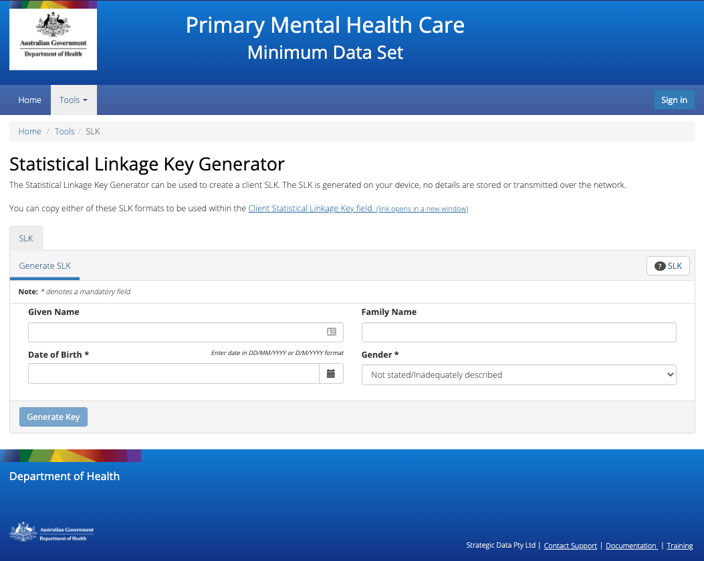

.. _SLK-generate:

Generate a Client's SLK
^^^^^^^^^^^^^^^^^^^^^^^

1. Navigate to the **Tools** tab and select **SLK**. This will open up the SLK generator
2. Enter the following client details: **Given Name**, **Family Name**, **Date of Birth** and
   **Gender**
3. Click on the blue **Generate Key** button

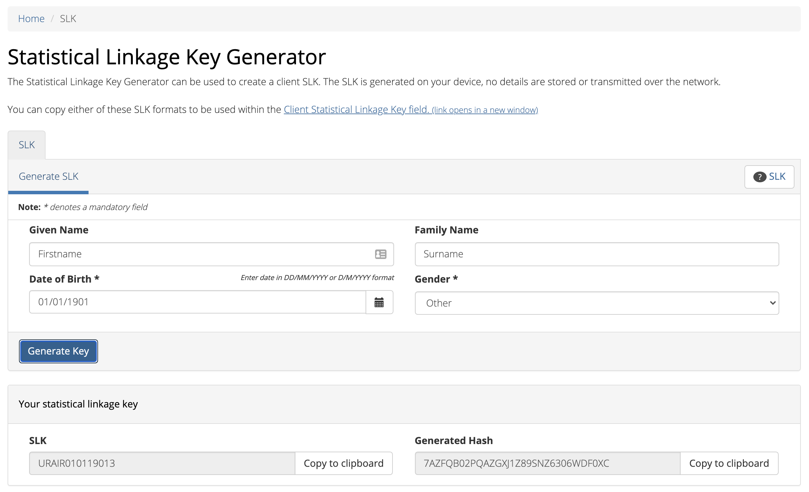

4. The client's **SLK Key** and **Generated Hash** key will now be displayed
5. Click **Copy to clipboard** next to either of these items
6. Paste this information into your data file

*Please note: you can only copy one SLK at a time to the clipboard.*

.. _video-training-module-SLK:

Video training module - Statistical Linkage Key (SLK)
^^^^^^^^^^^^^^^^^^^^^^^^^^^^^^^^^^^^^^^^^^^^^^^^^^^^^

.. toctree::
   :hidden:
   :maxdepth: 1

   slk-video-transcription

This tutorial will cover a basic introduction to the Statistical Linkage Key (SLK).
It will enable viewers to understand where you can find relevant SLK information,
step-by-step instructions on using the manual SLK generator provided on the PMHC MDS
and discusses the technical materials for implementing an SLK generator into an
internal client information management system.

.. raw:: html

  <iframe width="560" height="315" src="https://www.youtube.com/embed/YWv4pBOvntw" title="YouTube video player" frameborder="0" allow="accelerometer; autoplay; clipboard-write; encrypted-media; gyroscope; picture-in-picture" allowfullscreen></iframe>

A :ref:`transcription <slk-video-transcription>` of the video is available.

.. _yes-phn:

YES-PHN
-------

.. contents::
   :local:
   :depth: 2

The Tools: YES-PHN tab allows invitations to be sent to clients to complete a
`Your Experience of Service Primary Health Network (YES-PHN) Survey <https://www.amhocn.org/publications/your-experience-service-primary-health-network-yes-phn-survey>`_. The YES-PHN
survey is designed to gather information from mental health consumers about their
experiences of care.

After navigating to the **Tools: YES-PHN** tab, you will see a tab to request a report of
clients who have completed episodes in a specified period and a tab to re-upload the
report to generate invitations for the specified clients to complete a
Your Experience of Service Primary Health Network (YES PHN) Survey.

You will only be able to see the **Tools: YES-PHN** tab if you have been assigned
the 'Service Feedback' :ref:`roles`, when logged into the PMHC MDS on https://pmhc-mds.net.

If you don’t have access to the **Tools: YES-PHN** tab and you believe you should, please
contact someone in your provider organisation or provider organisation's PHN
who has the 'User Management' role. If you are unsure who has the 'User Management'
role please email the PMHC Helpdesk at support@pmhc-mds.com

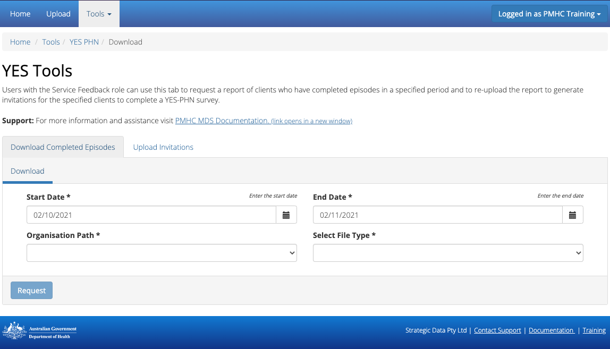

.. _yes-phn-download-complete-episodes:

Download Completed Episodes
^^^^^^^^^^^^^^^^^^^^^^^^^^^

You can request a report of clients who have completed episodes in a specified period by completing
the Download fields in the **Tools: YES-PHN** tab, by following these steps:

1. Navigate to the **Tools** tab and select **YES-PHN**
2. Click the first calendar icon to select the start date and then the second
   calendar icon to select the end date. See :ref:`yes-phn-complete-episodes-dates`
3. If you are allowed to download data from more than one organisation you will be
   asked to select an organisation name
4. Select the appropriate file type to be downloaded

   .. figure:: screen-shots/yes-phn-complete-episodes.png
      :alt: PMHC MDS File Selected

5. Click the blue **Request** button
6. A dialogue box will be displayed, showing that the file is being requested from the server

   .. figure:: screen-shots/yes-phn-data-extract-message-requesting.png
      :alt: PMHC MDS File Selected

7. When the file is ready, a 'File ready for download' message will be displayed

   .. figure:: screen-shots/yes-phn-data-extract-message-download.png
      :alt: PMHC MDS File Selected

8. Click the blue **Download** button
9. The data extract will be downloaded to your computer

.. note::
   Excel automatically removes leading zeros, and converts large numbers to
   scientific notation, like 1.23E+15, in order to allow formulas and math
   operations to work on them. See :ref:`Excel file issues <yes-phn-upload-key-error-support-faq>`

An example download file is available in the YES-PHN specification documentation at `YES-PHN Download Completed Episodes <https://docs.pmhc-mds.com/projects/data-specification-yes-invitation/en/v1/upload-specification.html#file-format>`_

.. _yes-phn-complete-episodes-dates:

Dates explained for Completed Episodes Download
~~~~~~~~~~~~~~~~~~~~~~~~~~~~~~~~~~~~~~~~~~~~~~~

The Download Completed Episodes dates are based on the Client's `Episode End Date <https://docs.pmhc-mds.com/projects/data-specification/en/v2/data-model-and-specifications.html#episode-end-date>`_
for the PMHC MDS. The file will include all Episodes that have an end date
within the date range of the request.

.. _yes-phn-uploading-invitations:

Uploading an invitations file
^^^^^^^^^^^^^^^^^^^^^^^^^^^^^

The YES-PHN survey is designed to gather information from mental health consumers
about their experiences of care. See :ref:`yes-phn-what-is-faq`.

After navigating to the **Tools: YES-PHN** tab, you will be able to upload client
details for the organisations for which you have the 'Service Feedback' role and
'Upload' role. The upload process will send YES-PHN invitations to these clients
via email or SMS.

   .. figure:: screen-shots/yes-phn-upload.png
      :alt: PMHC MDS Organisation Selected

The YES-PHN invitations file can either be auto generated through an internal system,
or a :ref:`yes-phn-download-complete-episodes` can be manually completed by adding
one of the the client's details, either the
`mobile_number <https://docs.pmhc-mds.com/projects/data-specification-yes-invitation/en/v1/specifications.html#mobile-number>`_, or
`email <https://docs.pmhc-mds.com/projects/data-specification-yes-invitation/en/v1/specifications.html#email>`_, and
`reminders <https://docs.pmhc-mds.com/projects/data-specification-yes-invitation/en/v1/specifications.html#reminders>`_
fields as documented in the YES_PHN specifications.
(Please note: manual changes to columns A-E should not occur. See :ref:`Incorrect data <yes-phn-upload-edit-data-faq>`)

You can upload YES-PHN invitations files through the upload tab, by following these steps:

1. Navigate to the **Tools: YES-PHN** tab
2. Click the **Upload Invitations** tab
3. Click the **Upload a file** tab
4. The PHN will be pre-filled in the **Organisation** field, unless you are
   allowed to upload to more than one PHN. (If blank - See :ref:`Can't see the organisation <yes-phn-upload-organisation-faq>`)

   .. figure:: screen-shots/yes-phn-upload-org-selected.png
      :alt: PMHC MDS Organisation Selected

5. Click the blue **Select File** button
6. Navigate to where the upload file is saved on your system. Select the file
   and click the grey **Open** button

   .. figure:: screen-shots/yes-phn-upload-file-selected.png
      :alt: PMHC MDS Upload File Selected

7. Check to ensure you have selected the correct file by reviewing the file
   name now displayed below the **Select File** button

8. Click the green **Upload** button

You will receive confirmation that your file has been accepted. The file will
now be validated and you will receive a confirmation notification and an
email. You can click on the link confirmation notification or open the email
to view the upload status, informing you that your file was successfully uploaded to
the PMHC MDS, or informing you of any errors that occurred. See :ref:`yes-phn-viewing-previous-uploads`.

Please email support@pmhc-mds.com if you don't receive an email within one hour.

Further discussion about the error messages can be found at :ref:`yes-phn-upload-error-messages`.

.. _yes-phn-uploading-a-file-in-test-mode:

Uploading a file in Test Mode
^^^^^^^^^^^^^^^^^^^^^^^^^^^^^

A file can be uploaded in Test Mode. When uploading in test mode, the file is
validated, however the data is not updated in the PMHC MDS database.

After navigating to the **Upload** tab, you will be able to upload in Test Mode
data files to organisations for which you have the 'Service Feedback' role.

You can upload data files in Test Mode through the **Upload** tab, by following these steps:

1. Navigate to the **Upload** tab
2. If you are allowed to upload to more than one organisation you will be
   asked to select an organisation name
3. Select the name of the organisation whose data you are uploading from the drop down list
4. Click the blue **Select File** button
5. Navigate to where the upload file is saved on your system. Select the file
   and click the grey **Open** button
6. Check to ensure you have selected the correct file by reviewing the file
   name now displayed below the **Select File** button
7. Click the **Upload as test data** checkbox on the right hand side

   .. figure:: screen-shots/yes-phn-upload-test-mode.png
      :alt: PMHC MDS Test Mode selected

8. Click the green **Upload** button

You will receive confirmation that your file has been accepted. The file will
now be validated and you will receive an email informing you if
your file was valid, or informing you of any errors that occurred.

*Even if your file was valid, the data will not be updated in the PMHC MDS database.*

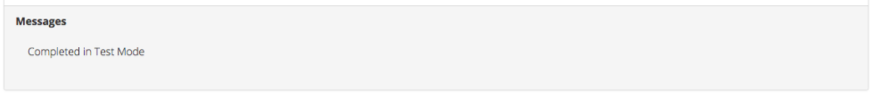

.. _yes-phn-viewing-previous-uploads:

Viewing Previous Uploads
^^^^^^^^^^^^^^^^^^^^^^^^

The PMHC MDS allows you to review previous uploads.

   .. figure:: screen-shots/yes-phn-upload-previous.png
      :alt: PMHC MDS Status of Previous Uploads

When an upload has been completed, irregardless of whether it validated successfully
or not, the upload will be added to the table.

The **Status of Previous Uploads** table refreshes once files finish the validation process. Types of status results are:

  * **accept** - the file is currently going through the validation process
  * **complete** - the file has successfully passed the validation process
  * **error** - the file has returned errors through the validation process. Please review the error messages and correct the data to upload again

Further discussion about the error messages can be found at :ref:`yes-phn-upload-error-messages`.

.. _yes-phn-viewing-uploads-details:

Viewing Upload Details
^^^^^^^^^^^^^^^^^^^^^^

You can view the results of an upload by following these steps:

1. Navigate to the **Upload** tab
2. Click the **Upload Status** tab
3. Locate the date and time of the upload you are interested in
4. Click on the filename of the relevant upload
5. You will be shown the **Upload Detail** page

.. _yes-phn-viewing-complete-uploads:

Complete uploads
^^^^^^^^^^^^^^^^

:ref:`viewing-uploads-details` for complete uploads will display data verification
information by listing the number of data records present and if those records
are added, updated, or deleted, within the MDS records.

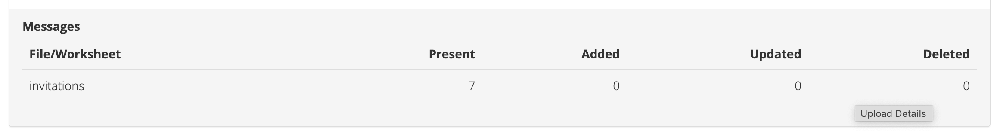

.. _yes-phn-upload-error-messages:

Error messages
^^^^^^^^^^^^^^

If the status of your file shows error, you can view the returned errors through
:ref:`yes-phn-viewing-previous-uploads`.

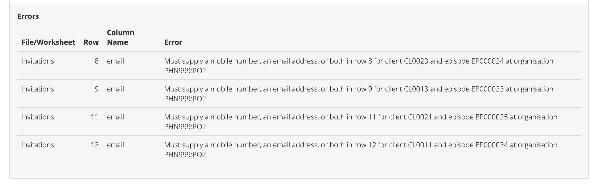

.. _yes-phn-upload-fixing-errors:

Correcting upload errors
^^^^^^^^^^^^^^^^^^^^^^^^

Any upload validation errors will need to be corrected in your internal system and
a new upload file created. Or if you manually record data on the upload file, you
can edit the data records directly on the file. See - `Validation Rules <https://docs.pmhc-mds.com/projects/data-specification-yes-invitation/en/v1/validation-rules.html#validation-rules>`_.

The definition of each data item has associated notes that will provide guidance
on why an error is returned. By visiting the data specifications documentation
and clicking on the `Record formats <https://docs.pmhc-mds.com/projects/data-specification-yes-invitation/en/v1/specifications.html#record-formats>`_ field name this will take you to the
field definition which outlines the associated notes.

In the Frequently Asked Questions guide there are questions about some of the
common and unusual upload error messages. These answers contain information on
what you can do to fix the error. See - :ref:`YES-PHN FAQs <yes-phn-FAQs>`.

If you require assistance in understanding an error message, please email support@pmhc-mds.com.

.. _yes-phn-example-OMSSS-screen:

Example Self Service Link Screens
^^^^^^^^^^^^^^^^^^^^^^^^^^^^^^^^^

*Example YES-PHN Invitation OMSSS Screens*

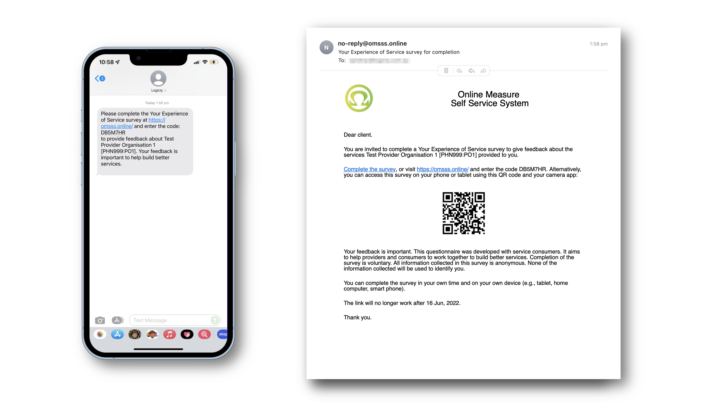

*Example YES-PHN Survey OMSSS Screens*

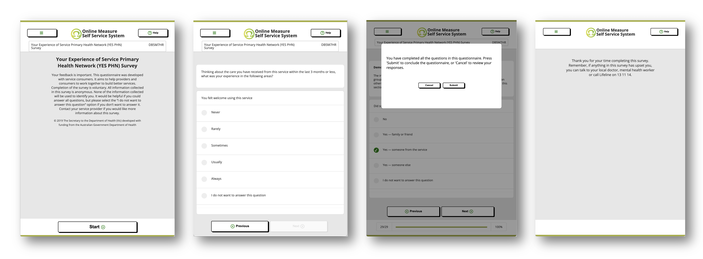

*Anonymised PMHC MDS Report 'B8 - YES PHN Index'*

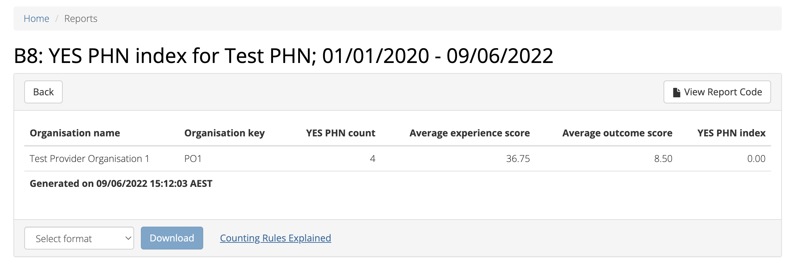

   More information available in the online user documentation for `B8 - YES PHN Index <https://docs.pmhc-mds.com/projects/user-documentation/en/latest/reporting.html#category-b8>`_ report.

.. _user-auditing:

User Auditing Tool
------------------

.. contents::
   :local:
   :depth: 2

The Tools: User Auditing tab allows users with the User Management role to
review users who have not recently logged in to the PMHC MDS.

You will only be able to see the **Tools: User Auditing** tab if you have been
assigned the 'User Management' :ref:`roles`, when logged into the PMHC MDS on https://pmhc-mds.net.

If you don’t have access to the **Tools: User Auditing** tab and you believe you should, please
contact someone in your provider organisation or provider organisation's PHN
who has the 'User Management' role. If you are unsure who has the 'User Management'
role please email the PMHC Helpdesk at support@pmhc-mds.com.

After navigating to the **Tools: User Auditing** tab, you will be presented with
a table of users whose access you manage. By default, the table is sorted by
the 'Last Logged In' column sorted so that users who have not logged in for the
longest are displayed at the top.

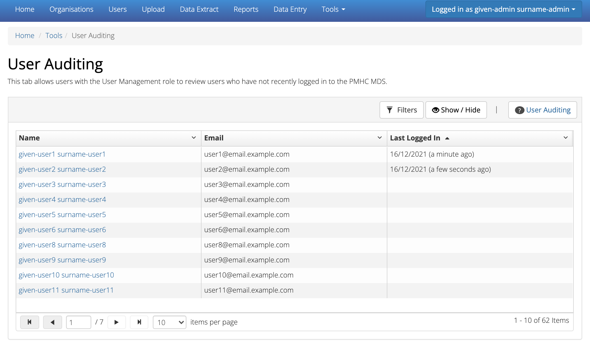

.. _auditing-users:

Auditing Users
^^^^^^^^^^^^^^

User managers should periodically check this table and :ref:`remove all roles <delete_user>`
from any user who no longer requires access.

A monthly 'PMHC-MDS User Audit Reminder Notification' email will be sent to users
with the User Management role to prompt this process:

* PMHC MDS Production users will receive the audit reminder email on the first Monday of each month
* PMHC MDS Developers users will receive the audit reminder email on the fourth Monday of each month

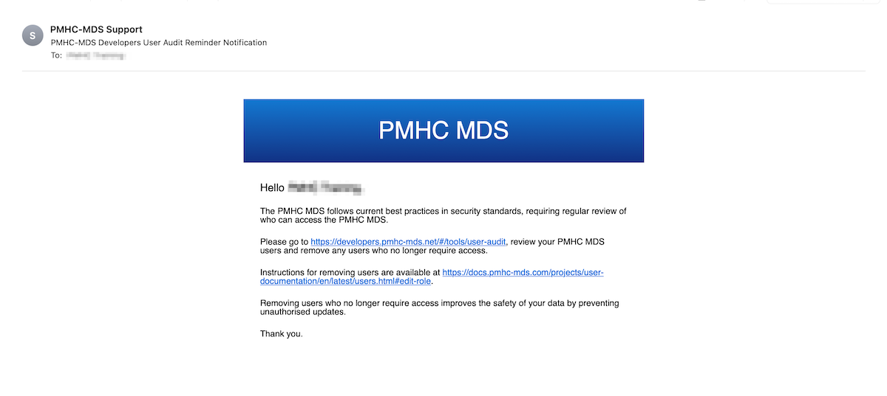

You can scroll through the results by using the page arrows to view the data. See :ref:`find-user`

.. _find-user:

Finding a User
^^^^^^^^^^^^^^

You can choose any of the filters to search for a user, depending on the user
information that is available.

To filter the listed users:

  1. Click the grey **Filters** button. This will open a field in which to enter
     text

     .. figure:: screen-shots/user-filter-fields.png
        :alt: User Data Search Results Filtered

  2. Type an appropriate filter into any of the fields
  3. Click the blue **Apply** button
     (or click the **Cancel** button if you decide not to filter the user data)

You can view the applied filters at the top of the filtered user data table.

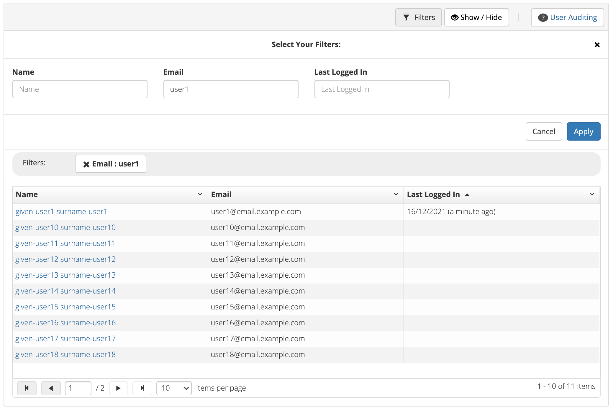

To remove the filter, click the grey cross (**X**) listed before the filter name
or click the blue **Clear all** button.

You can sort the listed user search results by simply clicking the column header.
Alternately you can click the arrow beside a column header for more sort options,
as follows:

- **Sort Ascending**
- **Sort Descending**

.. _removing-access:

Changing a users roles or removing access
^^^^^^^^^^^^^^^^^^^^^^^^^^^^^^^^^^^^^^^^^

Clicking on the user's name will take you to :ref:`edit-role`. From there you
can edit there roles, or fully remove their access to the PMHC MDS.

*Please note: use the 'Actions' feature when removing a user's roles to remove that user from the User Auditing list.*
